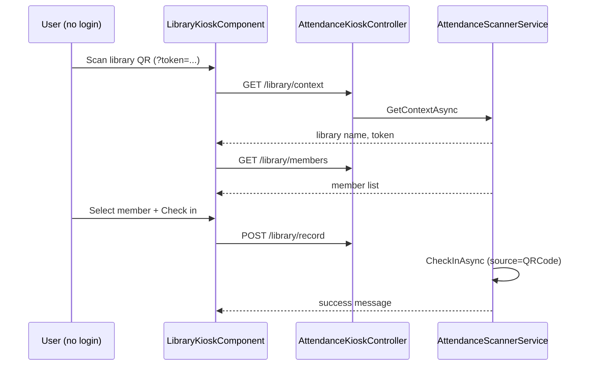
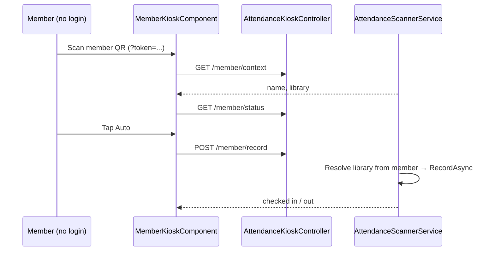

# Attendance QR Kiosk — Implementation Workflow

End-to-end workflow for **M-13 Attendance QR Kiosk** across **SLMS_UI** (Angular) and **SLMS_API** (.NET).

**Module ID:** M-13 · **Owner:** Operations / Front desk · **Depends on:** M-06 Members, M-08 Libraries

---

## 1. Overview

Three QR-based attendance flows:

| Flow | QR owner | Auth | Scan opens | User action |
|------|----------|------|------------|-------------|
| **Library kiosk** | One shared QR per library | None | Member list for that library | Select member → Check in / Check out |
| **Member kiosk** | One personal QR per member | None | Member self-service screen | Check in / Check out directly |
| **Staff member QR scan** | Same personal QR (ID card) | Staff login | Resolve member → record attendance | Check in / out with assigned seat |

Staff can generate, print, and camera-scan QR codes from authenticated admin pages (library standee PDF, member ID card PDF, library / attendance scanners).

```mermaid
flowchart TB
  subgraph public [Public — no login]
    LQR[Library QR scan] --> LK[/kiosk/attendance/library]
    MQR[Member QR scan] --> MK[/kiosk/attendance/member]
    LK --> APIK[AttendanceKioskController]
    MK --> APIK
  end

  subgraph staff [Staff — login + permission]
    SC[/attendance/scanner] --> APIS[AttendanceScannerController]
    MS[/attendance/member-scan · /members/scan] --> APIS
    MD[Member details → ID card / Attendance QR] --> APIS
  end

  APIK --> SVC[AttendanceScannerService]
  APIS --> SVC
  SVC --> ATT[AttendanceService CheckIn / CheckOut]
  ATT --> LIFE[MemberLifecycleHelper plan gate]
  ATT --> DB[(Members / Libraries / MemberAttendances)]
```

### Business rules

| Rule | Implementation |
|------|----------------|
| **BR-13.1** Library QR resolves exactly one active library | `Library.AttendanceQrToken` unique index; `ResolveLibraryAsync` |
| **BR-13.2** Member must belong to library for library-kiosk actions | `EnsureMemberInLibraryAsync` |
| **BR-13.3** Member QR uses current library assignment | `MemberLibraries` where `IsCurrent`, fallback latest `JoinedOn` |
| **BR-13.4** One check-in and one check-out per day | `AttendanceService` + `GetMemberStatusAsync` suggested action |
| **BR-13.5** Public APIs secured by token, not JWT | `[AllowAnonymous]` on kiosk controller; token in query/body |
| **BR-13.6** Attendance source = QR | `AttendanceSource.QRCode` on scanner record |
| **BR-13.7** One device → one member per day (kiosk) | `KioskDeviceService` + `EnsureDeviceAllowsMemberAsync`; staff scanner exempt (`staff:` prefix) |
| **BR-13.8** Membership plan gate (aligned with BR-06.1) | `MemberLifecycleHelper`: **Grace** (≤7 days past `EndDate`, dues = 0) and Active/New/Expiring soon **allow** check-in; **Expired** (past grace) and **No plan** **block** check-in. Check-out remains allowed. Enforced in `AttendanceService.CheckInAsync`, scanner `RecordAsync`, and status/`MemberScannerContext` (`SuggestedAction = blocked`, `PlanBlockMessage`). UI constant: `MEMBERSHIP_GRACE_DAYS = 7` in `member-lifecycle.util.ts`. |

> **Note:** Plan *daily* late grace (`Plan.GraceMinutes`) is separate — it only affects Late vs on-time status after a successful check-in, not whether check-in is allowed.

### Functional requirements

| ID | Requirement | Status |
|----|-------------|--------|
| FR-13.1 | Library common QR generation | Done |
| FR-13.2 | Public library kiosk — member list + check-in/out | Done |
| FR-13.3 | Member personal QR generation | Done |
| FR-13.4 | Public member kiosk — self check-in/out | Done |
| FR-13.5 | Staff library scanner page (authenticated) | Done |
| FR-13.6 | Member QR on member details + printable ID card (front/back + QR) | Done |
| FR-13.7 | Browser camera QR scanning (`QrScannerModalService`) | Done |
| FR-13.8 | Library QR printable standee PDF | Done |
| FR-13.9 | One device per member (QR kiosk) | Done |
| FR-13.10 | Staff scan member ID QR (`/attendance/member-scan`, `/members/scan`) | Done |
| FR-13.11 | Block QR/manual check-in when plan Expired / No plan (grace OK) | Done |

---

## 2. Angular Workflow (SLMS_UI)

### 2.1 Routing

| Route | Auth | Component | Purpose |
|-------|------|-----------|---------|
| `/kiosk/attendance/library?token=` | **None** | `LibraryKioskComponent` | Library QR → member picker → attendance |
| `/kiosk/attendance/member?token=` | **None** | `MemberKioskComponent` | Member QR → self check-in/out |
| `/attendance/scanner?token=` | `attendance.scanner.use` | `AttendanceScannerComponent` | Staff library scanner + QR display |
| `/attendance/member-scan?token=` | Staff login | `MemberQrScanPageComponent` | Scan member ID QR → check-in/out (attendance mode) |
| `/members/scan?token=` | Staff login | `MemberQrScanPageComponent` | Scan member ID QR → open profile (or `?mode=attendance`) |

Route config: `SLMS_UI/src/app/app.routes.ts`  
Kiosk routes are **outside** `AppShellComponent` and have no `permissionGuard`.

### 2.2 Public kiosk pages

```
LibraryKioskComponent
├── Header (library / branch / institution)
├── Member list (search + select)
└── Action panel
    ├── Today's check-in / check-out times
    ├── Seat picker (when check-in allowed)
    ├── Check-in blocked banner (Expired / No plan)
    ├── Check in | Check out | Auto buttons
    └── Action hint text

MemberKioskComponent
├── Member name + membership no + library
├── Status badge + today's times
├── Check-in blocked banner when SuggestedAction = blocked
└── Check in | Check out | Auto buttons (full width; check-in disabled when blocked)
```

**Files:**

| File | Role |
|------|------|
| `features/attendance/kiosk/library-kiosk.component.ts` | Library kiosk logic |
| `features/attendance/kiosk/library-kiosk.component.html` | Library kiosk UI |
| `features/attendance/kiosk/library-kiosk.component.css` | Kiosk button styles (enabled + disabled) |
| `features/attendance/kiosk/member-kiosk.component.ts` | Member self-service logic |
| `features/attendance/kiosk/member-kiosk.component.html` | Member kiosk UI |
| `features/attendance/kiosk/member-kiosk.component.css` | Shared kiosk button styles |
| `features/attendance/member-qr-scan/member-qr-scan-page.component.ts` | Staff camera / paste member ID QR |
| `features/attendance/member-qr-token.util.ts` | Extract token from raw QR / URL |
| `core/services/attendance-kiosk.service.ts` | Public API client (`attendance/kiosk/*`) |
| `core/services/kiosk-device.service.ts` | Persistent browser `deviceId`; local member binding |
| `core/services/attendance-scanner.service.ts` | Staff API client (`attendance/scanner/*`) |
| `core/services/qr-scanner-modal.service.ts` | In-browser camera QR modal |
| `core/models/attendanceModels.ts` | `Scanner*`, `MemberScanner*`, `MemberQrCode` types |

### 2.3 Member details integration

Member profile (staff view):

- **Attendance QR** card — `GET attendance/scanner/members/{memberId}/qr`
- **Download ID card PDF** — front/back card with personal QR (`member-id-card-pdf.util.ts`); scan URL targets member kiosk / staff resolve
- Today's attendance — Check In disabled + **Check-in blocked** banner when lifecycle is `Expired` or `No plan` (Grace still allowed)

File: `features/members/member-details-component/` · util: `features/members/member-id-card-pdf.util.ts`

### 2.4 Suggested action UX

Buttons use custom `.kiosk-btn` styles (not theme `app-button`) for dark kiosk background:

| `SuggestedAction` | Meaning | UI |
|-------------------|---------|-----|
| `check-in` | Not yet checked in today | Enable Check in / Auto |
| `check-out` | Checked in, not out | Enable Check out / Auto |
| `done` | Both done | Disable attendance actions |
| `blocked` | Plan Expired or No plan | Show **Check-in blocked** + `planBlockMessage`; disable Check in / Auto; Check out still allowed if already in |

| State | Visual |
|-------|--------|
| **Enabled** | Color-coded (green check-in, amber check-out, blue auto) |
| **Disabled** | Flat slate + dashed border, muted text |
| **Active action** | White ring highlight on the currently available action |
| **Hint** | Text below: e.g. "Tap Check in or use Auto to mark arrival." |
| **Plan blocked** | Destructive banner with renew message |

---

## 3. .NET Workflow (SLMS_API)

### 3.1 Controllers

| Controller | Auth | Base route |
|------------|------|------------|
| `AttendanceKioskController` | `[AllowAnonymous]` | `api/v1/attendance/kiosk` |
| `AttendanceScannerController` | JWT + `attendance.scanner.use` | `api/v1/attendance/scanner` |
| `AttendanceController` | JWT (staff) | `api/v1/attendance` |

### 3.2 Public kiosk endpoints

| Method | Endpoint | Description |
|--------|----------|-------------|
| `GET` | `/library/context?token=` | Resolve library from QR token |
| `GET` | `/library/members?token=&search=` | List members in library (max 50) |
| `GET` | `/library/members/{id}/status?token=` | Today's attendance status |
| `POST` | `/library/record` | Check in/out via library token + member id; body includes `deviceId` |
| `GET` | `/member/context?token=&deviceId=` | Resolve member from personal QR token; validates device binding |
| `GET` | `/member/status?token=` | Member's today status |
| `POST` | `/member/record` | Check in/out via member token; body includes `deviceId` |

### 3.3 Staff scanner endpoints

| Method | Endpoint | Description |
|--------|----------|-------------|
| `GET` | `/context?token=` | Same as kiosk library context |
| `GET` | `/members?token=` | Member search |
| `GET` | `/members/{id}/status?token=` | Member status (+ plan lifecycle / block fields) |
| `POST` | `/record` | Record attendance |
| `GET` | `/libraries/{libraryId}/qr` | Generate library QR image (base64 PNG) |
| `GET` | `/members/{memberId}/qr` | Generate member QR image (base64 PNG) |
| `GET` | `/members/resolve?token=` | Resolve member ID QR → `MemberScannerContext` (incl. `checkInBlocked`) |
| `POST` | `/members/record-by-token` | Record via member token (staff member QR scan) |

### 3.4 Service layer

**`AttendanceScannerService`** (`Application/Services/AttendanceScannerService.cs`):

- `GetContextAsync` — library token → context; auto-generates `AttendanceQrToken` on library if missing
- `SearchMembersAsync` — active members in library
- `GetMemberStatusAsync` — today's check-in/out + `SuggestedAction` (`check-in` \| `check-out` \| `done` \| `blocked`) + `PlanLifecycle` / `PlanBlockMessage`
- `RecordAsync` / `RecordByMemberTokenAsync` — refuses check-in when status is blocked; delegates to `IAttendanceService` with `Source = QRCode`
- `GetMemberContextAsync` — optional `deviceId`; returns `CheckInBlocked` / `PlanBlockMessage` for staff resolve UX
- `EnsureDeviceAllowsMemberAsync` — rejects QR attendance when `deviceId` already used for another member today (skipped for `staff:` prefix)
- `GetQrCodeAsync` / `GetMemberQrCodeAsync` — QRCoder PNG base64 + scan URL

**`MemberLifecycleHelper`** (`Application/Helpers/MemberLifecycleHelper.cs`):

- Mirrors UI `member-lifecycle.util.ts` (`MembershipGraceDays = 7`)
- `AllowsAttendanceCheckIn` / `EnsureAllowsAttendanceCheckIn` / `CheckInBlockedMessage`

**`AttendanceService.CheckInAsync`** — calls `EnsureMemberPlanAllowsCheckInAsync` before creating today's check-in (covers staff web + any path that uses CheckIn).

### 3.5 Domain & database

| Entity | Field | Notes |
|--------|-------|-------|
| `Library` | `AttendanceQrToken` | Unique, auto-generated on first use |
| `Member` | `AttendanceQrToken` | Unique, set on create; lazy-generated for existing members |

**Migrations:**

- `20260815140000_AddLibraryAttendanceQrToken`
- `20260816061655_AddMemberAttendanceQrToken`

### 3.6 Configuration

`appsettings.Development.json`:

```json
"Attendance": {
  "ScannerUrlBase": "http://localhost:4200/kiosk/attendance/library",
  "LibraryKioskUrlBase": "http://localhost:4200/kiosk/attendance/library",
  "MemberKioskUrlBase": "http://localhost:4200/kiosk/attendance/member"
}
```

Production must set these to the deployed Angular origin.

### 3.7 Permissions

| Key | ID | Used by |
|-----|-----|---------|
| `attendance.scanner.use` | 109 | Staff scanner page, QR generation APIs |

Kiosk public endpoints do **not** require this permission.

---

## 4. End-to-end flows

### 4.1 Library QR attendance (kiosk)



### 4.2 Member QR attendance (kiosk)



---

## 5. File map

```
SLMS_API/
├── Controllers/
│   ├── AttendanceKioskController.cs      # Public kiosk APIs
│   ├── AttendanceScannerController.cs    # Staff scanner APIs
│   └── AttendanceController.cs           # General attendance
├── Application/
│   ├── Helpers/MemberLifecycleHelper.cs  # Grace / Expired check-in gate
│   ├── Services/AttendanceScannerService.cs
│   ├── Services/AttendanceService.cs     # CheckInAsync plan gate
│   ├── Services/Interfaces/IAttendanceScannerService.cs
│   └── Contracts/Attendance/ScannerContracts.cs
├── Domain/Entities/
│   ├── Library.cs                        # AttendanceQrToken
│   └── Member.cs                         # AttendanceQrToken
└── Infrastructure/Data/Migrations/
    ├── 20260815140000_AddLibraryAttendanceQrToken.cs
    └── 20260816061655_AddMemberAttendanceQrToken.cs

SLMS_UI/src/app/
├── features/attendance/
│   ├── kiosk/                            # Public kiosk module
│   │   ├── library-kiosk.component.*
│   │   └── member-kiosk.component.*
│   ├── attendance-scanner/               # Staff library scanner (+ Download QR PDF)
│   ├── member-qr-scan/                   # Staff scan member ID QR
│   └── member-qr-token.util.ts
├── features/members/
│   ├── member-lifecycle.util.ts          # MEMBERSHIP_GRACE_DAYS = 7
│   ├── member-id-card-pdf.util.ts        # Printable front/back ID + QR
│   └── member-details-component/
├── features/libraries/
│   └── library-qr-pdf.util.ts            # A4 QR standee / poster PDF
├── core/services/
│   ├── attendance-kiosk.service.ts
│   ├── attendance-scanner.service.ts
│   └── qr-scanner-modal.service.ts
└── app.routes.ts                         # /kiosk/attendance/*, /attendance/member-scan, /members/scan
```

---

## 6. Testing checklist

| # | Scenario | Expected |
|---|----------|----------|
| 1 | Open `/kiosk/attendance/library?token={valid}` | Library name + member list, no login redirect |
| 2 | Select member → Check in | Success; check-in time shown |
| 3 | Check in again same day | Check-in disabled; check-out enabled |
| 4 | Check out | Success; both actions disabled (done) |
| 5 | Auto button | Checks in if not in; checks out if checked in |
| 6 | Open `/kiosk/attendance/member?token={valid}` | Member name + actions, no login |
| 7 | Invalid token | Error message on kiosk page |
| 8 | Member details → Attendance QR / Download ID card | QR image + PDF loads (staff logged in) |
| 9 | Staff `/attendance/scanner` without permission | Redirect to `/unauthorized` |
| 10 | Member A marks attendance on device → Member B on same device | Error: device already used for Member A |
| 11 | Same member check-out on bound device | Allowed |
| 12 | Staff scanner multiple members | Allowed (no device lock) |
| 13 | Camera scan on `/attendance/member-scan` | Resolves member; auto-records when seat assigned |
| 14 | Member in **Grace** (≤7d past end, dues 0) | Check-in allowed |
| 15 | Member **Expired** (past grace) or **No plan** | `SuggestedAction=blocked`; banner + renew message; Check in / Auto disabled; API rejects check-in |
| 16 | Expired member already checked in | Check-out still allowed |

---

## 7. Related modules

| Module | Doc | Relation |
|--------|-----|----------|
| M-13 Attendance (staff) | [attendance-module-workflow.md](./attendance-module-workflow.md) | Overview, calendar, live, records, export |
| M-06 Members | [members-list-workflow.md](./members-list-workflow.md) | Member library assignment, QR token, scan entry |
| M-06 Members | [members-detail-workflow.md](./members-detail-workflow.md) | Attendance tab, ID card, plan-gated check-in |
| M-06b Scoped members | [scoped-members-workflow.md](./scoped-members-workflow.md) | Members tabs on detail pages |
| Libraries list | [libraries-list-workflow.md](./libraries-list-workflow.md) | Global library portfolio |
| Library detail | [library-detail-workflow.md](./library-detail-workflow.md) | Library QR display / print |
| M-15 Administration | [administration-workflow.md](./administration-workflow.md) | `attendance.scanner.use` permission |

---

## 8. Planned enhancements

- Rate limiting on public kiosk endpoints
- Production `Attendance:*KioskUrlBase` in `appsettings.json`
