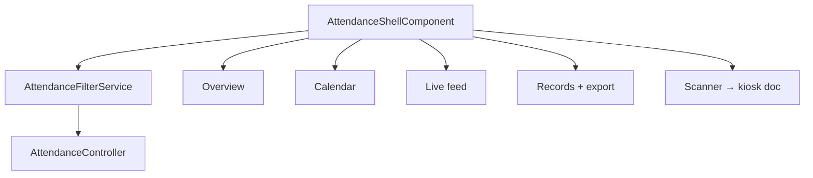

# Attendance Module (Staff) — Implementation Workflow

End-to-end workflow for **M-13 Attendance** staff tools across **SLMS_UI** (Angular) and **SLMS_API** (.NET).

**Module ID:** M-13 · **Routes:** `/attendance/*` · **Depends on:** M-06 Members, M-08 Libraries

> Public QR kiosk and scanner: [attendance-kiosk-workflow.md](./attendance-kiosk-workflow.md)

---

## 1. Overview

Authenticated attendance workspace with shared library filter, five sub-pages, and export on Records.



---

## 2. Angular Workflow (SLMS_UI)

### 2.1 Routing

| Route | Component | Permission | File |
|-------|-----------|------------|------|
| `/attendance` | `AttendanceOverviewComponent` | Login | `attendance-overview/` |
| `/attendance/calendar` | `AttendanceCalendarComponent` | Login | `attendance-calendar/` |
| `/attendance/live` | `AttendanceLiveComponent` | Login | `attendance-live/` |
| `/attendance/records` | `AttendanceRecordsComponent` | `attendance.records.view` | `attendance-records/` |
| `/attendance/scanner` | `AttendanceScannerComponent` | `attendance.scanner.use` | `attendance-scanner/` |

**Shell:** `SLMS_UI/src/app/features/attendance/attendance-shell/`  
Route config: `SLMS_UI/src/app/app.routes.ts`

Query param: `?libraryId=` — persisted by shell into `AttendanceFilterService`.

### 2.2 Shared filter service

`AttendanceFilterService` loads user-scoped libraries once; all tabs react via signals/effects.

### 2.3 Records & export

**Records page:**
- Server-paged `GET attendance/records` with date range, search, status, library filter
- Pagination: 10 / 20 / 50 per page

**Export (Excel / PDF):**
- `AttendanceExportService.fetchAllModuleRecords()` — fetches all pages for current filters
- `attendance-report-export.util.ts` — `downloadAttendanceExcel`, `downloadAttendancePdf`
- Client-side generation (no separate export API)

| File | Role |
|------|------|
| `attendance-records/attendance-records.component.ts` | UI + export trigger |
| `attendance-export.service.ts` | Paginated fetch for export |
| `attendance-report-export.util.ts` | Row mapping + file download |
| `core/services/attendance-module.service.ts` | API wrapper |

### 2.4 Member-scoped attendance

Member detail attendance tab uses per-member endpoints (not module shell):

| Endpoint | Purpose |
|----------|---------|
| `GET attendance/members/{id}/calendar` | Member calendar |
| `GET attendance/members/{id}/records` | Member records |
| `GET attendance/members/{id}/statistics` | Stats |
| `POST attendance/members/{id}/check-in` | Manual check-in |
| `POST attendance/members/{id}/check-out` | Manual check-out |

See [members-detail-workflow.md](./members-detail-workflow.md).

---

## 3. .NET Workflow (SLMS_API)

**Controller:** `SLMS_API/Controllers/AttendanceController.cs`  
**Base route:** `api/v1/attendance`

| Method | Endpoint | Used by |
|--------|----------|---------|
| GET | `/summary` | Overview tab |
| GET | `/records` | Records tab (paged) |
| GET | `/analytics` | Analytics widgets |
| GET | `/live` | Live feed |
| GET | `/calendar/month` | Calendar month grid |
| GET | `/calendar/summary` | Calendar range summary |
| GET | `/libraries/{libraryId}/seats` | Seat occupancy |
| PUT | `/{attendanceId}` | Edit record |
| POST | `/members/{memberId}/check-in` | Member detail / manual |
| POST | `/members/{memberId}/check-out` | Member detail / manual |

**Service:** `SLMS_API/Application/Services/AttendanceService.cs`

---

## 4. File map

```
SLMS_UI/src/app/features/attendance/
├── attendance-shell/
├── attendance-overview/
├── attendance-calendar/
├── attendance-live/
├── attendance-records/
├── attendance-export.service.ts
├── attendance-report-export.util.ts
├── attendance-filter.service.ts
└── attendance-format.util.ts

SLMS_UI/src/app/core/
├── services/attendance-module.service.ts
└── models/attendanceModels.ts

SLMS_API/
├── Controllers/AttendanceController.cs
└── Application/Services/AttendanceService.cs
```

---

## 5. Test checklist

- [ ] Shell library dropdown filters all tabs
- [ ] `?libraryId=` deep-link selects library
- [ ] Overview summary loads for date range
- [ ] Calendar month navigates and shows counts
- [ ] Live feed polls / refreshes events
- [ ] Records pagination and filters
- [ ] Export Excel/PDF with empty-range error handling
- [ ] Records permission gate blocks unauthorized users

---

## 6. Related docs

- [attendance-kiosk-workflow.md](./attendance-kiosk-workflow.md) — QR kiosk + scanner
- [members-detail-workflow.md](./members-detail-workflow.md) — Per-member attendance
- [library-detail-workflow.md](./library-detail-workflow.md) — Library QR
