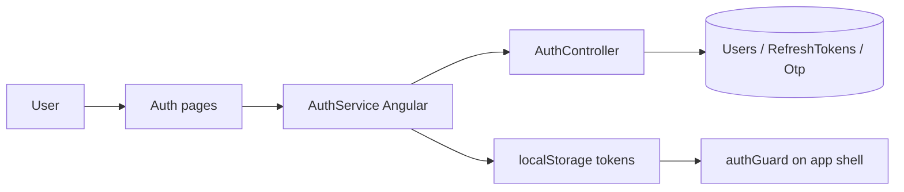

# Authentication & Tenant Onboarding Authorization — Implementation Workflow

End-to-end workflow for **M-01 Authentication** across **SLMS_UI** (Angular) and **SLMS_API** (.NET).

**Module ID:** M-01 · **Owner:** Platform / Security · **Depends on:** M-18 Tenant & Subscription Approvals

---

## 1. Overview

JWT-based auth with refresh tokens, OTP verification, password reset, optional 2FA, dynamic package registration, trial auto-approval, tenant approval checks, and self-service **profile** management. Public auth routes sit outside `AppShellComponent`; authenticated app-shell routes use `authGuard`, `onboardingCompleteGuard`, and route-level `permissionGuard`.



---

## 2. Angular Workflow (SLMS_UI)

### 2.1 Routing

| Route | Component | File |
|-------|-----------|------|
| `/login` | `LoginComponent` | `SLMS_UI/src/app/features/auth/login/` |
| `/register` | `RegisterComponent` | `SLMS_UI/src/app/features/auth/register/` |
| `/pending-approval` | `PendingApprovalComponent` | `SLMS_UI/src/app/features/auth/pending-approval/` |
| `/forgot-password` | `ForgotPasswordComponent` | `SLMS_UI/src/app/features/auth/forgot-password/` |
| `/reset-password` | `ResetPasswordComponent` | `SLMS_UI/src/app/features/auth/reset-password/` |
| `/verify-otp` | `VerifyOtpComponent` | `SLMS_UI/src/app/features/auth/verify-otp/` |
| `/unauthorized` | `UnauthorizedComponent` | `SLMS_UI/src/app/features/auth/unauthorized/` |

Route config: `SLMS_UI/src/app/app.routes.ts`  
Layout: `SLMS_UI/src/app/layouts/auth-layout/`

**Landing:** Public `/` page includes **Register** CTAs; authenticated users are redirected by guards (see §2.2).

### 2.2 Key Services & Guards

| File | Role |
|------|------|
| `SLMS_UI/src/app/core/services/auth.service.ts` | Login, logout, refresh, current user |
| `SLMS_UI/src/app/core/guards/auth.guard.ts` | Blocks unauthenticated app-shell access |
| `SLMS_UI/src/app/core/guards/onboarding.guard.ts` | `onboardingGuard` — redirects by step; `onboardingCompleteGuard` — blocks app shell until onboarding done and approved |
| `SLMS_UI/src/app/core/guards/permission.guard.ts` | Route-level permission checks |
| `SLMS_UI/src/app/core/Interceptor/authInterceptor.ts` | Attaches Bearer token; handles 401 refresh |

**App shell guard chain:** `authGuard` → `onboardingCompleteGuard` (see `app.routes.ts`).

### 2.3 Login Flow

1. User submits email/password on `/login`.
2. `AuthService.login()` → `POST /api/v1/auth/login`.
3. Tokens stored; `current-user` fetched.
4. Redirect:
   - If onboarding incomplete: navigate to appropriate onboarding step.
   - If onboarding complete but `ApprovalStatus === 'Pending'`: navigate to `/pending-approval`.
   - If `ApprovalStatus === 'Approved'`: navigate to `returnUrl` or `/dashboard`.
5. Demo login available in non-production (`environment.production === false`).

### 2.3.1 Development Seed Accounts

Seeded on API startup (see [administration-workflow.md](./administration-workflow.md)):

| Account | Email | Password | Role |
|---------|-------|----------|------|
| SuperAdmin | `superadmin@slms.com` | `SuperAdmin@123` | SuperAdmin |
| Demo org admin | `institution@slms.com` | `Demo@12345` | OrganisationAdmin (when `Demo:Enabled`) |

---

### 2.4 Registration Flow with Packages & Auto-Approval

1. User opens `/register` (optionally with `?packageId=...` from pricing page).
2. Active subscription packages loaded via `PackageService.getActivePackages()`.
3. If user navigated with a pre-selected package, dropdown is locked by default with an option to unlock via "Change Plan".
4. Inclusions summary card dynamically shows selected plan's resource limits (Institutions, Branches, Libraries, Staff Users, Active Members).
5. If `Trial` package is selected:
   - Add-on selection section is hidden.
   - Total price is ₹0.
   - User account is configured for **Auto-Approval** upon registration.
6. If a paid package (`Basic`, `Value`, `Premium`) is selected:
   - Capacity Add-ons accordion allows users to attach extra libraries, staff user seats, or member capacity packs during sign-up with live total pricing.
   - Account enters `ApprovalStatus = "Pending"`.
7. `AuthService.register()` sends `RegisterRequest` with `packageId` and `selectedAddons`.
8. API creates user, subscribes base package, attaches selected add-ons, and sets initial `OrganisationAdmin` role.
9. Redirects to `/onboarding/institution`.

---

## 3. .NET Workflow (SLMS_API)

**Controller:** `SLMS_API/Controllers/AuthController.cs`  
**Base route:** `api/v1/auth`

| Method | Endpoint | Purpose |
|--------|----------|---------|
| POST | `/register` | New user registration (auto-approves Trial; sets Pending for Paid) |
| POST | `/login` | Issue access + refresh tokens |
| POST | `/refresh-token` | Rotate access token |
| POST | `/logout` | Invalidate refresh token |
| POST | `/send-otp` | Send OTP (email) |
| POST | `/verify-otp` | Verify OTP code |
| POST | `/forgot-password` | Request reset link/code |
| POST | `/reset-password` | Set new password |
| GET | `/current-user` | Lightweight user with approval status & permission keys |
| GET | `/profile` | Full profile: roles, permissions, workspace access scope |
| PATCH | `/profile` | Update full name, username, email |
| POST | `/change-password` | Self-service password change |
| POST | `/enable-2fa` | Enable two-factor auth |
| POST | `/disable-2fa` | Disable two-factor auth |

---

## 4. File Map

```
SLMS_UI/src/app/features/auth/
├── login/
├── register/
├── pending-approval/
├── forgot-password/
├── reset-password/
├── verify-otp/
└── unauthorized/

SLMS_UI/src/app/core/
├── services/auth.service.ts
├── guards/auth.guard.ts
├── guards/onboarding.guard.ts
├── guards/permission.guard.ts
└── Interceptor/authInterceptor.ts

SLMS_API/
├── Controllers/AuthController.cs
├── Application/Services/AuthService.cs
└── Application/Services/ProfileService.cs
```

---

## 5. Test Checklist

- [x] Login with valid credentials → dashboard / pending approval
- [x] Invalid credentials → error toast, no redirect
- [x] Register with Trial plan → auto-approved, completes onboarding → dashboard
- [x] Register with Paid plan → completes onboarding → `/pending-approval`
- [x] Expired access token → silent refresh
- [x] Logout clears tokens and blocks protected routes
- [x] Incomplete onboarding user cannot reach `/dashboard` (redirect to wizard)
- [x] `GET /profile` returns access scope and permission details
