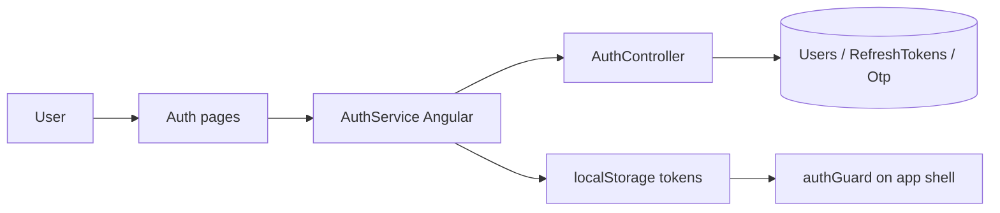

# Authentication — Implementation Workflow

End-to-end workflow for **M-01 Authentication** across **SLMS_UI** (Angular) and **SLMS_API** (.NET).

**Module ID:** M-01 · **Owner:** Platform / Security · **Depends on:** —

---

## 1. Overview

JWT-based auth with refresh tokens, OTP verification, password reset, and optional 2FA. Public auth routes sit outside `AppShellComponent`; authenticated routes use `authGuard` and `permissionGuard`.



---

## 2. Angular Workflow (SLMS_UI)

### 2.1 Routing

| Route | Component | File |
|-------|-----------|------|
| `/login` | `LoginComponent` | `SLMS_UI/src/app/features/auth/login/` |
| `/register` | `RegisterComponent` | `SLMS_UI/src/app/features/auth/register/` |
| `/forgot-password` | `ForgotPasswordComponent` | `SLMS_UI/src/app/features/auth/forgot-password/` |
| `/reset-password` | `ResetPasswordComponent` | `SLMS_UI/src/app/features/auth/reset-password/` |
| `/verify-otp` | `VerifyOtpComponent` | `SLMS_UI/src/app/features/auth/verify-otp/` |
| `/unauthorized` | `UnauthorizedComponent` | `SLMS_UI/src/app/features/auth/unauthorized/` |

Route config: `SLMS_UI/src/app/app.routes.ts`  
Layout: `SLMS_UI/src/app/layouts/auth-layout/`

### 2.2 Key services & guards

| File | Role |
|------|------|
| `SLMS_UI/src/app/core/services/auth.service.ts` | Login, logout, refresh, current user |
| `SLMS_UI/src/app/core/guards/auth.guard.ts` | Blocks unauthenticated app-shell access |
| `SLMS_UI/src/app/core/guards/permission.guard.ts` | Route-level permission checks |
| `SLMS_UI/src/app/core/interceptors/auth.interceptor.ts` | Attaches Bearer token; handles 401 refresh |

### 2.3 Login flow

1. User submits email/password on `/login`.
2. `AuthService.login()` → `POST /api/v1/auth/login`.
3. Tokens stored; `current-user` fetched.
4. Redirect: onboarding step if incomplete, else `returnUrl` or `/dashboard`.
5. Demo login available in non-production (`environment.production === false`).

### 2.3.1 Development seed accounts

Seeded on API startup (see [administration-workflow.md](./administration-workflow.md)):

| Account | Email | Password | Role |
|---------|-------|----------|------|
| SuperAdmin | `superadmin@slms.com` | `SuperAdmin@123` | SuperAdmin |
| Demo org admin | `institution@slms.com` | `Demo@12345` | OrganisationAdmin (when `Demo:Enabled`) |

Override credentials via `Identity:SuperAdmin*` and `Demo:Admin*` in `appsettings.Development.json`.

---

## 3. .NET Workflow (SLMS_API)

**Controller:** `SLMS_API/Controllers/AuthController.cs`  
**Base route:** `api/v1/auth`

| Method | Endpoint | Purpose |
|--------|----------|---------|
| POST | `/register` | New user registration |
| POST | `/login` | Issue access + refresh tokens |
| POST | `/refresh-token` | Rotate access token |
| POST | `/logout` | Invalidate refresh token |
| POST | `/send-otp` | Send OTP (email) |
| POST | `/verify-otp` | Verify OTP code |
| POST | `/forgot-password` | Request reset link/code |
| POST | `/reset-password` | Set new password |
| GET | `/current-user` | Authenticated profile + permissions |
| POST | `/enable-2fa` | Enable two-factor auth |
| POST | `/disable-2fa` | Disable two-factor auth |

Validators: `SLMS_API/Application/Validation/Auth/`

---

## 4. File map

```
SLMS_UI/src/app/features/auth/
├── login/
├── register/
├── forgot-password/
├── reset-password/
├── verify-otp/
└── unauthorized/

SLMS_UI/src/app/core/
├── services/auth.service.ts
├── guards/auth.guard.ts
├── guards/permission.guard.ts
└── interceptors/auth.interceptor.ts

SLMS_API/
├── Controllers/AuthController.cs
└── Application/Services/ (auth, token, OTP services)
```

---

## 5. Test checklist

- [ ] Login with valid credentials → dashboard
- [ ] Invalid credentials → error toast, no redirect
- [ ] Expired access token → silent refresh
- [ ] Logout clears tokens and blocks protected routes
- [ ] Register → verify OTP flow (if enabled)
- [ ] Forgot / reset password end-to-end
- [ ] `/unauthorized` when permission guard fails

---

## 6. Related docs

- Administration & permissions: [administration-workflow.md](./administration-workflow.md)
- Onboarding after first login: [onboarding-workflow.md](./onboarding-workflow.md)
