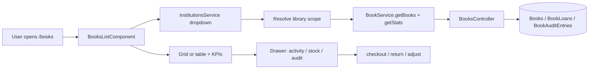
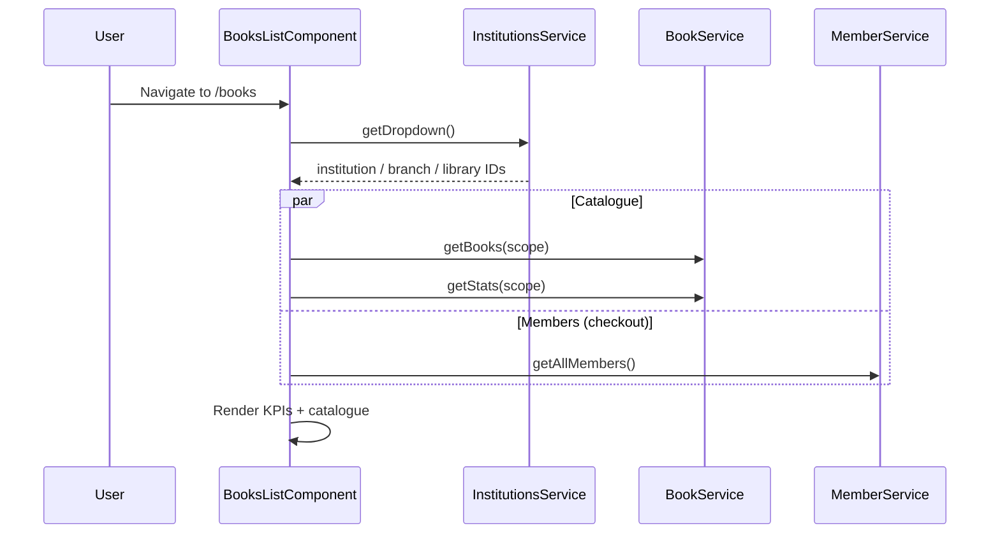
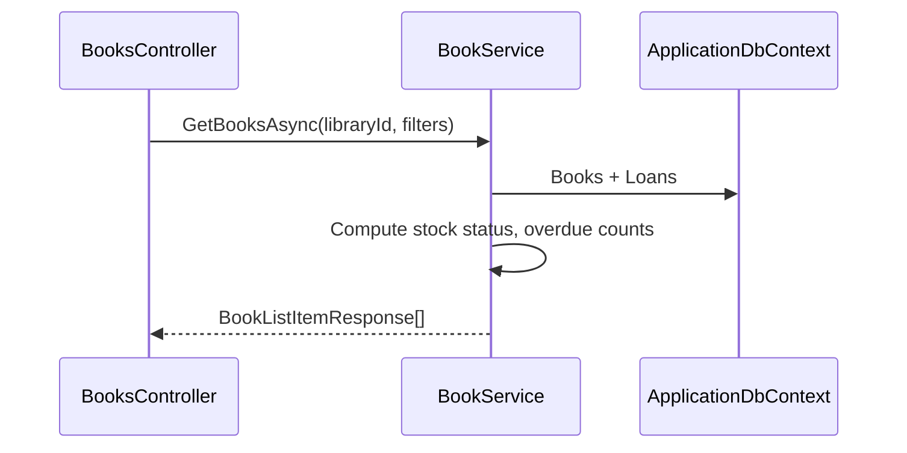

# Books & Circulation — Implementation Workflow

End-to-end workflow for **M-12 Books & Circulation** across **SLMS_UI** (Angular) and **SLMS_API** (.NET).

**Module ID:** M-12 · **Owner:** Collection Management · **Depends on:** M-06 Members

---

## 1. Overview

| Layer | Entry | Strategy |
|-------|--------|----------|
| **Angular** | Route `/books` | Library-scoped catalogue; client-side filter/sort; drawer for detail & circulation |
| **.NET** | `GET /api/v1/institutions/{i}/branches/{b}/libraries/{l}/books` | Library-scoped CRUD, stock, checkout/return |



### Business rules

| Rule | Implementation |
|------|----------------|
| **BR-12.1** ISBN checksum | `IsbnValidator` (API) + `isValidIsbn()` (Angular) block save |
| **BR-12.2** Available ≤ total, never negative | `ValidateBookRequest`, `AdjustStockAsync`, checkout/return |
| **BR-12.3** Overdue when due date passed | `ResolveLoanStatus()` on read; surfaced on book + member profile |

### Functional requirements (M-12)

| ID | Requirement | Status |
|----|-------------|--------|
| FR-12.1 | Browse catalogue in grid or table | Done |
| FR-12.2 | Search/filter by title, author, category, availability | Done |
| FR-12.3 | Create/edit with ISBN validation | Done |
| FR-12.4 | Adjust stock levels | Done |
| FR-12.5 | Borrow/return timeline per book | Done |
| FR-12.6 | Borrowing history on member profile | Done |

---

## 2. Angular Workflow (SLMS_UI)

### 2.1 Routing & navigation

| Route | Component | File |
|-------|-----------|------|
| `/books` | `BooksListComponent` | `SLMS_UI/src/app/features/books/books-list-component/` |

Route config: `SLMS_UI/src/app/app.routes.ts`  
Sidebar: `SLMS_UI/src/app/layouts/sidebar/sidebar.component.ts`  
Navigation constants: `SLMS_UI/src/app/core/constants/navigation.ts`

### 2.2 Page layout

```
PageHeader (title, library label, Add Book, Export CSV)
├── KPI strip (titles, total copies, on loan, overdue)
├── Filters (search, category, status, sort, grid/table toggle)
├── Catalogue (table or grid cards)
├── BookFormDialog (create / edit — fixed overlay modal)
└── Book drawer (slide-over)
    ├── Tabs: Activity | Stock | Audit
    ├── Issue copy (member dropdown)
    └── Return from activity timeline
```

### 2.3 Library scope resolution

On `ngOnInit`, `BooksListComponent` calls `InstitutionsService.getDropdown()` and picks the **first** institution → branch → library. All book API calls use that `LibraryScope`:

```typescript
{ institutionId, branchId, libraryId }
```

If no library exists (onboarding incomplete), the page shows an error toast and stops loading.

### 2.4 State management

**Pattern:** Angular signals + computed (no NgRx).

| Signal | Purpose |
|--------|---------|
| `scope`, `libraryLabel` | Active library context |
| `books`, `stats` | Catalogue + KPI data |
| `query`, `category`, `status`, `sort`, `view` | Client filter/sort/view mode |
| `filteredBooks` | Computed pipeline from `books` |
| `showForm`, `editBook`, `formBusy` | Create/edit dialog |
| `drawerOpen`, `selectedBook`, `drawerTab`, `drawerBusy` | Detail drawer |
| `checkoutMemberId`, `showCheckout`, `stockNote` | Circulation & stock actions |
| `members` | Member list for checkout dropdown |

### 2.5 Page load sequence



### 2.6 Catalogue interactions

| Action | UI | API |
|--------|-----|-----|
| Search | `query` signal — title, author, ISBN (client) | Optional server `?search=` on refresh |
| Filter category | `category` dropdown | Client + server `?category=` |
| Filter status | Available / Low / Out of stock | Client + server `?status=` |
| Sort | title, author, available, category | Client-side |
| View mode | Table ↔ Grid | Local only |
| Export CSV | `exportCsv()` | Client from `filteredBooks` |
| Open drawer | Row/card click | `GET .../books/{id}` |

### 2.7 Create / edit book

**Component:** `BookFormDialogComponent` (`components/book-form-dialog/`)

- Modal pattern matches `renew-plan-dialog` / `new-ticket-dialog` (`fixed inset-0 z-50`).
- **ISBN validation (BR-12.1):** `isValidIsbn()` in `book-format.util.ts` — inline error blocks submit.
- **Stock (BR-12.2):** `availableCopies` clamped to `0..totalCopies` in form.
- On submit → `POST` (create) or `PUT` (update) → `refresh()`.

### 2.8 Book drawer

| Tab | Content | Actions |
|-----|---------|---------|
| **Activity** | Borrow/return timeline from `BookDetail.activities` | Return active loan |
| **Stock** | Available / total copies | `+1` / `-1` adjust, mark damaged/lost |
| **Audit** | `BookDetail.auditEntries` | Read-only |

**Checkout flow:**

1. Open drawer → Activity tab → Issue copy.
2. Select member from `members` list (`membership` label).
3. `POST .../books/{id}/checkout` `{ memberId, loanDays: 14 }`.
4. Available copies decremented; activity timeline updated.

**Return flow:**

1. Click Return on an active borrow row.
2. `POST .../books/{id}/loans/{loanId}/return`.
3. Available copies incremented (capped at total).

### 2.9 Angular services & models

| Service | Path | Scope |
|---------|------|-------|
| `BookService` | `SLMS_UI/src/app/features/books/book.service.ts` | Component |
| `InstitutionsService` | `SLMS_UI/src/app/features/institutions/institutions.service.ts` | Component |
| `MemberService` | `SLMS_UI/src/app/features/members/MemberService.ts` | Component (checkout) |

| Model / util | Path |
|--------------|------|
| `BookListItem`, `BookDetail`, `BookStats`, `MemberBookLoan` | `SLMS_UI/src/app/core/models/book.models.ts` |
| ISBN validation, status helpers | `SLMS_UI/src/app/features/books/book-format.util.ts` |

#### API call summary (books page)

| HTTP | Endpoint | Trigger |
|------|----------|---------|
| GET | `institutions/dropdown` | Resolve library scope |
| GET | `institutions/.../libraries/.../books` | `refresh()` |
| GET | `institutions/.../libraries/.../books/stats` | `refresh()` |
| GET | `institutions/.../libraries/.../books/{id}` | Open drawer |
| POST | `institutions/.../libraries/.../books` | Create book |
| PUT | `institutions/.../libraries/.../books/{id}` | Update book |
| POST | `.../books/{id}/stock/adjust` | Stock +/- |
| POST | `.../books/{id}/stock/damaged` \| `lost` | Mark condition |
| POST | `.../books/{id}/checkout` | Issue copy |
| POST | `.../books/{id}/loans/{loanId}/return` | Return copy |
| GET | `members` | Checkout member dropdown |

---

## 3. .NET Workflow (SLMS_API)

### 3.1 Books request flow



### 3.2 `BooksController`

**File:** `SLMS_API/Controllers/BooksController.cs`  
**Route:** `api/v1/institutions/{institutionId}/branches/{branchId}/libraries/{libraryId}/books`  
**Auth:** `[Authorize]`

| HTTP | Route | Service method |
|------|-------|----------------|
| GET | `/` | `GetBooksAsync` |
| GET | `/stats` | `GetStatsAsync` |
| GET | `/{bookId}` | `GetByIdAsync` |
| POST | `/` | `CreateAsync` |
| PUT | `/{bookId}` | `UpdateAsync` |
| POST | `/{bookId}/stock/adjust` | `AdjustStockAsync` |
| POST | `/{bookId}/stock/{kind}` | `MarkConditionAsync` (`damaged` \| `lost`) |
| POST | `/{bookId}/checkout` | `CheckoutAsync` |
| POST | `/{bookId}/loans/{loanId}/return` | `ReturnLoanAsync` |

### 3.3 Member book loans

**File:** `SLMS_API/Controllers/AllMembersController.cs`

| HTTP | Route | Service method |
|------|-------|----------------|
| GET | `members/{memberId}/book-loans` | `GetMemberLoansAsync` |

Used by **Member Details → Books tab** (see [members-detail-workflow.md](./members-detail-workflow.md)).

### 3.4 `BookService` behavior

**File:** `SLMS_API/Application/Services/BookService.cs`

#### Create / update

1. `EnsureLibraryAsync` — validate institution/branch/library chain.
2. `ValidateBookRequest` — title, author, category, ISBN, copy bounds.
3. `IsbnValidator.Normalize` + `IsbnValidator.IsValid`.
4. `EnsureUniqueIsbnAsync` per library.
5. Audit entry (`Added` / `Edited`).

#### Stock adjust

- `delta` applied to `availableCopies`, clamped to `[0, totalCopies]`.
- Audit entry type `Adjust`.

#### Mark damaged / lost

- Decrements `totalCopies` by 1; clamps `availableCopies` to new total.
- Audit entry type `Damaged` or `Lost`.

#### Checkout

1. Reject if `availableCopies <= 0`.
2. Validate member exists.
3. Decrement `availableCopies`.
4. Create `BookLoan` (`Active`, `DueAtUtc = now + loanDays`).
5. Activity timeline built from loans on `GetById`.

#### Return

1. Set loan `Returned`, `ReturnedAtUtc`.
2. Increment `availableCopies` (max `totalCopies`).

#### Overdue resolution (`ResolveLoanStatus`)

- Returned → `BookLoanStatus.Returned`
- `DueAtUtc < now` → `BookLoanStatus.Overdue`
- Else → `BookLoanStatus.Active`

### 3.5 DTOs, entities & enums

| Contract | Path |
|----------|------|
| `CreateBookRequest`, `UpdateBookRequest`, `AdjustBookStockRequest`, `CheckoutBookRequest` | `SLMS_API/Application/Contracts/Books/Requests/` |
| `BookListItemResponse`, `BookDetailResponse`, `BookStatsResponse`, `MemberBookLoanResponse` | `SLMS_API/Application/Contracts/Books/Responses/` |

| Entity | Path |
|--------|------|
| `Book` | `SLMS_API/Domain/Entities/Book.cs` |
| `BookLoan` | `SLMS_API/Domain/Entities/BookLoan.cs` |
| `BookAuditEntry` | `SLMS_API/Domain/Entities/BookAuditEntry.cs` |

| Enum | Path |
|------|------|
| `BookStockStatus`, `BookLoanStatus`, `BookAuditType` | `SLMS_API/Common/Enums/` |
| `IsbnValidator` | `SLMS_API/Common/Utilities/IsbnValidator.cs` |

### 3.6 Database

- Migration: `Infrastructure/Data/Migrations/*AddBooksModule*`
- Seed: `Infrastructure/Data/BooksSeedData.cs` (sample catalogue per library)
- DI: `ServiceCollectionExtensions.cs` → `IBookService` / `BookService`

---

## 4. Member profile integration

Borrowing history is **not** on the books page — it lives on the member profile:

| Location | Data |
|----------|------|
| KPI strip (sidebar) | `bookLoanStats()` — active count |
| Books tab | Full loan table with Active / Overdue / Returned stats |

See **§2.5 Books** in [members-detail-workflow.md](./members-detail-workflow.md).

---

## 5. User journeys

### 5.1 Add a title to the catalogue

```
/books → Add Book → fill form → ISBN validated inline → Save
  → POST .../books
  → Toast + catalogue refresh
```

### 5.2 Issue a copy

```
/books → open book drawer → Issue copy → select member → Issue
  → POST .../checkout
  → availableCopies -= 1, activity shows borrow entry
```

### 5.3 Return a copy

```
Drawer → Activity → Return on active loan
  → POST .../loans/{id}/return
  → availableCopies += 1, activity shows return entry
```

### 5.4 Review member borrow history

```
/members/:id → Books tab
  → GET members/{id}/book-loans
  → KPI cards + loan table (overdue highlighted)
```

---

## 6. File index

### Angular

```
SLMS_UI/src/app/
├── app.routes.ts                          # /books lazy route
├── core/models/book.models.ts
└── features/books/
    ├── book.service.ts
    ├── book-format.util.ts                # ISBN, status, date helpers
    ├── books-list-component/
    │   ├── books-list.component.ts
    │   ├── books-list.component.html
    │   └── books-list.component.css
    └── components/book-form-dialog/
        ├── book-form-dialog.component.ts
        └── book-form-dialog.component.html
```

### .NET

```
SLMS_API/
├── Controllers/
│   ├── BooksController.cs
│   └── AllMembersController.cs            # GET book-loans
├── Application/
│   ├── Services/BookService.cs
│   ├── Services/Interfaces/IBookService.cs
│   └── Contracts/Books/
├── Domain/Entities/Book.cs, BookLoan.cs, BookAuditEntry.cs
├── Common/Utilities/IsbnValidator.cs
├── Common/Enums/Book*.cs
└── Infrastructure/Data/
    ├── BooksSeedData.cs
    └── Migrations/*AddBooksModule*
```

---

## 7. Known gaps & extension points

| Area | Status |
|------|--------|
| Library picker on `/books` | Uses first library from dropdown only |
| Fines automation | Out of scope (M-12) |
| External catalogue federation | Out of scope |
| Server-side pagination | Full catalogue loaded per library |
| Category donut chart | KPI categories available in stats API; chart optional |

---

## 8. Related docs

- Member details (Books tab): [members-detail-workflow.md](./members-detail-workflow.md)
- Members list: [members-list-workflow.md](./members-list-workflow.md)
- Lovable reference: `docs/lovable-source/src/routes/_authenticated.books.index.tsx`
