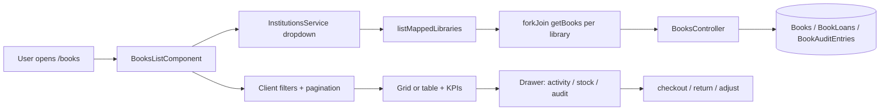
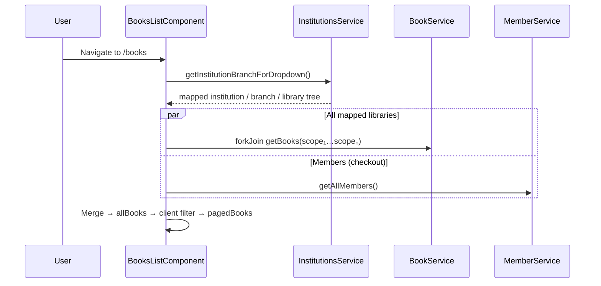
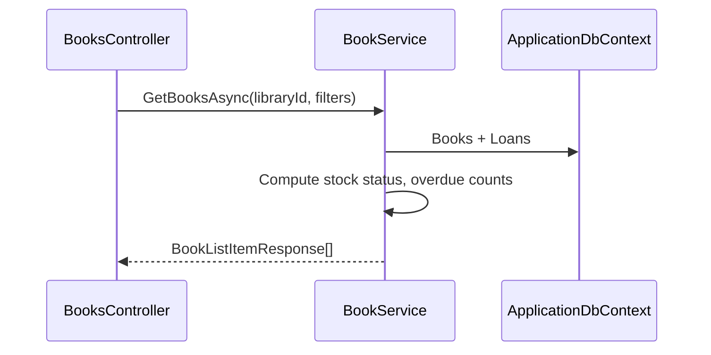

# Books & Circulation — Implementation Workflow

End-to-end workflow for **M-12 Books & Circulation** across **SLMS_UI** (Angular) and **SLMS_API** (.NET).

**Module ID:** M-12 · **Owner:** Collection Management · **Depends on:** M-06 Members, M-08 Libraries

---

## 1. Overview

| Layer | Entry | Strategy |
|-------|--------|----------|
| **Angular** | Route `/books` | Load books from **all user-mapped libraries**; client-side scope/search/sort/pagination; drawer for detail & circulation |
| **.NET** | `GET /api/v1/institutions/{i}/branches/{b}/libraries/{l}/books` | Per-library CRUD, stock, checkout/return |



### Business rules

| Rule | Implementation |
|------|----------------|
| **BR-12.1** ISBN checksum | `IsbnValidator` (API) + `isValidIsbn()` (Angular) block save |
| **BR-12.2** Available ≤ total, never negative | `ValidateBookRequest`, `AdjustStockAsync`, checkout/return |
| **BR-12.3** Overdue when due date passed | `ResolveLoanStatus()` on read; surfaced on book + member profile |
| **BR-12.4** User sees only mapped libraries | `institutions/dropdown` + `listMappedLibraries()` |
| **BR-12.5** Book belongs to one library | Cascading institution → branch → library on create/edit |

### Functional requirements (M-12)

| ID | Requirement | Status |
|----|-------------|--------|
| FR-12.1 | Browse catalogue in grid or table | Done |
| FR-12.2 | Search/filter by title, author, category, availability | Done |
| FR-12.3 | Create/edit with ISBN validation | Done |
| FR-12.4 | Adjust stock levels | Done |
| FR-12.5 | Borrow/return timeline per book | Done |
| FR-12.6 | Borrowing history on member profile | Done |
| FR-12.7 | All mapped libraries by default | Done |
| FR-12.8 | Institution / branch / library filter dropdowns | Done |
| FR-12.9 | Sort by newest (default), title, author, available, category | Done |
| FR-12.10 | Client-side pagination (10 / 25 / 50 / 100) | Done |
| FR-12.11 | Cascading scope on add/edit book dialog | Done |

---

## 2. Angular Workflow (SLMS_UI)

### 2.1 Routing & navigation

| Route | Component | File |
|-------|-----------|------|
| `/books` | `BooksListComponent` | `SLMS_UI/src/app/features/books/books-list-component/` |

Route config: `SLMS_UI/src/app/app.routes.ts`  
Sidebar: `SLMS_UI/src/app/layouts/sidebar/sidebar.component.ts`  
Navigation constants: `SLMS_UI/src/app/core/constants/navigation.ts`

### 2.2 Page layout

```
PageHeader (title, scope description, Add Book, Export CSV)
├── KPI strip (titles, total copies, on loan, overdue — scoped to active filters)
├── Scope filters (institution / branch / library — "All" options)
├── Filters (search, category, status, sort, grid/table toggle)
├── Catalogue (table or grid cards)
│   └── Library column when viewing "All libraries"
├── Pagination footer (page size, prev/next)
├── BookFormDialog (create / edit — cascading scope + optional PDF)
└── Book drawer (slide-over)
    ├── Tabs: Activity | Stock | Audit
    ├── Issue copy (member dropdown)
    └── Return from activity timeline
```

### 2.3 Library scope resolution

**Default load:** Books from **every library** the logged-in user is mapped to (via `institutions/dropdown`).

```typescript
// library-scope.util.ts
listMappedLibraries(institutions) → MappedLibraryScope[]
```

On `refresh()`, `BooksListComponent` runs `forkJoin` across all mapped libraries and merges results into `allBooks` with scope labels attached (`ScopedBookListItem`).

**Filter dropdowns** (client-side, no re-fetch):

| Filter | Value | Effect |
|--------|-------|--------|
| Institution | `''` (All) | Show all institutions |
| Branch | `''` (All) | Show all branches in selected institution |
| Library | `''` (All) | Show all libraries in selected branch |

Branch dropdown disabled until institution selected. Library dropdown disabled until branch selected.

If no mapped libraries exist → error toast: *"No library mapping found for your account."*

### 2.4 State management

**Pattern:** Angular signals + computed (no NgRx).

| Signal | Purpose |
|--------|---------|
| `allBooks` | Merged catalogue from all mapped libraries |
| `institutions` | Dropdown tree from API |
| `filterInstitutionId`, `filterBranchId`, `filterLibraryId` | Client scope filters (`''` = All) |
| `scopeFilteredBooks` | Books after institution/branch/library filter |
| `query`, `category`, `status`, `sort`, `view` | Search, category, stock status, sort, view mode |
| `filteredBooks` | Full client filter + sort pipeline |
| `page`, `pageSize` | Pagination (default 25, options 10/25/50/100) |
| `pagedBooks` | Current page slice |
| `displayStats` | KPIs from `scopeFilteredBooks` via `computeBookStats()` |
| `showLibraryColumn` | `true` when library filter is "All" |
| `formDefaultScope` | Pre-fill add-book dialog from active list filters |
| `showForm`, `editBook`, `formBusy` | Create/edit dialog |
| `drawerOpen`, `selectedBook`, `drawerTab` | Detail drawer |
| `members` | Member list for checkout dropdown |

### 2.5 Sort & pagination

| Sort key | Behaviour |
|----------|-----------|
| `newest` **(default)** | `createdAtUtc` descending |
| `title`, `author`, `category` | Locale string compare |
| `available` | `availableCopies` descending |

Filter or search changes call `resetPage()` → page 1.

Pagination mirrors members list pattern: page size selector, page X of Y, first/prev/next/last controls.

### 2.6 Page load sequence



### 2.7 Catalogue interactions

| Action | UI | Notes |
|--------|-----|-------|
| Scope filter | Institution / branch / library dropdowns | Client-side on `allBooks` |
| Search | `query` — title, author, ISBN | Client-side |
| Filter category | `category` dropdown | From scoped book categories |
| Filter status | Available / Low / Out of stock | Client-side |
| Sort | newest, title, author, available, category | Client-side; default `newest` |
| Pagination | 10 / 25 / 50 / 100 per page | Client-side |
| View mode | Table ↔ Grid | Local only |
| Library column | Shown when library filter = All | `institutionName / libraryName` |
| Export CSV | `exportCsv()` | From `filteredBooks` (all pages) |
| Open drawer | Row/card click | `GET .../books/{id}` |

### 2.8 Create / edit book

**Component:** `BookFormDialogComponent` (`components/book-form-dialog/`)

| Feature | Implementation |
|---------|----------------|
| Cascading scope | Institution → branch → library dropdowns |
| Single-option fields | Auto-selected and disabled when only one choice |
| Init on open only | `wasOpen` flag — prevents form reset on parent re-render |
| Scope pre-fill | `defaultScope` from list filters via `formDefaultScope` |
| ISBN validation (BR-12.1) | `isValidIsbn()` in `book-format.util.ts` |
| Stock (BR-12.2) | `availableCopies` clamped to `0..totalCopies` |
| Optional PDF | Upload on create/update |
| Save scope persistence | `finishBookSave()` applies saved library to list filters |

On submit → `POST` (create) or `PUT` (update) → `refresh()`.

### 2.9 Book drawer

| Tab | Content | Actions |
|-----|---------|---------|
| **Activity** | Borrow/return timeline from `BookDetail.activities` | Return active loan |
| **Stock** | Available / total copies | `+1` / `-1` adjust, mark damaged/lost |
| **Audit** | `BookDetail.auditEntries` | Read-only |

**Checkout flow:**

1. Open drawer → Activity tab → Issue copy.
2. Select member from `members` list.
3. `POST .../books/{id}/checkout` `{ memberId, loanDays: 14 }`.
4. Available copies decremented; activity timeline updated.

**Return flow:**

1. Click Return on an active borrow row.
2. `POST .../books/{id}/loans/{loanId}/return`.
3. Available copies incremented (capped at total).

### 2.10 Shared utilities

**`library-scope.util.ts`**

| Function | Purpose |
|----------|---------|
| `listMappedLibraries()` | Flatten dropdown tree to scope + labels |
| `computeBookStats()` | KPI aggregation for filtered book set |
| `resolveDefaultLibraryScope()` | First institution/branch/library fallback |
| `branchesForInstitution()` | Branch dropdown options |
| `librariesForBranch()` | Library dropdown options |
| `libraryScopeLabels()` | Resolve display names from scope IDs |

**`ScopedBookListItem`** extends `BookListItem` with `institutionId`, `branchId`, `libraryId`, and name labels for multi-library table view.

### 2.11 Angular services & models

| Service | Path | Scope |
|---------|------|-------|
| `BookService` | `features/books/book.service.ts` | Component |
| `InstitutionsService` | `features/institutions/institutions.service.ts` | Component |
| `MemberService` | `features/members/MemberService.ts` | Component (checkout) |

| Model / util | Path |
|--------------|------|
| `BookListItem`, `BookDetail`, `BookStats`, `MemberBookLoan` | `core/models/book.models.ts` |
| ISBN validation, status helpers | `features/books/book-format.util.ts` |
| Scope helpers | `features/books/library-scope.util.ts` |

#### API call summary (books page)

| HTTP | Endpoint | Trigger |
|------|----------|---------|
| GET | `institutions/dropdown` | Load mapped library tree |
| GET | `institutions/.../libraries/.../books` | `refresh()` — once per mapped library |
| GET | `institutions/.../libraries/.../books/stats` | Available per-library (optional) |
| GET | `institutions/.../libraries/.../books/{id}` | Open drawer |
| POST | `institutions/.../libraries/.../books` | Create book |
| PUT | `institutions/.../libraries/.../books/{id}` | Update book |
| POST | `.../books/{id}/stock/adjust` | Stock +/- |
| POST | `.../books/{id}/stock/damaged` \| `lost` | Mark condition |
| POST | `.../books/{id}/checkout` | Issue copy |
| POST | `.../books/{id}/loans/{loanId}/return` | Return copy |
| GET | `members` | Checkout member dropdown |

---

## 3. .NET Workflow (SLMS_API)

### 3.1 Books request flow



### 3.2 `BooksController`

**File:** `SLMS_API/Controllers/BooksController.cs`  
**Route:** `api/v1/institutions/{institutionId}/branches/{branchId}/libraries/{libraryId}/books`  
**Auth:** `[Authorize]`

| HTTP | Route | Service method |
|------|-------|----------------|
| GET | `/` | `GetBooksAsync` |
| GET | `/stats` | `GetStatsAsync` |
| GET | `/{bookId}` | `GetByIdAsync` |
| POST | `/` | `CreateAsync` |
| PUT | `/{bookId}` | `UpdateAsync` |
| POST | `/{bookId}/stock/adjust` | `AdjustStockAsync` |
| POST | `/{bookId}/stock/{kind}` | `MarkConditionAsync` (`damaged` \| `lost`) |
| POST | `/{bookId}/checkout` | `CheckoutAsync` |
| POST | `/{bookId}/loans/{loanId}/return` | `ReturnLoanAsync` |

### 3.3 Member book loans

**File:** `SLMS_API/Controllers/AllMembersController.cs`

| HTTP | Route | Service method |
|------|-------|----------------|
| GET | `members/{memberId}/book-loans` | `GetMemberLoansAsync` |

Used by **Member Details → Books tab** (see [members-detail-workflow.md](./members-detail-workflow.md)).

### 3.4 `BookService` behavior

**File:** `SLMS_API/Application/Services/BookService.cs`

#### Create / update

1. `EnsureLibraryAsync` — validate institution/branch/library chain.
2. `ValidateBookRequest` — title, author, category, ISBN, copy bounds.
3. `IsbnValidator.Normalize` + `IsbnValidator.IsValid`.
4. `EnsureUniqueIsbnAsync` per library.
5. Audit entry (`Added` / `Edited`).

#### Stock adjust

- `delta` applied to `availableCopies`, clamped to `[0, totalCopies]`.
- Audit entry type `Adjust`.

#### Mark damaged / lost

- Decrements `totalCopies` by 1; clamps `availableCopies` to new total.
- Audit entry type `Damaged` or `Lost`.

#### Checkout

1. Reject if `availableCopies <= 0`.
2. Validate member exists.
3. Decrement `availableCopies`.
4. Create `BookLoan` (`Active`, `DueAtUtc = now + loanDays`).
5. Activity timeline built from loans on `GetById`.

#### Return

1. Set loan `Returned`, `ReturnedAtUtc`.
2. Increment `availableCopies` (max `totalCopies`).

#### Overdue resolution (`ResolveLoanStatus`)

- Returned → `BookLoanStatus.Returned`
- `DueAtUtc < now` → `BookLoanStatus.Overdue`
- Else → `BookLoanStatus.Active`

### 3.5 DTOs, entities & enums

| Contract | Path |
|----------|------|
| `CreateBookRequest`, `UpdateBookRequest`, `AdjustBookStockRequest`, `CheckoutBookRequest` | `SLMS_API/Application/Contracts/Books/Requests/` |
| `BookListItemResponse`, `BookDetailResponse`, `BookStatsResponse`, `MemberBookLoanResponse` | `SLMS_API/Application/Contracts/Books/Responses/` |

| Entity | Path |
|--------|------|
| `Book` | `SLMS_API/Domain/Entities/Book.cs` |
| `BookLoan` | `SLMS_API/Domain/Entities/BookLoan.cs` |
| `BookAuditEntry` | `SLMS_API/Domain/Entities/BookAuditEntry.cs` |

| Enum | Path |
|------|------|
| `BookStockStatus`, `BookLoanStatus`, `BookAuditType` | `SLMS_API/Common/Enums/` |
| `IsbnValidator` | `SLMS_API/Common/Utilities/IsbnValidator.cs` |

### 3.6 Database

- Migration: `Infrastructure/Data/Migrations/*AddBooksModule*`
- PDF support: `*AddBookPdf*`
- Fines & notifications: `*AddBookLoanFinesAndNotifications*`
- Seed: `Infrastructure/Data/BooksSeedData.cs`
- DI: `ServiceCollectionExtensions.cs` → `IBookService` / `BookService`

---

## 4. Member profile integration

Borrowing history lives on the member profile:

| Location | Data |
|----------|------|
| KPI strip (sidebar) | `bookLoanStats()` — active count |
| Books tab | Full loan table with Active / Overdue / Returned stats |

See **Books tab** in [members-detail-workflow.md](./members-detail-workflow.md).

---

## 5. User journeys

### 5.1 View all books across mapped libraries

```
/books → loads all mapped libraries via forkJoin
  → KPIs + table with Library column
  → Filter by institution / branch / library as needed
```

### 5.2 Add a title to a specific library

```
/books → filter to target library (optional)
  → Add Book → cascading scope pre-filled
  → ISBN validated → Save
  → List switches to saved library scope
```

### 5.3 Issue a copy

```
/books → open book drawer → Issue copy → select member → Issue
  → POST .../checkout
  → availableCopies -= 1
```

### 5.4 Return a copy

```
Drawer → Activity → Return on active loan
  → POST .../loans/{id}/return
  → availableCopies += 1
```

### 5.5 Review member borrow history

```
/members/:id → Books tab
  → GET members/{id}/book-loans
```

---

## 6. File index

### Angular

```
SLMS_UI/src/app/
├── app.routes.ts
├── core/models/book.models.ts
└── features/books/
    ├── book.service.ts
    ├── book-format.util.ts
    ├── library-scope.util.ts              # Multi-library scope helpers
    ├── books-list-component/
    │   ├── books-list.component.ts
    │   ├── books-list.component.html
    │   └── books-list.component.css
    └── components/book-form-dialog/
        ├── book-form-dialog.component.ts
        └── book-form-dialog.component.html
```

### .NET

```
SLMS_API/
├── Controllers/
│   ├── BooksController.cs
│   └── AllMembersController.cs            # GET book-loans
├── Application/
│   ├── Services/BookService.cs
│   ├── Services/Interfaces/IBookService.cs
│   └── Contracts/Books/
├── Domain/Entities/Book.cs, BookLoan.cs, BookAuditEntry.cs
├── Common/Utilities/IsbnValidator.cs
├── Common/Enums/Book*.cs
└── Infrastructure/Data/
    ├── BooksSeedData.cs
    └── Migrations/*AddBooksModule*, *AddBookPdf*, *AddBookLoanFines*
```

---

## 7. Known gaps & extension points

| Area | Status |
|------|--------|
| Server-side pagination | Full catalogue loaded per mapped library; pagination is client-side |
| Cross-library book search API | Single aggregated endpoint not implemented |
| Fines automation | Partial — fines fields exist; full automation out of scope |
| External catalogue federation | Out of scope |
| Category donut chart | KPI categories in `computeBookStats()`; chart optional |
| Digital books (member e-books) | Separate feature — `member-digital-books-component` |

---

## 8. Related docs

- Member details (Books tab): [members-detail-workflow.md](./members-detail-workflow.md)
- Members list: [members-list-workflow.md](./members-list-workflow.md)
- Attendance QR kiosk: [attendance-kiosk-workflow.md](./attendance-kiosk-workflow.md)
- Lovable reference: `docs/lovable-source/src/routes/_authenticated.books.index.tsx`
