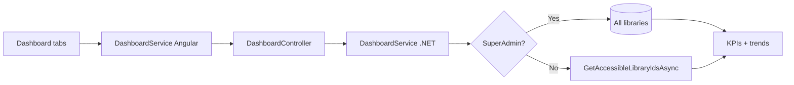

# Dashboard — Implementation Workflow

End-to-end workflow for **M-07 Dashboard** across **SLMS_UI** (Angular) and **SLMS_API** (.NET).

**Module ID:** M-07 · **Route:** `/dashboard/*` · **Permission:** `dashboard.view`

---

## 1. Overview

Lovable-style dashboard with 8 tabs, shared filter bar (7/14/30/90 day range), and **API-backed KPIs/charts**.

### Data scoping

| User | Data scope |
|------|------------|
| **SuperAdmin** | All institutions, branches, libraries, members, revenue, attendance |
| **Other roles** | Libraries accessible via `UserInstitutions` / `UserBranches` / `UserLibraries` (same as library list) |

Optional query filters: `institutionId`, `branchId`, `libraryId`.



---

## 2. Angular Workflow (SLMS_UI)

### 2.1 Routing

| Route | Component |
|-------|-----------|
| `/dashboard` | `DashboardOverviewComponent` |
| `/dashboard/analytics` | `DashboardAnalyticsComponent` |
| `/dashboard/occupancy` | `DashboardOccupancyComponent` |
| `/dashboard/revenue` | `DashboardRevenueComponent` |
| `/dashboard/attendance` | `DashboardAttendanceComponent` |
| `/dashboard/subscriptions` | `DashboardSubscriptionsComponent` |
| `/dashboard/notifications` | `DashboardNotificationsComponent` |
| `/dashboard/activity` | `DashboardActivityComponent` |

**Shell:** `dashboard-layout.component.ts` — tab strip + `DashboardFiltersBarComponent` + `<router-outlet />`

**Filter service:** `dashboard-filter.service.ts` — range/density persisted in `localStorage`

**API service:** `core/services/dashboard.service.ts`

### 2.2 Charts

PrimeNG `ChartModule` + helpers in `dashboard-chart.util.ts`

---

## 3. .NET Workflow (SLMS_API)

**Controller:** `SLMS_API/Controllers/DashboardController.cs`  
**Base route:** `api/v1/dashboard`

| Method | Endpoint | Purpose |
|--------|----------|---------|
| GET | `/overview` | KPIs, revenue/attendance trends, member mix, branches, activity, notifications |
| GET | `/revenue` | Revenue KPIs, trend, recent plan transactions |

**Service:** `SLMS_API/Application/Services/DashboardService.cs`

Query params: `days`, `institutionId`, `branchId`, `libraryId`

---

## 4. File map

```
SLMS_UI/src/app/features/dashboard/
├── dashboard-layout.component.ts
├── dashboard-filters-bar.component.ts
├── dashboard-filter.service.ts
├── dashboard-chart.util.ts
├── dashboard-overview.component.*
├── dashboard-analytics.component.*
├── dashboard-occupancy.component.*
├── dashboard-revenue.component.*
├── dashboard-attendance.component.*
├── dashboard-subscriptions.component.*
├── dashboard-notifications.component.*
└── dashboard-activity.component.*

SLMS_UI/src/app/core/
├── models/dashboard.models.ts
└── services/dashboard.service.ts

SLMS_API/
├── Controllers/DashboardController.cs
├── Application/Services/DashboardService.cs
└── Application/Contracts/Dashboard/DashboardContracts.cs
```

---

## 5. Test checklist

- [ ] SuperAdmin login → dashboard shows all-org KPIs and branch table
- [ ] Branch/Librarian login → scoped KPIs (fewer libraries/branches)
- [ ] Change range 7d/30d → charts reload
- [ ] Revenue tab shows transactions from scoped libraries only
- [ ] User without `dashboard.view` → `/unauthorized`

---

## 6. Related docs

- [libraries-list-workflow.md](./libraries-list-workflow.md) — library scoping pattern
- [attendance-module-workflow.md](./attendance-module-workflow.md) — attendance analytics
- [administration-workflow.md](./administration-workflow.md) — roles & permissions
