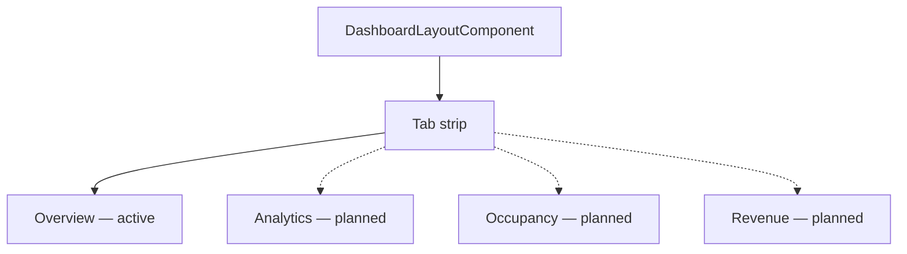

# Dashboard — Implementation Workflow

End-to-end workflow for **M-07 Dashboard** across **SLMS_UI** (Angular) and **SLMS_API** (.NET).

**Module ID:** M-07 · **Route:** `/dashboard` · **Depends on:** M-01 Authentication

---

## 1. Overview

Dashboard shell with tab navigation mirroring the Lovable design. **Current status:** only the layout shell and Overview route are active; sub-tab routes are commented out in `app.routes.ts`.



---

## 2. Angular Workflow (SLMS_UI)

### 2.1 Routing

| Route | Component | Status |
|-------|-----------|--------|
| `/dashboard` | `DashboardLayoutComponent` | Active (single page, no child outlet content yet) |
| `/dashboard/analytics` | — | Commented out |
| `/dashboard/occupancy` | — | Commented out |
| `/dashboard/revenue` | — | Commented out |
| `/dashboard/attendance` | — | Commented out |
| `/dashboard/subscriptions` | — | Commented out |
| `/dashboard/notifications` | — | Commented out |
| `/dashboard/activity` | — | Commented out |

**File:** `SLMS_UI/src/app/features/dashboard/dashboard-layout.component.ts`  
**Fallback route:** `{ path: '**', redirectTo: 'dashboard' }` in `app.routes.ts`

### 2.2 Tab definitions

Tabs defined inline in `DashboardLayoutComponent` and duplicated in `SLMS_UI/src/app/core/constants/navigation.ts` as `DASHBOARD_TABS` for sidebar consistency.

Planned child components (commented in routes):
- `dashboard-overview.component.ts`
- `dashboard-analytics.component.ts`
- `dashboard-occupancy.component.ts`
- etc.

---

## 3. .NET Workflow (SLMS_API)

No dedicated dashboard controller yet. Future tabs will likely aggregate:

| Source | Data |
|--------|------|
| `InstitutionsController` analytics | Institution KPIs |
| `AttendanceController` `/summary` | Attendance widgets |
| `LibraryListController` `/list/revenue` | Revenue MTD |
| `NotificationsController` | Notification feed |

---

## 4. File map

```
SLMS_UI/src/app/features/dashboard/
└── dashboard-layout.component.ts    ← active

SLMS_UI/src/app/core/constants/navigation.ts   ← DASHBOARD_TABS

SLMS_UI/src/app/app.routes.ts        ← child routes commented
```

---

## 5. Extension plan

1. Uncomment child routes in `app.routes.ts`.
2. Add `<router-outlet />` content components per tab.
3. Wire `DashboardFiltersBarComponent` (import commented in layout).
4. Add API aggregation endpoint or compose existing module services client-side.

---

## 6. Test checklist

- [ ] Authenticated user lands on `/dashboard` after login
- [ ] Tab strip renders all labels
- [ ] Unknown routes redirect to dashboard
- [ ] (When implemented) Each sub-tab loads scoped data

---

## 7. Related docs

- [attendance-module-workflow.md](./attendance-module-workflow.md) — Attendance summary API
- [institutions-list-workflow.md](./institutions-list-workflow.md) — Portfolio KPIs
- [libraries-list-workflow.md](./libraries-list-workflow.md) — Revenue KPIs
