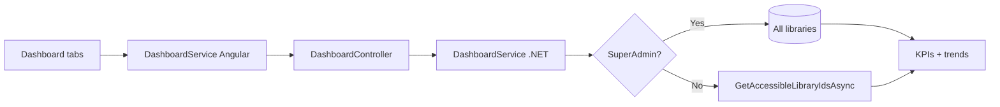

# Dashboard — Implementation Workflow

End-to-end workflow for **M-07 Dashboard** across **SLMS_UI** (Angular) and **SLMS_API** (.NET).

**Module ID:** M-07 · **Route:** `/dashboard/*` · **Permission:** `dashboard.view`

---

## 1. Overview

Operational dashboard with **Overview** and **Activity** tabs (other sub-tabs exist in routes but are hidden in the shell nav). Data is **API-backed** with period-scoped revenue, attendance trends, member mix, branch/library performance, and a live activity feed.

### Layout order

1. **Page header** — dynamic title/description from `DashboardHeaderService` (scope badge for SuperAdmin)
2. **Tab strip** — Overview | Activity
3. **Tab content** — period filter lives **inside Overview only** (`DashboardFiltersBarComponent`)

### Data scoping

| User | Data scope |
|------|------------|
| **SuperAdmin** | All institutions, branches, libraries, members, revenue, attendance |
| **Other roles** | Libraries accessible via `UserInstitutions` / `UserBranches` / `UserLibraries` (same as library list) |

Optional query filters: `institutionId`, `branchId`, `libraryId`.



---

## 2. Period filter (Overview)

**Service:** `dashboard-filter.service.ts`  
**Options:** `weekly` · `monthly` · `quarterly` · `yearly` · `all`  
**Persistence:** `localStorage` key `slms-dashboard-filters`

| Period | API label | Date range (inclusive) |
|--------|-----------|------------------------|
| `weekly` | This week | Last 7 days |
| `monthly` | This month | Last 30 days |
| `quarterly` | This quarter | Quarter start → today |
| `yearly` | This year | Jan 1 → today |
| `all` | All time | Last 5 years → today |

Changing period reloads `GET /dashboard/overview` via `DashboardOverviewComponent` effect.

### What the period filter affects

| Widget | Period-scoped? |
|--------|----------------|
| Revenue & renewals line chart | Yes — `revenueTrend` |
| Period revenue / renewals KPIs | Yes — sum of `revenueTrend` |
| Attendance trend chart | Yes — `attendanceTrend` |
| Branch performance — **Revenue** column | Yes — paid plan amounts from `rangeStartUtc` |
| Library performance — **Revenue** column | Yes — same |
| Revenue by period charts (monthly/quarterly/yearly tabs) | No — fixed windows (12 mo / 4 q / 5 yr) |
| Revenue snapshot strip (Week/Month/Quarter/Year/All time) | No — always calendar buckets |
| Hero KPI “Revenue MTD” | No — calendar month-to-date |
| Member status mix | No — current snapshot |

Branch/library revenue column header: **`Revenue · {periodLabel}`** (e.g. “Revenue · This week”).

---

## 3. Pending plan payments (member dues)

Dashboard member mix exposes `memberMix.totalFeesOwed` (API field name unchanged). UI label: **“Pending plan payments”** (not “Outstanding dues” / “Fees due”).

**Shared helper:** `SLMS_API/Application/Helpers/MemberPlanMetricsHelper.cs`

| Rule | Logic |
|------|--------|
| **BR-06.1 grace** | Expired ≤ 7 days past plan end → no dues |
| **Expired dues** | Expired > 7 days → full current plan price |
| **Partial payment** | `max(0, planAmount − paidAmount)` when not in expired-dues state |
| **No double count** | `expiredDue > 0 ? expiredDue : partialDue` |
| **One member once** | Dashboard aggregates distinct members (`GroupBy Id`); same member cannot appear in multiple libraries |

Members list KPI **“Fees due”** still sums per-row `feesOwed` from `ComputePlanMetrics` (expired dues only). Dashboard total additionally includes partial unpaid balances.

---

## 4. Angular Workflow (SLMS_UI)

### 4.1 Routing

| Route | Component | Nav visible |
|-------|-----------|-------------|
| `/dashboard` | `DashboardOverviewComponent` | Yes |
| `/dashboard/activity` | `DashboardActivityComponent` | Yes |
| `/dashboard/analytics` | `DashboardAnalyticsComponent` | Route only |
| `/dashboard/occupancy` | `DashboardOccupancyComponent` | Route only |
| `/dashboard/revenue` | `DashboardRevenueComponent` | Route only |
| `/dashboard/attendance` | `DashboardAttendanceComponent` | Route only |
| `/dashboard/subscriptions` | `DashboardSubscriptionsComponent` | Route only |
| `/dashboard/notifications` | `DashboardNotificationsComponent` | Route only |

**Shell:** `dashboard-layout.component.ts` — page header + tab strip + `<router-outlet />` (no global filter bar)

**API service:** `core/services/dashboard.service.ts`

### 4.2 Overview sections

| Section | Notes |
|---------|--------|
| Hero KPIs | Active members, occupancy, revenue MTD, branches live |
| Revenue snapshot strip | Week / month / quarter / year / all-time (fixed calendar) |
| Revenue & renewals | Line chart + period totals; uses selected period |
| Member status | Bar mix by active / inactive / suspended |
| Revenue by period | `DashboardRevenueChartsComponent` — monthly/quarterly/yearly tabs + scrollable table (newest first, sticky opaque header) |
| Attendance trend | Present vs late bar chart |
| Library table | Top libraries by members; period revenue column |
| Branch table | Top branches by occupancy; period revenue column |
| Live activity sidebar | Last 8 events from overview payload |

### 4.3 Activity tab

Dedicated endpoint: `GET /dashboard/activity`  
**Query:** `activityDays` (7–365, default 90), `limit` (10–200, default 120), plus optional scope filters.

**UI:** day-range chips, search, rich activity feed (`DashboardActivityFeedComponent`) with type filters and load-more.

**Activity types:** check-in, check-out, payment, enrollment, renewal, book-checkout, book-return, pending-payment.

### 4.4 Charts

PrimeNG `ChartModule` + helpers in `dashboard-chart.util.ts` (currency formatting on line/bar charts).

---

## 5. .NET Workflow (SLMS_API)

**Controller:** `SLMS_API/Controllers/DashboardController.cs`  
**Base route:** `api/v1/dashboard`

| Method | Endpoint | Purpose |
|--------|----------|---------|
| GET | `/overview` | KPIs, revenue breakdown/charts/trend, attendance, member mix, branch/library performance, recent activity |
| GET | `/revenue` | Revenue KPIs, trend, recent plan transactions |
| GET | `/activity` | Paginated activity feed + summary counts |

**Service:** `Application/Services/DashboardService.cs`  
**Period helper:** `Application/Helpers/DashboardPeriodHelper.cs`  
**Plan metrics:** `Application/Helpers/MemberPlanMetricsHelper.cs`  
**Period revenue by entity:** `InstitutionRevenueHelper.AggregateByBranchFrom` / `AggregateByLibraryFrom`

**Query params (`DashboardQuery`):**

| Param | Purpose |
|-------|---------|
| `period` | `weekly` \| `monthly` \| `quarterly` \| `yearly` \| `all` |
| `days` | Legacy window — ignored when `period` is set |
| `institutionId`, `branchId`, `libraryId` | Optional scope narrowing |

---

## 6. File map

```
SLMS_UI/src/app/features/dashboard/
├── dashboard-layout.component.ts
├── dashboard-header.service.ts
├── dashboard-filters-bar.component.ts
├── dashboard-filter.service.ts
├── dashboard-chart.util.ts
├── dashboard-revenue-charts.component.ts
├── dashboard-activity-feed.component.ts
├── dashboard-overview.component.*
├── dashboard-activity.component.*
├── dashboard-analytics.component.*
├── dashboard-occupancy.component.*
├── dashboard-revenue.component.*
├── dashboard-attendance.component.*
├── dashboard-subscriptions.component.*
└── dashboard-notifications.component.*

SLMS_UI/src/app/core/
├── models/dashboard.models.ts
└── services/dashboard.service.ts

SLMS_API/
├── Controllers/DashboardController.cs
├── Application/Services/DashboardService.cs
├── Application/Contracts/Dashboard/DashboardContracts.cs
├── Application/Helpers/DashboardPeriodHelper.cs
├── Application/Helpers/MemberPlanMetricsHelper.cs
└── Application/Helpers/InstitutionRevenueHelper.cs
```

---

## 7. Test checklist

- [ ] SuperAdmin login → header shows “SuperAdmin · all libraries & members”; library table shows all orgs
- [ ] Branch/Librarian login → scoped KPIs and fewer libraries/branches
- [ ] Change period Weekly → Monthly → branch/library revenue column updates and header shows new `periodLabel`
- [ ] Revenue line chart totals match period revenue KPI on Overview
- [ ] Revenue-by-period table: latest period row at top; sticky header stays opaque on scroll
- [ ] Member with partial plan payment → pending total appears in API `totalFeesOwed` (if UI block enabled)
- [ ] Activity tab loads dedicated feed; filters and search work
- [ ] User without `dashboard.view` → `/unauthorized`

---

## 8. Related docs

- [members-list-workflow.md](./members-list-workflow.md) — `ComputePlanMetrics` / BR-06.1
- [libraries-list-workflow.md](./libraries-list-workflow.md) — library scoping pattern
- [attendance-module-workflow.md](./attendance-module-workflow.md) — attendance analytics
- [administration-workflow.md](./administration-workflow.md) — SuperAdmin role & seed
