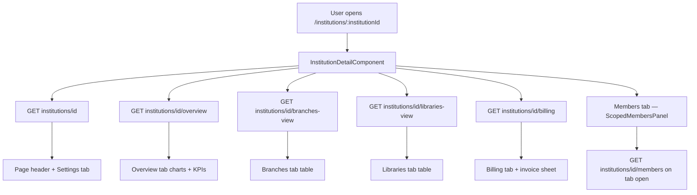
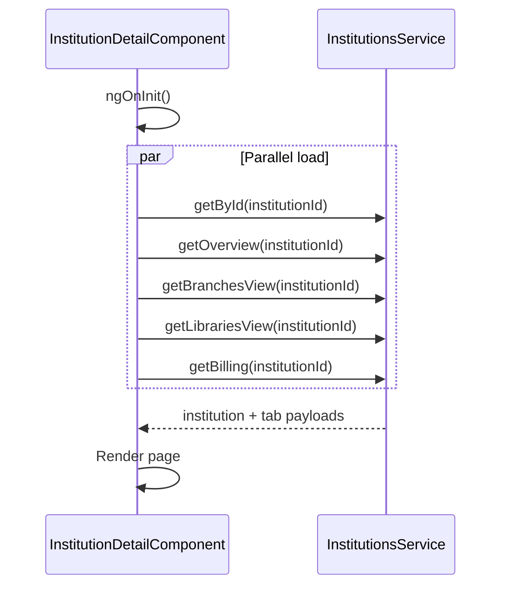
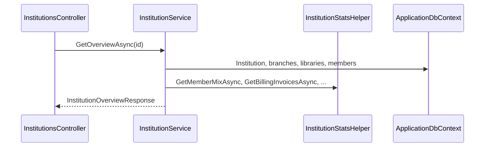
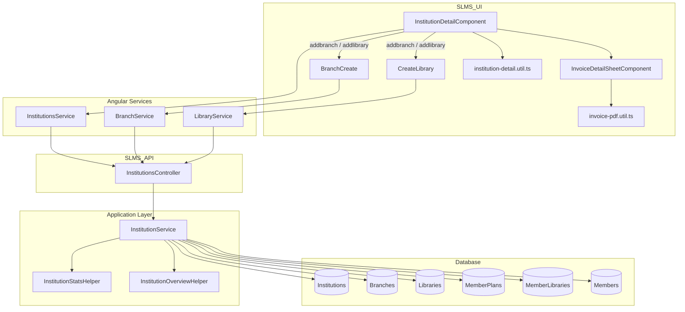

# Institution Details — Implementation Workflow

End-to-end workflow for the **Institution Details** feature across **SLMS_UI** (Angular) and **SLMS_API** (.NET).

---

## 1. Overview

| Layer | Entry | Strategy |
|-------|--------|----------|
| **Angular** | Route `/institutions/:institutionId` | Tabbed single page; parallel API calls on load |
| **.NET** | `GET /api/v1/institutions/{id}` + tab-specific view endpoints | Aggregated DTOs per tab |



---

## 2. Angular Workflow (SLMS_UI)

### 2.1 Routing

| Route | Component | File |
|-------|-----------|------|
| `/institutions` | `InstitutionsListComponent` | `SLMS_UI/src/app/features/institutions/institutions-list/` |
| `/institutions/:institutionId` | `InstitutionDetailComponent` | `SLMS_UI/src/app/features/institutions/institution-detail/` |
| `/institutions/:institutionId/addbranch` | `BranchCreate` (reused) | `SLMS_UI/src/app/features/branches/branch-create/` |
| `/institutions/:institutionId/addlibrary` | `CreateLibrary` (reused) | `SLMS_UI/src/app/features/libraries/create-library/` |
| `/institutions/:institutionId/members/create` | `CreateMemberComponent` | Scoped create — institution locked |
| `/institutions/:institutionId/members/:memberId` | `MemberDetailsComponent` | Scoped detail — back to `?tab=members` |
| `/institutions/:institutionId/branches/:branchId/members/create` | `CreateMemberComponent` | Scoped create under branch |
| `/institutions/:institutionId/branches/:branchId/members/:memberId` | `MemberDetailsComponent` | Scoped detail under branch |
| `/institutions/:institutionId/branches/:branchId/libraries/:libraryId` | `LibraryDetailComponent` | Nested library detail |
| `/branches/create` | `BranchCreate` | Same branch module — institution select enabled |
| `/libraries/create` | `CreateLibrary` | Same library module — institution select enabled |

Route param: `institutionId` from `ActivatedRoute.snapshot.paramMap`.

Optional query param: `?tab=overview|branches|libraries|billing|settings|members` (default: `overview`).

**Route order:** `:institutionId/addbranch`, `:institutionId/addlibrary`, and all `:institutionId/.../members/*` routes must be registered **before** `:institutionId` in `app.routes.ts`.

Entry from list: `routerLink="['/institutions', item.id]"`.

### 2.2 Page layout

```
PageHeader (back, refresh, institution name + subtitle)
├── Summary KPI cards (Overview, Branches, Libraries, Billing tabs only)
├── PrimeNG SelectButton tab nav (pill style, allowEmpty=false)
└── Tab content
    ├── Overview — revenue, occupancy, member mix, attendance, heatmap
    ├── Branches — filters, table, sidebar cards, pagination
    ├── Libraries — filters, table, pagination
    ├── Members — ScopedMembersPanel (institution scope)
    ├── Billing — subscription card, invoices table, invoice detail sheet
    └── Settings — institution profile form
```

### 2.3 Tabs

| Tab ID | Label | Status | Content |
|--------|-------|--------|---------|
| `overview` | Overview | Implemented | KPIs, revenue/occupancy charts, member mix doughnut, attendance stacked bar, weekly occupancy heatmap |
| `branches` | Branches | Implemented | Search + status/size filters, branch table, top performer / needs attention sidebar |
| `libraries` | Libraries | Implemented | Search + status/branch/occupancy filters, library table |
| `members` | Members | Implemented | `ScopedMembersPanelComponent` — search, status, branch/library filters, table |
| `billing` | Billing | Implemented | Revenue summary, payment methods placeholder, invoices table, invoice detail sheet |
| `settings` | Settings | Implemented | Editable institution profile (`PUT institutions/{id}`) |

### 2.4 Initial load sequence



**`ngOnInit` calls:**

1. Read `?tab` query param and set active tab if valid.
2. `load()` → `forkJoin` of five API calls (each with `catchError(() => of(null))`).
3. If institution is missing → show error state.
4. Populate signals: `institution`, `overview`, `branchesView`, `librariesView`, `billing`.
5. Initialize `settingsForm` from institution profile.

**Tab switch (`setTab`):**

- Ignores `null`/invalid values (prevents tab clear on double-click).
- `p-selectbutton` uses `[allowEmpty]="false"` so the active tab cannot be deselected.
- Clears branch, library, and billing filters when tab actually changes.
- Closes invoice detail sheet.
- Updates `?tab` query param (`overview` omits the param).

### 2.4.1 Add branch / library from institution detail

Institution detail reuses existing create forms from the **Branches** and **Libraries** modules. No duplicate forms.

| Action | Route from detail | Standalone module route |
|--------|-------------------|-------------------------|
| Add branch | `/institutions/:institutionId/addbranch` | `/branches/create` |
| Add library | `/institutions/:institutionId/addlibrary` | `/libraries/create` |

**Institution-context behavior** (`fromInstitutionDetail`):

| Field / UI | Add branch | Add library |
|------------|------------|-------------|
| Institution | Pre-selected from route, **disabled** | Pre-selected from route, **disabled** |
| Branch | N/A | Loaded for institution; user selects branch (auto-select + disable if only one) |
| Page header | Back arrow → institution Branches tab | Back arrow → institution Libraries tab |
| Cancel | `/institutions/{id}?tab=branches` | `/institutions/{id}?tab=libraries` |
| After save | Same as cancel | Same as cancel |

**Back navigation:** `PageHeaderComponent` uses `[routerLink]` as an array plus `[queryParams]` (not a encoded `?tab=` string) to avoid `%3Ftab%3D` URL bugs.

**Detection in create components:**

```typescript
readonly presetInstitutionId = this.route.snapshot.paramMap.get('institutionId');
readonly fromInstitutionDetail =
  this.router.url.includes('/addbranch') && !!this.presetInstitutionId; // or /addlibrary
```

Institution detail **Add branch** / **Add library** buttons:

```html
[routerLink]="['/institutions', institutionId(), 'addbranch']"
[routerLink]="['/institutions', institutionId(), 'addlibrary']"
```

### 2.5 Tab workflows

#### Overview

| Section | Data source |
|---------|-------------|
| Summary KPI cards | `overview` — branches, libraries, members, seats, revenue MTD |
| Revenue chart | `overview.revenueTrend` → `buildRevenueChartData()` (PrimeNG Chart) |
| Occupancy chart | `overview.occupancyTrend` → `buildOccupancyChartData()` |
| Member mix | `overview.memberMix` → doughnut chart (`buildMemberMixChartData()`) |
| Attendance trend | `overview.attendanceTrend` → stacked bar (`buildAttendanceChartData()`) |
| Occupancy heatmap | `overview.occupancyHeatmap` → `normalizeOccupancyHeatmap()` |

Chart builders live in `institution-detail.util.ts`.

#### Branches

| Feature | Behavior |
|---------|----------|
| Filters | Search (name/city/contact), status dropdown, capacity size dropdown |
| Table columns | Branch, city, capacity, occupancy, libraries, members, status |
| Sidebar | Top performer card, needs-attention list |
| Pagination | Client-side; page sizes 5 / 10 / 15 / 30 |
| Add branch CTA | Links to `/institutions/{id}/addbranch` |

Filters reset when switching tabs.

#### Libraries

| Feature | Behavior |
|---------|----------|
| Access | API scopes libraries by `UserLibraries` (non-SuperAdmin) or all (SuperAdmin) |
| Filters | Search, status, branch, occupancy dropdowns |
| Table columns | Library, branch, floor, capacity, members, occupancy, status |
| Pagination | Client-side; page sizes 5 / 10 / 15 / 30 |
| Add library CTA | Links to `/institutions/{id}/addlibrary` |

#### Billing

| Section | Data / component |
|---------|------------------|
| Subscription summary | `billing.revenueMtd`, `billing.revenueAllTime`, `billing.activeMembers` |
| Payment methods | Empty-state placeholder |
| Invoices table | `billing.invoices` with search + status filter + pagination |
| Invoice detail | `InvoiceDetailSheetComponent` + `buildInvoiceDocument()` |

**Invoice fields:**

| Field | Source |
|-------|--------|
| Number | `INV-{yyyyMM}-{seq}` |
| Issued | `MemberPlan.CreatedAtUtc` |
| Paid at | `MemberPlan.UpdatedAtUtc ?? CreatedAtUtc` |
| Plan start / end | `MemberPlan.StartDate`, `MemberPlan.EndDate` |
| Amount | `MemberPlan.PaidAmount` |
| Member | Linked to `/members/{memberId}` |

**Invoice actions:**

| Action | Utility |
|--------|---------|
| View | Opens `app-invoice-detail-sheet` side panel |
| Download PDF | `downloadInvoicePdf()` → browser print dialog |
| Print | `printInvoice()` |
| Download HTML | `downloadInvoiceHtml()` |

Shared invoice utilities: `SLMS_UI/src/app/shared/utils/invoice-pdf.util.ts`

#### Settings

| Field | API |
|-------|-----|
| Name, description, type, contact, address, timezone, active flag | `PUT institutions/{id}` |

`saveSettings()` validates name, calls `updateInstitution()`, refreshes institution signal and toast.

### 2.6 Angular services & models

| Service | Path | Scope |
|---------|------|-------|
| `InstitutionsService` | `SLMS_UI/src/app/features/institutions/institutions.service.ts` | List + detail |

| Model | Path |
|-------|------|
| `InstitutionDetail`, `InstitutionOverview`, `InstitutionBranchesView`, `InstitutionLibrariesView`, `InstitutionBilling` | `SLMS_UI/src/app/core/models/institution-detail.models.ts` |
| `InvoiceDocument` | `SLMS_UI/src/app/core/models/invoice-document.model.ts` |

#### API call summary (detail page)

| HTTP | Endpoint | Trigger |
|------|----------|---------|
| GET | `institutions/{id}` | `load()` |
| GET | `institutions/{id}/overview` | `load()` |
| GET | `institutions/{id}/branches-view` | `load()` |
| GET | `institutions/{id}/libraries-view` | `load()` (requires auth) |
| GET | `institutions/{id}/billing` | `load()` |
| GET | `institutions/{id}/members` | Members tab (`ScopedMembersPanel`) |
| PUT | `institutions/{id}` | Settings save |
| POST | `institutions/{id}/branches` | Add branch (`BranchCreate` from detail or `/branches/create`) |
| POST | `institutions/{id}/branches/{branchId}/libraries` | Add library (`CreateLibrary` via `LibraryService`) |

---

## 3. .NET Workflow (SLMS_API)

### 3.1 Institution detail request flow



### 3.2 `InstitutionsController`

**File:** `SLMS_API/Controllers/InstitutionsController.cs`  
**Route:** `api/v1/institutions`

| HTTP | Route | Returns | Notes |
|------|-------|---------|-------|
| GET | `/list` | `InstitutionListViewResponse` | User-scoped; SuperAdmin sees all |
| GET | `/{id}` | `InstitutionResponse` | Institution profile |
| GET | `/{id}/overview` | `InstitutionOverviewResponse` | KPIs + charts data |
| GET | `/{id}/branches-view` | `InstitutionBranchesViewResponse` | Branch cards + summary |
| GET | `/{id}/libraries-view` | `InstitutionLibrariesViewResponse` | User-scoped libraries |
| GET | `/{id}/billing` | `InstitutionBillingResponse` | Revenue + invoices |
| GET | `/{id}/members` | `MemberListResponse[]` | Via `InstitutionMembersController`; requires auth |
| GET | `/{id}/quick-view` | `InstitutionQuickViewResponse` | List drawer sparkline |
| PUT | `/{id}` | `InstitutionResponse` | Update profile |

### 3.3 `GetOverviewAsync` aggregation

**File:** `SLMS_API/Application/Services/InstitutionService.cs`

| Data | Source |
|------|--------|
| Branch count | Active `Branches` for institution |
| Library count | `InstitutionStatsHelper.GetLibraryCountAsync` |
| Seats / occupancy | Branch capacity vs enrolled members |
| Member mix | `InstitutionStatsHelper.GetMemberMixAsync` |
| Revenue | `MemberPlans` joined to `MemberLibraries` → `InstitutionRevenueHelper` |
| Revenue trend | `InstitutionOverviewHelper.BuildRevenueTrendAsync` (30 days) |
| Occupancy trend | `InstitutionQuickViewHelper.BuildOccupancyTrendAsync` |
| Attendance trend | `InstitutionOverviewHelper.BuildAttendanceTrendAsync` (14 days) |
| Occupancy heatmap | `InstitutionOverviewHelper.BuildOccupancyHeatmapAsync` |

### 3.4 `GetBillingAsync`

| Data | Source |
|------|--------|
| Revenue MTD / all-time | `MemberPlans` + `MemberLibraries` |
| Active members | `GetMemberMixAsync().Active` |
| Invoices (max 20) | `InstitutionStatsHelper.GetBillingInvoicesAsync` |

**Invoice query** (`GetBillingInvoicesAsync`):

- Joins `MemberPlans` → `MemberLibraries` → `Members` → `Plans`
- Filters: `PaidAmount > 0`, institution via `MemberLibraries`
- Ordered by `CreatedAtUtc` descending

### 3.5 `GetLibrariesViewAsync` access control

| Role | Libraries returned |
|------|-------------------|
| SuperAdmin | All libraries for institution |
| Other users | Libraries linked via `UserLibraries` where `IsActive` |
| All | Institution must be in user's `UserInstitutions` (non-SuperAdmin) |

### 3.6 Helpers

| Helper | File | Purpose |
|--------|------|---------|
| `InstitutionStatsHelper` | `SLMS_API/Application/Helpers/InstitutionStatsHelper.cs` | Member mix, branch stats, billing invoices |
| `InstitutionOverviewHelper` | `SLMS_API/Application/Helpers/InstitutionOverviewHelper.cs` | Revenue/attendance trends, heatmap |
| `InstitutionUiHelper` | `SLMS_API/Application/Helpers/InstitutionUiHelper.cs` | Status labels, codes, initials |
| `InstitutionRevenueHelper` | `SLMS_API/Application/Helpers/` | MTD/quarterly/yearly revenue aggregation |

### 3.7 DTOs

| Contract | File |
|----------|------|
| `InstitutionOverviewResponse` | `SLMS_API/Application/Contracts/Organizations/Responses/InstitutionOverviewResponse.cs` |
| `InstitutionBranchesViewResponse` | `SLMS_API/Application/Contracts/Organizations/Responses/InstitutionBranchesViewResponse.cs` |
| `InstitutionLibrariesViewResponse` | `SLMS_API/Application/Contracts/Organizations/Responses/InstitutionLibrariesViewResponse.cs` |
| `InstitutionBillingResponse` | `SLMS_API/Application/Contracts/Organizations/Responses/InstitutionBillingResponse.cs` |
| `InstitutionBillingInvoiceResponse` | Same file — includes `PaidAtUtc`, `PlanStartDate`, `PlanEndDate` |

---

## 4. End-to-end data flow



---

## 5. User journeys

### 5.1 View institution profile

```
Institutions list → click row / View
  → GET institutions/{id} + overview + branches + libraries + billing
  → Render Overview tab with charts
```

### 5.2 Review branches

```
Open Branches tab
  → Filter by status / capacity / search
  → Paginate table
  → Review top performer and needs-attention sidebar cards
```

### 5.2.1 Add branch from institution detail

```
Branches tab (or Overview empty state) → Add branch
  → /institutions/{id}/addbranch
  → BranchCreate: institution locked, form submit
  → POST institutions/{id}/branches
  → Redirect to /institutions/{id}?tab=branches
```

### 5.3 Review libraries

```
Open Libraries tab
  → Filter by status / branch / occupancy / search
  → Paginate table
```

### 5.3.1 Add library from institution detail

```
Libraries tab → Add library
  → /institutions/{id}/addlibrary
  → CreateLibrary: institution locked, branch dropdown populated
  → POST institutions/{id}/branches/{branchId}/libraries
  → Redirect to /institutions/{id}?tab=libraries
```

### 5.4 View and download invoice

```
Open Billing tab
  → Search/filter invoices
  → Click row or View
  → Invoice detail sheet opens (paid at, plan start, plan end)
  → Download PDF / Print / Download HTML
```

### 5.5 Update institution settings

```
Open Settings tab
  → Edit profile fields
  → Save → PUT institutions/{id}
  → Toast + updated institution signal
```

---

## 6. File index

### Angular

```
SLMS_UI/src/app/
├── app.routes.ts
├── core/
│   ├── models/institution-detail.models.ts
│   └── models/invoice-document.model.ts
├── shared/
│   ├── components/
│   │   ├── invoice-detail-sheet/
│   │   └── page-header/page-header.component.ts  # back link + queryParams
│   └── utils/invoice-pdf.util.ts
├── features/branches/
│   └── branch-create/
│       ├── branch-create.ts
│       └── branch-create.html
├── features/libraries/
│   └── create-library/
│       ├── create-library.ts
│       └── create-library.html
└── features/institutions/
    ├── institutions.service.ts
    ├── institutions-list/
    │   ├── institutions-list.ts
    │   └── institutions-list.html
    └── institution-detail/
        ├── institution-detail.component.ts
        ├── institution-detail.component.html
        ├── institution-detail.component.css
        └── institution-detail.util.ts
```

### .NET

```
SLMS_API/
├── Controllers/InstitutionsController.cs
├── Application/
│   ├── Services/InstitutionService.cs
│   ├── Services/Interfaces/IInstitutionService.cs
│   ├── Helpers/
│   │   ├── InstitutionStatsHelper.cs
│   │   ├── InstitutionOverviewHelper.cs
│   │   └── InstitutionUiHelper.cs
│   └── Contracts/Organizations/Responses/
│       ├── InstitutionOverviewResponse.cs
│       ├── InstitutionBranchesViewResponse.cs
│       ├── InstitutionLibrariesViewResponse.cs
│       └── InstitutionBillingResponse.cs
```

---

## 7. Known gaps & extension points

| Area | Status |
|------|--------|
| Payment methods (Billing tab) | UI placeholder only |
| Branch / library row drill-down | Branch detail at `/institutions/{id}/branches/{branchId}` or `/branches/{id}`; library detail at nested or `/libraries/{id}` |
| Members tab | Implemented — see [scoped-members-workflow.md](./scoped-members-workflow.md) |
| Tab deselect on double-click | Fixed — `allowEmpty=false` + `setTab` null guard |
| Billing invoice limit | API returns latest 20 paid plans |
| Invoice PDF | Browser print dialog (no server-side PDF) |
| `libraries-view` / scoped members APIs | Require authenticated user (`401` if not logged in); see auth notes in [scoped-members-workflow.md](./scoped-members-workflow.md) |
| Global libraries list | Implemented — see [libraries-list-workflow.md](./libraries-list-workflow.md) |

---

## 8. Related docs

- Libraries list (global): [libraries-list-workflow.md](./libraries-list-workflow.md)
- Scoped members (detail tabs + nested URLs): [scoped-members-workflow.md](./scoped-members-workflow.md)
- Member details: [members-detail-workflow.md](./members-detail-workflow.md)
- Members list: [members-list-workflow.md](./members-list-workflow.md)
- Lovable reference: `docs/lovable-source/src/components/institution/billing-tab.tsx`, `invoice-detail-sheet.tsx`
