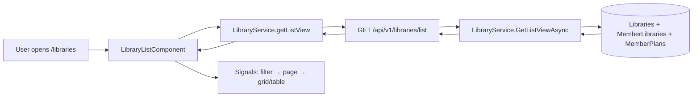
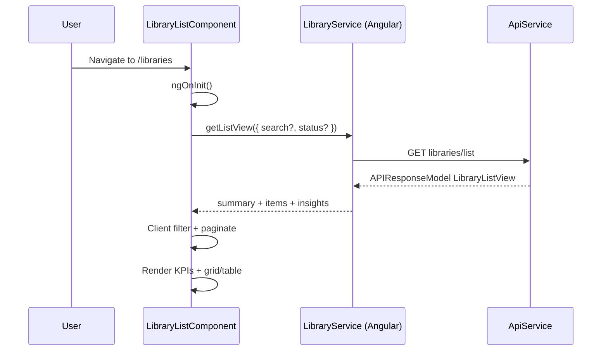
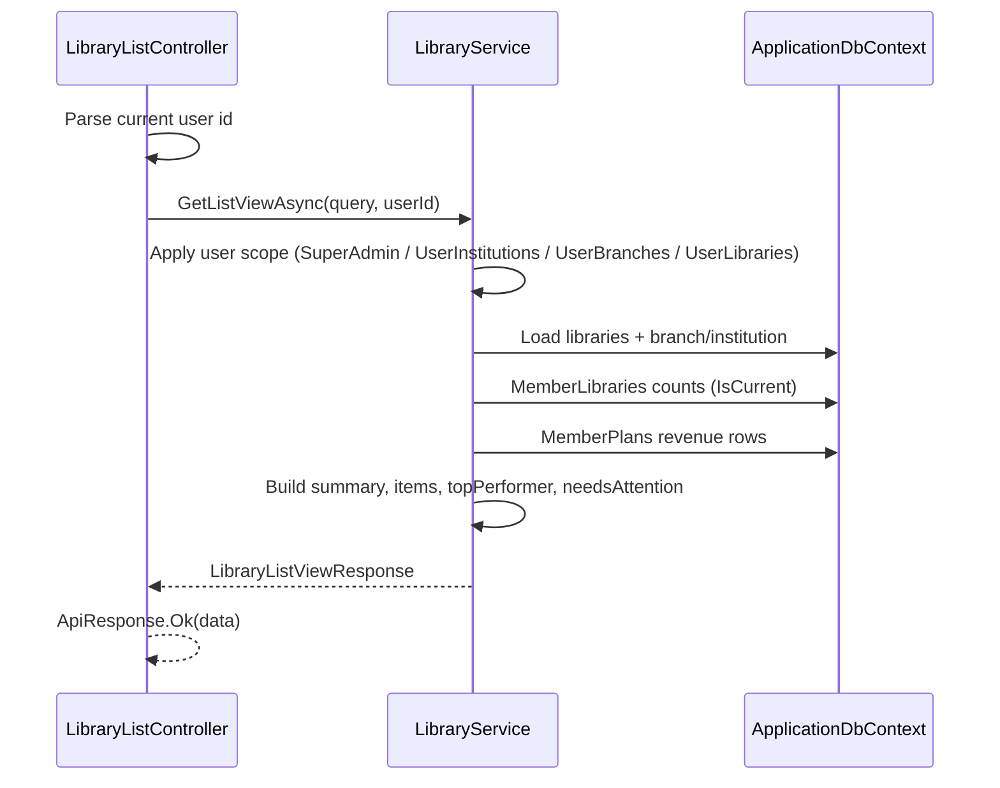

# Libraries List — Implementation Workflow

End-to-end workflow for the **Libraries List** feature across **SLMS_UI** (Angular) and **SLMS_API** (.NET).

**Module:** Organization · **Route:** `/libraries` · **Depends on:** M-01 Authentication, institution/branch hierarchy

---

## 1. Overview

| Layer | Entry | Strategy |
|-------|--------|----------|
| **Angular** | Route `/libraries` | Single API load → client-side filter (institution, branch, floor, occupancy), paginate, grid/table toggle |
| **.NET** | `GET /api/v1/libraries/list` | User-scoped aggregate list with KPIs, occupancy, revenue, insights |



**UI reference:** Lovable `docs/lovable-source/src/routes/_authenticated.libraries.index.tsx`  
**KPI cards:** Same `inst-stat-kpi` pattern as institution list and branch list.

---

## 2. Angular Workflow (SLMS_UI)

### 2.1 Routing

| Route | Component | File |
|-------|-----------|------|
| `/libraries` | `LibraryListComponent` | `SLMS_UI/src/app/features/libraries/library-list-component/` |
| `/libraries/create` | `CreateLibrary` | `SLMS_UI/src/app/features/libraries/create-library/` |
| `/libraries/:libraryId` | `LibraryDetailComponent` | `SLMS_UI/src/app/features/libraries/library-detail-component/` |
| `/libraries/:libraryId/edit` | `LibraryEdit` | `SLMS_UI/src/app/features/libraries/library-edit/` |
| `/institutions/:institutionId/addlibrary` | `CreateLibrary` (institution locked) | Same create module |
| `/branches/:branchId/addlibrary` | `CreateLibrary` (institution + branch locked) | Same create module |

Route config: `SLMS_UI/src/app/app.routes.ts`  
Navigation: sidebar **Libraries** → `/libraries` (`SLMS_UI/src/app/core/constants/navigation.ts`).

> **Detail:** See [library-detail-workflow.md](./library-detail-workflow.md) for tabs, hours, plans, and seat layout.

### 2.2 Page layout & Entitlements

```
PageHeader (View branches, New library)
├── KPI section (inst-stat-kpi — 2 cards)
│   ├── Portfolio — total libraries, active, occupancy, branches/capacity/near-capacity grid
│   └── Revenue MTD — member plan payments + period breakdown
├── Glass card — filter bar
│   ├── Search (debounced → server)
│   ├── Status (server)
│   ├── Institution / Branch / Occupancy band / Floor (client)
│   └── Grid ↔ Table toggle
└── Content
    ├── Grid — library cards (occupancy bar, capacity/members/hours)
    ├── Table — sortable-style columns with occupancy progress
    └── Pagination (12 / 24 / 48 per page)
```

**Creation Entitlements & Permissions:**
- `canCreateLibrary` computed signal checks `OrganizationEntitlementService.canCreateLibrary()` (Basic tier blocked; Value, Premium, and Trial permitted) and `AuthService.hasPermission(PermissionKey.LibrariesCreate)`.

### 2.3 Page load sequence



**Steps:**

1. Initial load and debounced search (250 ms) call `getListView()`.
2. Server filters: `search`, `status` (and optional `institutionId`, `branchId` query params on API).
3. Client filters: institution, branch, floor, occupancy band.
4. Pipeline: `items` → `filtered` → `paged` → template.

### 2.4 State management

**Pattern:** Angular signals + computed.

| Signal | Purpose |
|--------|---------|
| `items`, `summary`, `topPerformer`, `needsAttention` | API payload |
| `loading`, `error` | Fetch state |
| `query`, `statusFilter` | Server-side filters |
| `institutionFilter`, `branchFilter`, `floorFilter`, `occFilter` | Client-side filters |
| `view` | `grid` \| `table` (default **`grid`**) |
| `page`, `pageSize` | Client pagination (12 / 24 / 48) |

### 2.5 Grid card behaviour

| Element | Source |
|---------|--------|
| Name, branch, floor | `LibraryListItem` |
| Occupancy bar | `occupancyPercent` (color: low / mid / high) |
| Capacity, members, hours | `capacity`, `memberCount`, `hoursStart`–`hoursEnd` (from branch) |
| Top performer / needs attention flags | `topPerformer`, `needsAttention` from API |
| Click target | `/branches/{branchId}?tab=libraries` |

### 2.6 Angular services & models

| File | Role |
|------|------|
| `features/libraries/library.service.ts` | `getListView()`, `createlibrary()` |
| `core/models/library-list.models.ts` | `LibraryListView`, `LibraryListItem`, `LibraryListSummary`, query types |

#### List-related API calls (Angular)

| Method | HTTP | Endpoint |
|--------|------|----------|
| `getListView(query?)` | GET | `libraries/list` |
| `createlibrary(inst, branch, body)` | POST | `institutions/{id}/branches/{id}/libraries` |

---

## 3. .NET Workflow (SLMS_API)

### 3.1 Request flow



### 3.2 Controller

**File:** `SLMS_API/Controllers/LibraryListController.cs`  
**Route:** `api/v1/libraries`  
**Auth:** Requires authenticated user (`ICurrentUserService.UserId`)

| HTTP | Route | Action | Service |
|------|-------|--------|---------|
| GET | `/list` | `GetListView` | `GetListViewAsync` |

**Query params (`LibraryListQuery`):**

| Param | Description |
|-------|-------------|
| `search` | Library name, branch, institution, city, address |
| `status` | `active`, `maintenance`, `closed` / `inactive` (omit or `all` = no filter) |
| `institutionId` | Optional GUID filter |
| `branchId` | Optional GUID filter |

### 3.3 `GetListViewAsync` logic

**File:** `SLMS_API/Application/Services/LibraryService.cs`

1. **User scope** — non–Super Admin users see libraries where they have:
   - `UserInstitutions` (institution access), or
   - `UserBranches` (branch access), or
   - `UserLibraries` (direct library assignment).
2. Apply `search`, `status`, `institutionId`, `branchId` filters.
3. Project library rows with institution/branch names, floor, capacity, operating hours from branch.
4. **Member count** — distinct members per library from `MemberLibraries` where `IsCurrent && !IsDeleted`.
5. **Occupancy** — `memberCount / capacity × 100` (1 decimal).
6. **Revenue** — `MemberPlans` joined to `MemberLibraries` by library; aggregated via `InstitutionRevenueHelper.AggregateByLibrary`.
7. **Summary** — totals, active count, avg occupancy, near-capacity (≥ 80%), distinct branch count, revenue periods.
8. **Insights** — top performer (highest occupancy), needs attention (lowest 4 by occupancy).

### 3.4 DTOs

| DTO | File |
|-----|------|
| `LibraryListQuery` | `SLMS_API/Application/Contracts/Organizations/Queries/LibraryListQuery.cs` |
| `LibraryListViewResponse` | `SLMS_API/Application/Contracts/Organizations/Responses/LibraryListViewResponse.cs` |
| `LibraryListSummaryResponse` | Same file |
| `LibraryListItemResponse` | Same file |
| `LibraryListInsightResponse` | Same file |

### 3.5 Helpers

| Helper | Role |
|--------|------|
| `InstitutionUiHelper.ToLibraryStatusLabel` | Display status from `InstitutionStatus` + `IsActive` |
| `InstitutionRevenueHelper.AggregateByLibrary` | MTD / quarter / year revenue by library |

### 3.6 Database entities

| Entity | Role |
|--------|------|
| `Library` | Name, floor, capacity, status |
| `Branch` | Branch name, city, operating hours |
| `Institution` | Institution name |
| `MemberLibrary` | Current member assignment per library |
| `MemberPlan` | Paid amounts for revenue KPIs |
| `UserInstitution`, `UserBranch`, `UserLibrary` | Access scoping |

---

## 4. User journeys

### 4.1 Browse libraries network-wide

```
Open /libraries
  → Load scoped library list + KPIs
  → Search by name / branch / city (server)
  → Filter by status (server)
  → Filter by institution, branch, floor, occupancy (client)
  → Toggle grid ↔ table
  → Paginate results
```

### 4.2 Create a new library

```
/libraries → New library
  → /libraries/create (institution + branch selectable)

Institution detail → Libraries tab → Add library
  → /institutions/{id}/addlibrary (institution locked)

Branch detail → Libraries tab → Add library
  → /branches/{id}/addlibrary (institution + branch locked)
```

### 4.3 Drill-down from list card

```
Click library card or table row
  → /branches/{branchId}?tab=libraries
  → Branch detail Libraries tab (institution-scoped table)
```

---

## 5. File map

```
SLMS_UI/
├── src/app/app.routes.ts
├── src/app/core/models/library-list.models.ts
├── src/app/core/constants/navigation.ts
└── src/app/features/libraries/
    ├── library.service.ts
    ├── library-list-component/
    │   ├── library-list-component.ts
    │   ├── library-list-component.html
    │   └── library-list-component.css
    └── create-library/
        ├── create-library.ts
        └── create-library.html

SLMS_API/
├── Controllers/LibraryListController.cs
├── Application/
│   ├── Services/LibraryService.cs
│   ├── Services/Interfaces/ILibraryService.cs
│   ├── Helpers/InstitutionRevenueHelper.cs      # AggregateByLibrary
│   ├── Helpers/InstitutionUiHelper.cs
│   └── Contracts/Organizations/
│       ├── Queries/LibraryListQuery.cs
│       └── Responses/LibraryListViewResponse.cs
```

---

## 6. Known gaps & extension points

| Area | Status |
|------|--------|
| Library detail | Implemented — [library-detail-workflow.md](./library-detail-workflow.md) |
| Server-side pagination | Full scoped list returned; pagination is client-side |
| Revenue KPI query | Aggregated in SQL (`AggregateSummaryForLibrariesAsync`) — not row-by-row in memory |
| Multi-select filters (Lovable) | Single-select dropdowns; same data coverage |
| Library QR print from list | Planned — see [attendance-kiosk-workflow.md](./attendance-kiosk-workflow.md) |
| Sortable table columns | Display only; sort not wired in Angular yet |
| Institution `libraries-view` vs global list | Institution tab is scoped to one institution; `/libraries` is cross-institution for user scope |

---

## 7. Related docs

- Institution detail (Libraries tab): [institution-detail-workflow.md](./institution-detail-workflow.md)
- Library detail (`/libraries/:id`) — Members tab: [scoped-members-workflow.md](./scoped-members-workflow.md)
- Branch detail (Libraries tab): `/branches/:branchId?tab=libraries`
- Books (per-library scope): [books-workflow.md](./books-workflow.md)
- Attendance kiosk (library QR): [attendance-kiosk-workflow.md](./attendance-kiosk-workflow.md)
- Members list: [members-list-workflow.md](./members-list-workflow.md)
- Scoped members tab: [scoped-members-workflow.md](./scoped-members-workflow.md)
- Lovable reference: `docs/lovable-source/src/routes/_authenticated.libraries.index.tsx`
