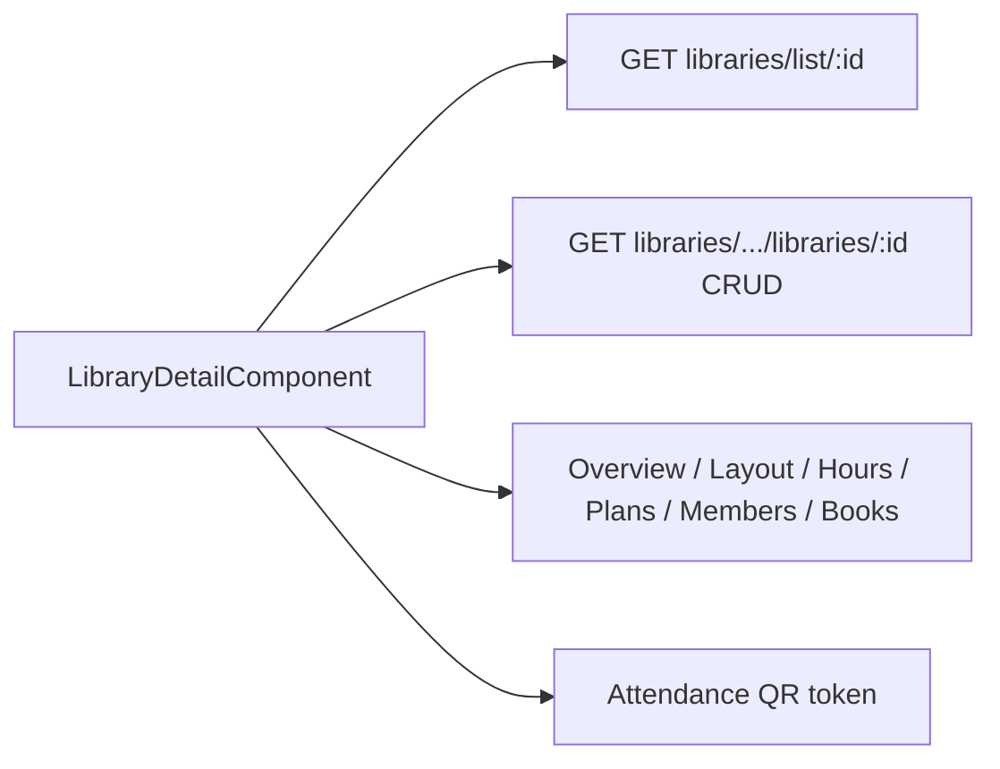

# Library Detail — Implementation Workflow

End-to-end workflow for **M-08 Library detail** across **SLMS_UI** (Angular) and **SLMS_API** (.NET).

**Module ID:** M-08 · **Routes:** `/libraries/:libraryId`, nested under branch/institution · **Depends on:** M-05 Branches, M-06 Members

> Global list: [libraries-list-workflow.md](./libraries-list-workflow.md)

---

## 1. Overview

Library detail is a tabbed workspace: overview, seat layout, hours & calendar, plans, members, books, attendance QR, and settings.



---

## 2. Angular Workflow (SLMS_UI)

### 2.1 Routing

| Route | Component | Notes |
|-------|-----------|-------|
| `/libraries/:libraryId` | `LibraryDetailComponent` | Global entry |
| `/libraries/:libraryId/edit` | `LibraryEdit` | Edit form |
| `/libraries/:libraryId/members/*` | Member components | Scoped members |
| `/branches/:branchId/libraries/:libraryId` | `LibraryDetailComponent` | Branch nested |
| `/institutions/.../libraries/:libraryId` | `LibraryDetailComponent` | Institution nested |

**File:** `SLMS_UI/src/app/features/libraries/library-detail-component/`

### 2.2 Tabs

| Tab | Features |
|-----|----------|
| Overview | KPIs, occupancy chart, activity feed |
| Layout | Seat grid, sections, floor utilisation |
| Hours | Weekly hours + exceptions; calendar component |
| Plans | `LibraryPlansPanelComponent` — CRUD membership plans |
| Members | `ScopedMembersPanelComponent` |
| Books | Link to books scoped by library |
| Attendance | Library QR display / print |
| Settings | Status, capacity, metadata |

**Utilities:** `library-detail.util.ts`, `library-calendar/` subfolder

### 2.3 Key child components

| Component | Path |
|-----------|------|
| `LibraryCalendarComponent` | `library-detail-component/library-calendar/` |
| `LibraryPlansPanelComponent` | `libraries/components/library-plans-panel/` |
| `ScopedMembersPanelComponent` | `members/components/scoped-members-panel/` |

---

## 3. .NET Workflow (SLMS_API)

### Detail (list controller — read-optimized)

**Controller:** `SLMS_API/Controllers/LibraryListController.cs`  
**Route:** `api/v1/libraries`

| Method | Endpoint | Purpose |
|--------|----------|---------|
| GET | `/{libraryId}` | Detail view aggregate |
| GET | `/{libraryId}/calendar` | Calendar data |
| GET | `/{libraryId}/attendance-qr` | QR token for kiosk |

### CRUD (institution/branch scoped)

**Controller:** `SLMS_API/Controllers/LibrariesController.cs`  
**Route:** `api/v1/institutions/{institutionId}/branches/{branchId}/libraries`

| Method | Endpoint | Purpose |
|--------|----------|---------|
| GET | `/` | List for branch |
| POST | `/` | Create library |
| GET | `/{libraryId}` | Get entity |
| PUT | `/{libraryId}` | Update metadata |
| PUT | `/{libraryId}/weekly-hours` | Hours schedule |
| PUT | `/{libraryId}/hours-exceptions` | Exception dates |
| DELETE | `/{libraryId}` | Delete |
| GET | `/capacity-summary` | Capacity KPI helper |

**Plans:** `PlanController` under same library scope.

---

## 4. File map

```
SLMS_UI/src/app/features/libraries/
├── library-detail-component/
│   ├── library-detail.component.ts
│   ├── library-detail.util.ts
│   └── library-calendar/
├── library-edit/
├── create-library/
├── library-list-component/
├── library.service.ts
└── components/library-plans-panel/

SLMS_API/
├── Controllers/LibraryListController.cs
├── Controllers/LibrariesController.cs
└── Controllers/PlanController.cs
```

---

## 5. Test checklist

- [ ] Open library from `/libraries` list → detail loads
- [ ] Tab navigation via URL query `?tab=`
- [ ] Weekly hours save and exception validation
- [ ] Seat layout renders sections and occupancy colors
- [ ] Plans panel CRUD
- [ ] Members tab uses scoped routes
- [ ] Attendance QR token loads for kiosk

---

## 6. Related docs

- [libraries-list-workflow.md](./libraries-list-workflow.md)
- [scoped-members-workflow.md](./scoped-members-workflow.md)
- [books-workflow.md](./books-workflow.md)
- [attendance-kiosk-workflow.md](./attendance-kiosk-workflow.md)
