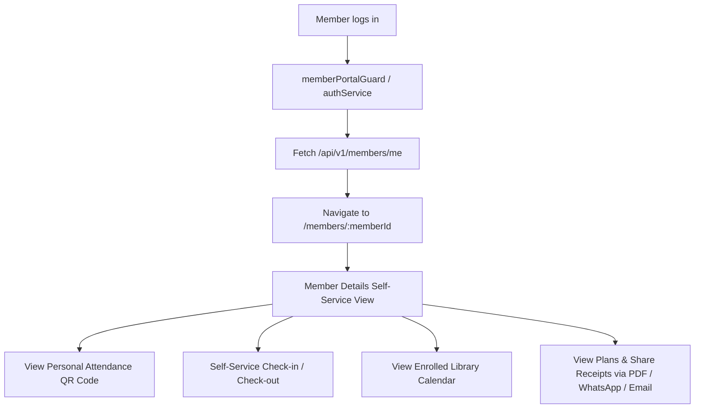

# Member Portal & Self-Service — Implementation Workflow

End-to-end workflow for **M-16 Member Portal & Self-Service** across **SLMS_UI** (Angular) and **SLMS_API** (.NET).

**Module ID:** M-16 · **Role:** `Members` · **Target Route:** `/members/:memberId` (Self-service isolated view)

---

## 1. Overview

Users assigned the `Members` role are restricted to their own member details page. Administrative navigation (sidebar links, institution/branch/library management, administrative member editing) is locked down, allowing the member to view their profile, plans, library calendar, attendance heatmap, and perform self-service check-in / check-out and attendance QR code scanning.



---

## 2. Angular Workflow (SLMS_UI)

### 2.1 Route Protection & Member Portal Guard

**Guard:** `SLMS_UI/src/app/core/guards/member-portal.guard.ts`  
**Service:** `SLMS_UI/src/app/core/services/member-portal.service.ts`

- When a user with the `Members` role logs in or attempts to navigate anywhere on the platform:
  - `memberPortalGuard` intercepts the route.
  - If the user is a `Members` role user and tries to access routes other than `/members/:ownMemberId`, they are redirected directly to `/members/:ownMemberId`.
  - Non-member users are prevented from being trapped in member self-service redirects.

### 2.2 Member ID Resolution (`MemberPortalService`)

- Calls `GET /api/v1/members/me` to obtain the authenticated user's associated `MemberId`.
- Caches the ID in an Angular signal `memberId()`.
- Cleared upon `logout()`.

### 2.3 UI Conditional Rendering & Restrictions

**Component:** `MemberDetailsComponent` (`SLMS_UI/src/app/features/members/member-details-component/`)

- `isMemberPortalView` computed signal:
  ```typescript
  protected readonly isMemberPortalView = computed(
    () => this.auth.isMemberPortalUser() && this.memberPortal.memberId() === this.memberId,
  );
  ```
- **Hidden / Disabled in Member Portal View:**
  - "Edit profile" button (`@if (!isMemberPortalView() && canUpdateMember())`).
  - "Actions" dropdown menu (Change plan, deactivate, delete, etc.).
  - Manual "Edit" button for today's attendance.
  - Sidebar administrative links (Institutions, Branches, Libraries, Users, Settings).

### 2.4 Payments & Plan Receipts Sharing

**Component:** `MemberPaymentsComponent` (`SLMS_UI/src/app/features/members/pages/member-payments-component/`)

- Dedicated direct quick-action buttons per table row:
  - **Download PDF:** Generates PDF payment receipt.
  - **WhatsApp:** Direct WhatsApp share with member phone number pre-filled.
  - **Email:** Direct email receipt sharing.
- Header batch actions: "Download all", "WhatsApp", "Email" with responsive tooltips and disabled states when phone/email is missing.

---

## 3. .NET Workflow (SLMS_API)

### 3.1 Self-Service Endpoints

#### 1. Current Member ID Resolution
**Route:** `GET /api/v1/members/me`  
**Controller:** `SLMS_API/Controllers/MembersController.cs`  
**Response:** `CurrentMemberResponse { MemberId = ... }`

#### 2. Hybrid Authorization for Attendance Check-In / Check-Out
**Controller:** `SLMS_API/Controllers/AttendanceController.cs`  
- Endpoint: `POST /api/v1/attendance/members/{memberId}/check-in`
- Endpoint: `POST /api/v1/attendance/members/{memberId}/check-out`
- **Authorization Logic:**
  - Allowed if user has `SuperAdmin` role or `AttendanceCreate` / `AttendanceUpdate` permission claim.
  - **Self-Service Fallback:** If user lacks administrative permission, checks if `_memberService.GetCurrentMemberIdAsync()` matches `{memberId}`. If it matches, the request succeeds. Otherwise, returns `403 Forbidden`.

#### 3. Member QR Code Retrieval
**Controller:** `SLMS_API/Controllers/AttendanceScannerController.cs`  
- Endpoint: `GET /api/v1/attendance/scanner/members/{memberId}/qr`
- **Authorization Logic:**
  - Allowed for `SuperAdmin` or users with `AttendanceScannerUse`, `AttendanceView`, or `MembersView` permissions.
  - **Self-Service Fallback:** Allowed if the authenticated user owns `{memberId}`.

#### 4. Library Calendar & Plans Access
**Controllers:** `LibraryListController.cs`, `PlanController.cs`  
- Members enrolled in a library (`MemberLibraries` table) can view that library's calendar and available plans via scoped query expansion in `LibraryService.BuildScopedLibrariesQueryAsync`.

---

## 4. Testing & Verification Checklist

- [x] Login with `Members` role user redirects to `/members/:memberId`.
- [x] Sidebar navigation is restricted.
- [x] Profile edit and actions dropdown are hidden.
- [x] Member can view Attendance QR code without 403 error.
- [x] Member can perform self check-in and check-out.
- [x] Member can view library calendar and plans for enrolled libraries.
- [x] Receipt download, WhatsApp, and Email actions work cleanly on Payments tab.
