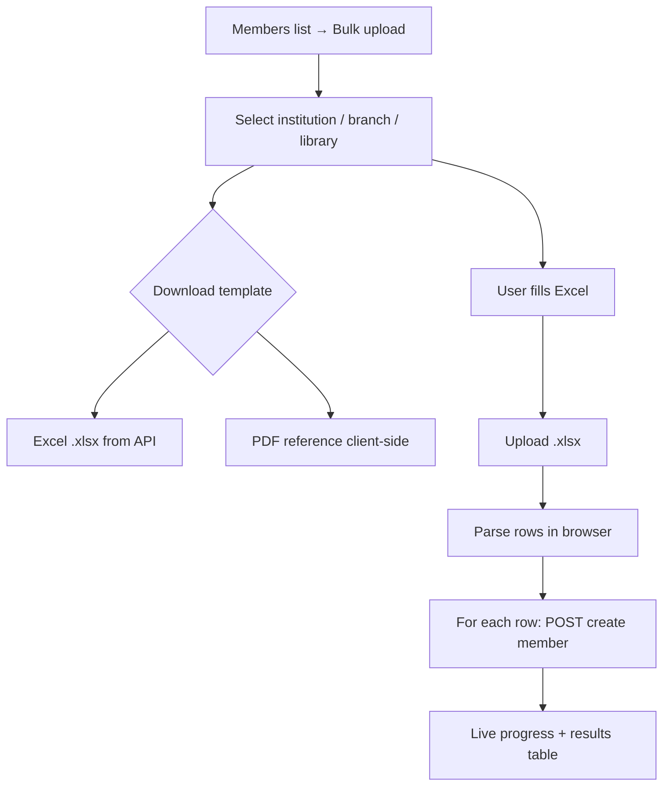

# Members Bulk Upload — Implementation Workflow

End-to-end workflow for **bulk member enrollment via Excel** across **SLMS_UI** (Angular) and **SLMS_API** (.NET).

**Module ID:** M-06 (extension) · **Route:** `/members/bulk-upload` · **Depends on:** M-06 Members (single create), M-08 Libraries (plans)

---

## 1. Overview

Administrators download an Excel template (or PDF reference), fill member rows for a selected library, and upload. Each row follows the **same rules as single add member** (unique email, plan validation, default member password).

| Layer | Entry | Strategy |
|-------|--------|----------|
| **Angular** | `/members/bulk-upload` | Parse `.xlsx` in browser → create members **one row at a time** with live progress |
| **.NET** | Template + optional bulk API | Excel template generation (ClosedXML); row create reuses `CreateAsync` |



### Business rules

| Rule | Implementation |
|------|----------------|
| **BR-06c.1** Phone number is required & unique | `^[6-9]\d{9}$`; Indian mobile format; used as fallback login |
| **BR-06c.2** Email is optional | If provided, validated & unique system-wide; receives credentials email |
| **BR-06c.3** Duplicate emails or phones within file rejected | Client `seenEmails` / `seenPhones` set + API bulk helper |
| **BR-06c.4** Plan name must match active library plan | Resolved to `PlanId` before create |
| **BR-06c.5** Default member password from config | `Identity:DefaultMemberPassword` on Identity user create |
| **BR-06c.6** Partial success allowed | Failed rows reported; successful rows remain committed |
| **BR-06c.7** Photo / Aadhaar not in bulk | Upload individually after create on member detail |

---

## 2. Angular Workflow (SLMS_UI)

### 2.1 Routing & entry

| Route | Component | Entry |
|-------|-----------|-------|
| `/members/bulk-upload` | `BulkUploadMembersComponent` | Members list header **Bulk upload** button |

Route config: `SLMS_UI/src/app/app.routes.ts`

### 2.2 Page flow

1. **Select location** — institution → branch → library (same dropdown data as create member).
2. **Download template**
   - **Excel** — `GET .../members/bulk/template` (API; includes Members, Instructions, Plans sheets).
   - **PDF** — client-generated reference (`member-bulk-template-export.util.ts`) with columns, sample row, plan list.
3. **Upload filled Excel** — `.xlsx` only, max 5 MB.
4. **Live processing** — progress bar, `X / Y done`, success/fail counts, current row label.
5. **Results table** — updates after each row; final summary toast.

### 2.3 Upload implementation (live progress)

The UI **does not** call `POST .../members/bulk` for the main flow. Instead:

1. `parseMemberBulkExcel(file)` — `xlsx` library, reads **Members** sheet (or first sheet).
2. `getLibraryPlan(...)` — resolve plan names → IDs.
3. Loop rows sequentially → `MemberService.createMember(...)` per row.
4. Update `uploadProgress` and `uploadResult` signals after each iteration.

This gives real-time **“5 / 20 done”** feedback. The API bulk endpoint remains for programmatic use.

### 2.4 Excel template columns

| Column | Required | Notes |
|--------|----------|-------|
| `FullName` | Yes | 2–100 characters |
| `Email` | No | Optional; unique if provided; used for login username & credentials email |
| `PhoneNumber` | Yes | 10-digit Indian mobile number (`^[6-9]\d{9}$`) |
| `DateOfBirth` | No | Optional; `yyyy-MM-dd` format if provided |
| `Gender` | Yes | Male, Female, Other |
| `Shift` | Yes | Morning, Afternoon, Evening, Night, Full, General |
| `PlanName` | Yes | Must match active plan for selected library |

### 2.5 Key files

| File | Role |
|------|------|
| `bulk-upload-members-component/` | Page UI, scope form, upload orchestration |
| `member-bulk-upload.util.ts` | Parse + validate Excel rows |
| `member-bulk-template-export.util.ts` | PDF reference download (jsPDF) |
| `MemberService.ts` | `downloadBulkTemplate`, `createMember`, `getLibraryPlan`, `bulkUploadMembers` (API bulk, optional) |
| `MemberRequest.ts` | `BulkMemberUploadResponse`, `BulkMemberUploadRowResult` |

---

## 3. .NET Workflow (SLMS_API)

### 3.1 Endpoints (`MembersController`)

**Route:** `api/v1/institutions/{institutionId}/branches/{branchId}/libraries/{libraryId}/members`

| HTTP | Route | Action | Purpose |
|------|-------|--------|---------|
| GET | `bulk/template` | `DownloadBulkTemplate` | Excel template `.xlsx` |
| POST | `bulk` | `BulkUpload` | Server-side parse + create all rows (single response) |
| POST | `/` | `Create` | Single member (used by UI row-by-row upload) |

### 3.2 Services & helpers

| File | Role |
|------|------|
| `MemberService.GetBulkUploadTemplateAsync` | Load library plans → `MemberBulkExcelHelper.GenerateTemplate` |
| `MemberService.BulkCreateAsync` | Parse upload, validate, call `CreateAsync` per row |
| `MemberBulkExcelHelper.cs` | ClosedXML generate/parse, row validation |
| `BulkMemberUploadResponse.cs` | `TotalRows`, `SuccessCount`, `FailedCount`, `Results[]` |

### 3.3 Dependencies

- **ClosedXML** — Excel read/write (`SLMS_API.csproj`)

---

## 4. User journey

```
Members → Bulk upload
  → Select library
  → Download Excel template (and optional PDF reference)
  → Fill rows in Excel
  → Choose file → Upload members
  → Watch progress (N / total, succeeded, failed)
  → Review per-row results
  → Return to /members list
```

---

## 5. Test checklist

- [ ] Template download requires library selection
- [ ] Excel template includes Plans sheet for selected library
- [ ] PDF reference lists same plans
- [ ] Upload rejects non-`.xlsx` and files > 5 MB
- [ ] Progress bar advances per row
- [ ] Duplicate email in file → row failed, others continue
- [ ] Duplicate email in DB → row failed with API message
- [ ] Invalid plan name → row failed before API call
- [ ] Successful rows appear in `/members` list after completion

---

## 6. Related docs

- [members-list-workflow.md](./members-list-workflow.md) — list page, create member
- [members-detail-workflow.md](./members-detail-workflow.md) — photo/Aadhaar after bulk create
- [scoped-members-workflow.md](./scoped-members-workflow.md) — contextual create URLs (bulk is global only)
