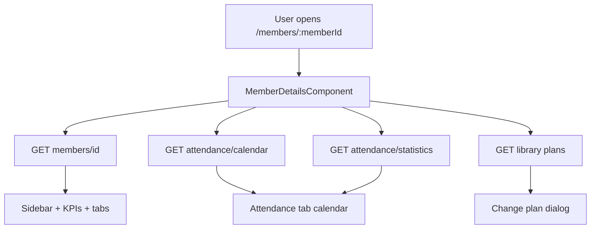
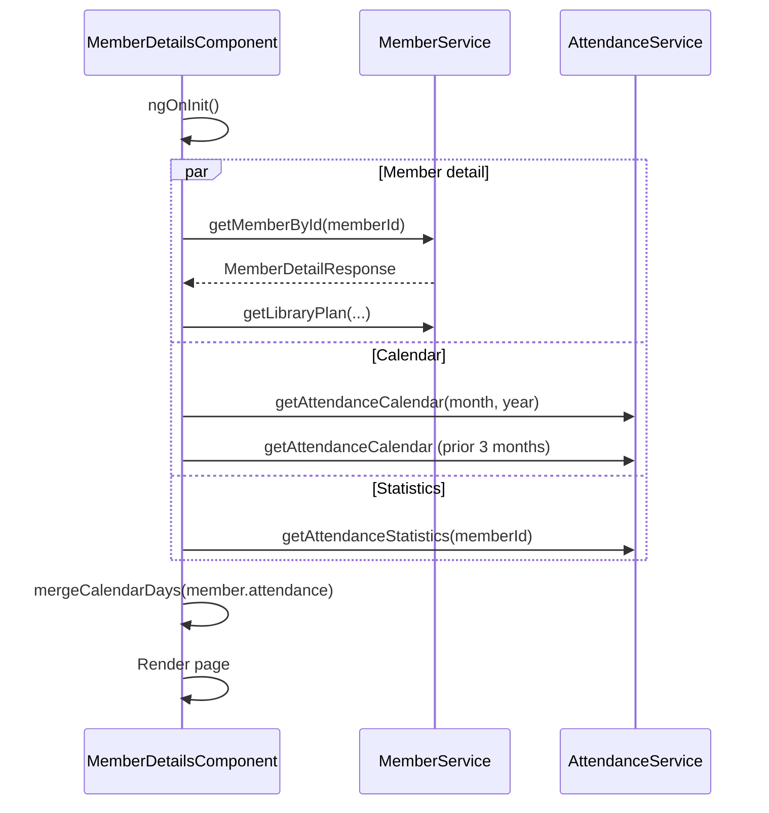
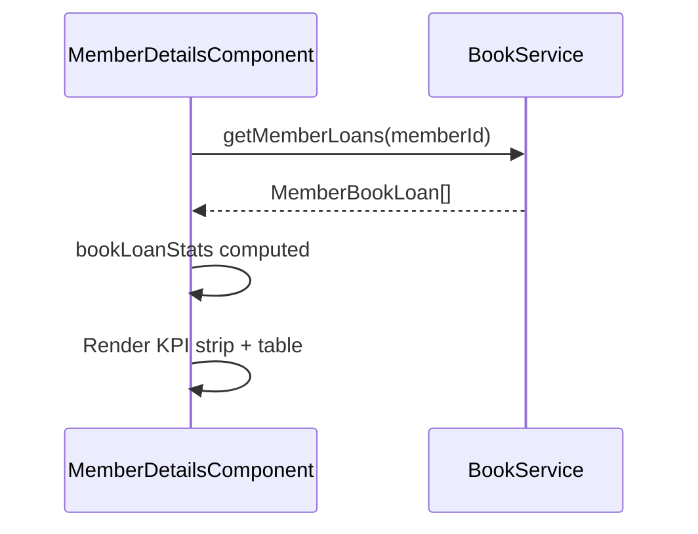
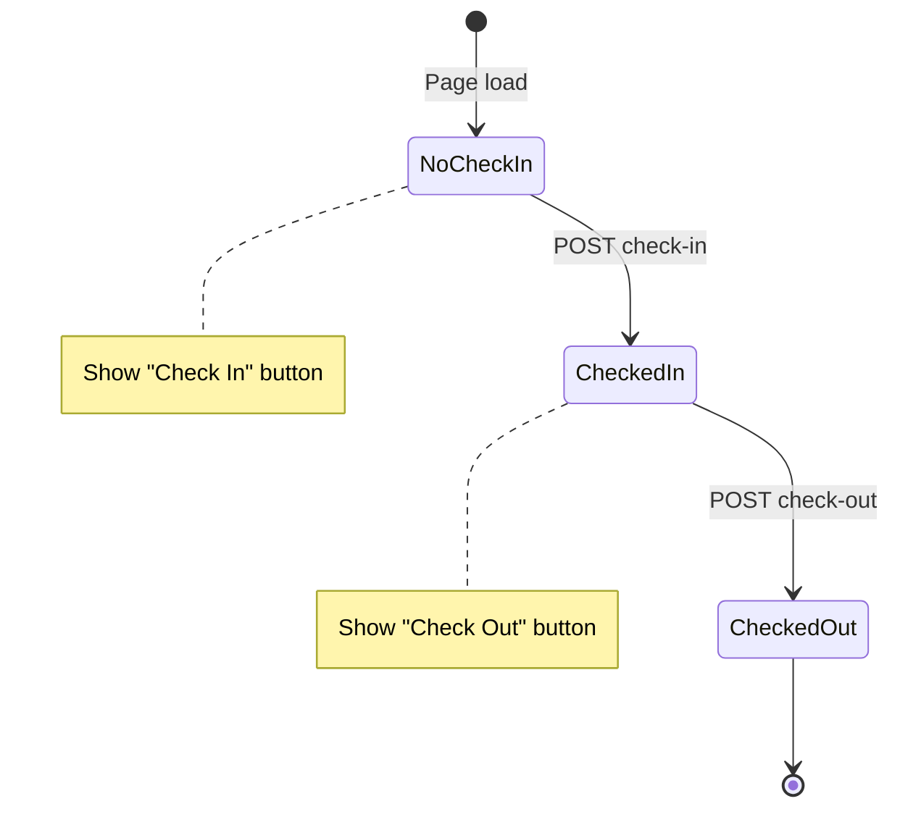
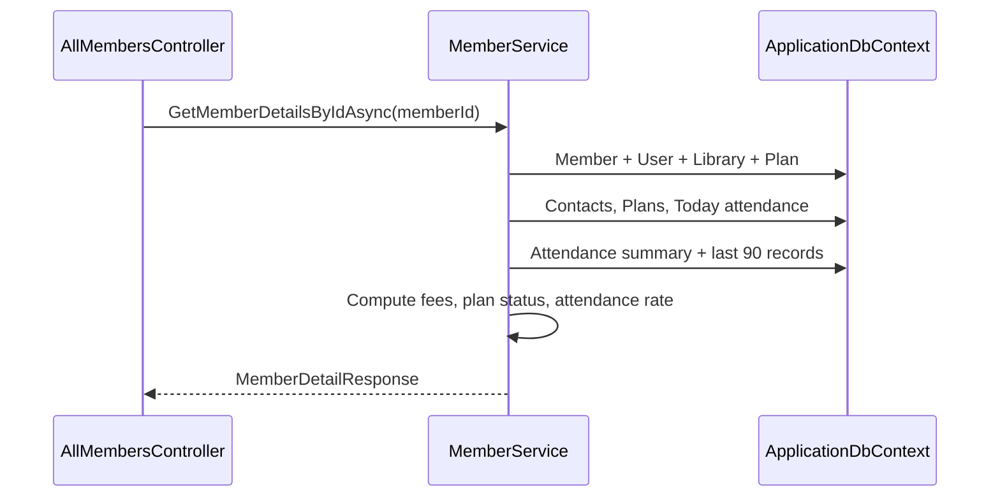
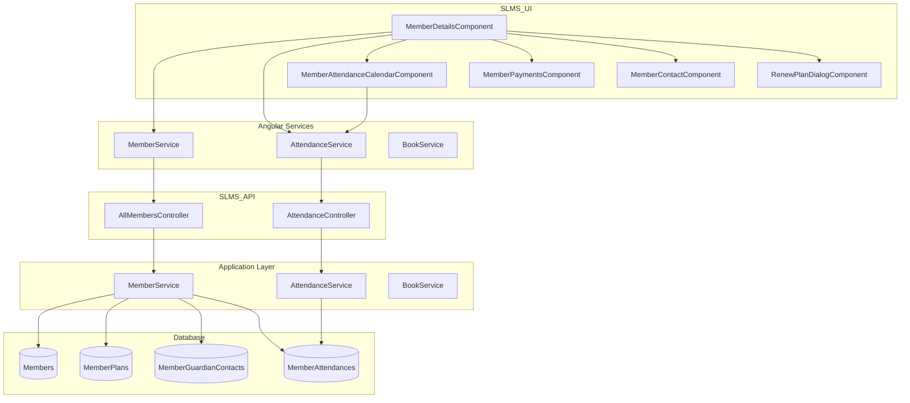

# Member Details — Implementation Workflow

End-to-end workflow for the **Member Details** feature across **SLMS_UI** (Angular) and **SLMS_API** (.NET).

---

## 1. Overview

| Layer | Entry | Strategy |
|-------|--------|----------|
| **Angular** | Route `/members/:memberId` or nested contextual routes | Tabbed single page; multiple API calls per tab/feature |
| **.NET** | `GET /api/v1/members/{id}` + attendance endpoints | Aggregated detail DTO + separate attendance APIs |

> Nested routes (e.g. `/institutions/{id}/members/{memberId}`) use the same component and API; back navigation is context-aware via `entity-routes.util.ts`. See [scoped-members-workflow.md](./scoped-members-workflow.md).



---

## 2. Angular Workflow (SLMS_UI)

### 2.1 Routing

| Route | Component | File |
|-------|-----------|------|
| `/members/:memberId` | `MemberDetailsComponent` | Global entry |
| `/institutions/:institutionId/members/:memberId` | Same | Back → institution `?tab=members` |
| `/institutions/:institutionId/branches/:branchId/members/:memberId` | Same | Back → branch `?tab=members` |
| `/branches/:branchId/members/:memberId` | Same | Back → branch `?tab=members` |
| `/libraries/:libraryId/members/:memberId` | Same | Back → library `?tab=members` |

Route params: `memberId` plus optional `institutionId`, `branchId`, `libraryId` from parent segments (`collectRouteParams`).

Entry from list: `routerLink` via `memberDetailLink()` or `['/members', m.id]`.

### 2.2 Page layout

```
PageHeader (back, copy ID, actions)
├── Sidebar card
│   Profile, contact, institution, seat, plan
└── Main column
    ├── KPI strip (plan, attendance %, visits, books, fees, tenure)
    ├── Lifecycle banner + Renew CTA
    ├── Today's attendance card (check-in / check-out)
    ├── Tab selector (PrimeNG SelectButton)
    └── Tab content
```

### 2.3 Tabs

| Tab ID | Label | Status | Child / content |
|--------|-------|--------|-----------------|
| `overview` | Overview | Implemented | Insights, contacts, activity timeline, Aadhaar docs, **Attendance QR** |
| `attendance` | Attendance | Implemented | KPIs, calendar, check-in log, heatmap |
| `library-calendar` | Library Calendar | Implemented | `LibraryCalendarComponent` |
| `books` | Books | Implemented | Loan KPIs + borrow history via `BookService` |
| `ebooks` | E-Books | Implemented | `MemberDigitalBooksComponent` |
| `plans` | Payments & Plans | Implemented | `MemberPaymentsComponent` |
| `contacts` | Contacts | Implemented | `MemberContactComponent` |
| `password` | Change Password | Implemented | In-tab password reset form with visibility toggle & requirements check |

> `payments` exists in `TabId` type but is merged into the Plans tab in the UI.

### 2.4 Initial load sequence



**`ngOnInit` calls:**

1. `loadMemberDetails()` → `GET members/{memberId}`
2. `loadAttendanceCalendar()` → current month calendar
3. `loadRecentAttendance()` → prefetch 3 prior months (heatmap)
4. `loadAttendanceStatistics()` → 90-day stats for KPI cards

**On tab switch to `attendance`:** reload calendar + statistics.

### 2.5 Tab workflows

#### Overview

| Section | Data source |
|---------|-------------|
| Member insights | Computed from `memberDetails` (lifetime spend, renewal, shift, etc.) |
| Contacts | `MemberContactComponent` ← `memberDetails.contacts` |
| Activity timeline | Computed from `plans`, `attendance`, `joinedOn` |

#### Attendance

| Section | Data / component |
|---------|------------------|
| Stats row | `GET attendance/statistics` (fallback: `calendarDays`) |
| Calendar | `MemberAttendanceCalendarComponent` (`angular-calendar`) |
| Check-in log | Last 30 days from `calendarDays` (≤ today only); duration from check-in/out times |
| 90-day heatmap | Client-computed from `calendarDays` (duration from check-in/out times) |
| Today's card | `memberDetails.todayAttendance` |

**Calendar component:** `SLMS_UI/src/app/features/members/components/member-attendance-calendar/`

| View | Behavior |
|------|----------|
| **Month** | Custom cell template; status colors per day; hours from check-in/out times |
| **Week** | All-day status row + timesheet grid (6:00–22:00, 1-hour slots); timed check-in → check-out blocks |
| **Year** | 12-month summary grid (present / late / absent counts); click a month → month view |

**Status colors (month cells + week blocks):**

| Status | Color | Month | Week |
|--------|-------|-------|------|
| Checked in | Blue | Cell background | All-day badge + timed block |
| Present | Green | Cell background | All-day badge + timed block |
| Late | Amber | Cell background | All-day badge + timed block |
| Absent | Rose | Cell background | All-day badge only |
| Weekend / holiday | Slate | — | All-day badge + muted column |
| Future / no record | Neutral (dashed) | Cell only | Not rendered |

**Month view**

- Uses `calendarEvents()` — one all-day event per attendance day (from `records` input).
- Custom `#attendanceCellTpl`: day number, optional hours, tooltip via `mwlCalendarTooltip`.
- Hours on cell computed via `sessionDurationMinutes()` (check-in/out times take priority over `durationMinutes`).
- Future dates: neutral styling; no synthetic absent coloring.

**Week view (timesheet)**

- Uses `weekTimesheetEvents()` — separate computed event list from month view (two events per session day).
- **All-day status row (top):** `Present`, `Late`, `CheckedIn`, `Absent`, `Weekend`, or `Holiday` badge per day.
  - All-day events use `end = start + 1 day` (required by `angular-calendar` when `precision` is `minutes`).
- **Timed blocks (grid):** check-in → check-out on weekdays with sessions.
  - End time priority: `checkOutTime` / `checkOutAtUtc` → `durationMinutes` → live “now” if still checked in today → minimum 15 min block.
  - Block shows `HH:mm – HH:mm` and duration (e.g. `2h 19m`); same in/out time → `0h`.
  - Status label is **not** repeated inside the timed block (only in the all-day row).
- **Weekday absent**: rose all-day badge only (no timed block).
- **Weekend / holiday**: slate all-day badge; weekend columns use muted background.
- Grid config: `dayStartHour` 6, `dayEndHour` 22, `weekHourSegments` 1 (1-hour slots), `hourSegmentHeight` 30; time area scrollable.
- Custom `#weekEventTpl` with `timesheet-event--*` CSS classes and tooltips (date, status, in/out, hours on premises).
- Future dates are excluded from week events.

**Duration calculation (week, month hours, check-in log, heatmap)**

- `sessionDurationMinutes()` / `attendanceDurationMinutes()` compute from `checkInTime`/`checkOutTime` (or UTC fields) when both exist.
- Stale or incorrect `durationMinutes` from API is ignored when times are available (e.g. 14:14 in / 14:14 out → `0h`, not 4.5h).

**Year view**

- Client-side aggregation from `attendanceByDate` for the selected year.
- Each month card shows present / late / absent counts; navigates to that month in month view.

**Data inputs**

- `[records]` — merged `calendarDays` from parent (`mergeCalendarDays` keyed by `attendanceDate`).
- `[viewDate]` / `(viewDateChange)` — parent controls month/week navigation.
- Check-in/out times read from `checkInTime`, `checkOutTime`, or UTC equivalents on `AttendanceResponse`.

#### Payments & Plans

- Child: `MemberPaymentsComponent`
- Data: `memberDetails.plans`
- Renew: `RenewPlanDialogComponent` → `POST members/{id}/renew`
- Change plan: dialog → `POST members/{id}/plan-or-shift`
- Plan options: `GET institutions/{i}/branches/{b}/libraries/{l}/plans`
- **Receipt Sharing Quick Actions:**
  - Individual table row buttons: Download PDF, WhatsApp (pre-filled phone), Email (pre-filled mailto).
  - Batch actions on table header: "Download all", "WhatsApp", "Email".

### 2.6 Member Portal & Self-Service Mode

When viewed by a user logged in with the `Members` role:
- `isMemberPortalView` becomes `true`.
- Administrative buttons ("Edit profile", "Actions" dropdown, manual attendance "Edit") are hidden.
- Members have self-service access to:
  - **Attendance QR Code:** Retrieved via `GET /api/v1/attendance/scanner/members/{memberId}/qr` (self-service authorized).
  - **Self Check-In / Check-Out:** `POST /api/v1/attendance/members/{memberId}/check-in` & `check-out`.
  - **Enrolled Library Calendar & Plans:** Scoped query in API permits members to view plans and calendars for libraries where they hold an active membership.

#### Contacts

- Child: `MemberContactComponent`
- Read: `memberDetails.contacts`
- Write: `POST members/{id}/contacts` → reload member

#### Books

| Section | Data / component |
|---------|------------------|
| Overview KPI (sidebar) | `bookLoanStats()` — active loans count |
| Books tab KPIs | Active, overdue, returned, total from `bookLoans` |
| Borrow history table | `GET members/{memberId}/book-loans` |

**Load trigger:** `loadBookLoans()` on `ngOnInit` and when switching to the `books` tab.



| Column | Source field |
|--------|--------------|
| Book | `title`, `author` |
| Category | `category` |
| Borrowed | `borrowedAtUtc` |
| Due | `dueAtUtc` |
| Status | `BookLoanStatus` — Overdue uses destructive badge (**BR-12.3**) |

Circulation actions (issue/return) are performed from `/books` drawer, not the member profile.

### 2.6 Check-in / check-out workflow



**UI method:** `MemberDetailsComponent.checkIn(isCheckIn: boolean)`

**Request (`CheckInRequest`):**

```typescript
{
  memberId: string,
  seatNumber: member.seatNumber ?? '0',
  deviceId: 'web',
  remarks: 'Checked in/out via web app'
}
```

| Action | Endpoint |
|--------|----------|
| Check in | `POST attendance/members/{id}/check-in` |
| Check out | `POST attendance/members/{id}/check-out` |

**On success:** reload member details, calendar, and statistics.

### 2.7 Plan lifecycle & renew

**Utility:** `SLMS_UI/src/app/features/members/member-lifecycle.util.ts`

- `computeMemberLifecycle()` — expiry state, days left, action text
- `renewTargetFromListMember()` / banner renew → `RenewPlanDialogComponent`
- `POST members/{id}/renew` → returns updated `MemberDetailResponse`

### 2.8 Action dialogs (header dropdown)

| Dialog | API wired? | Endpoint |
|--------|------------|----------|
| Change shift | Yes | `POST members/{id}/plan-or-shift` `{ shift }` |
| Change plan | Yes | `POST members/{id}/plan-or-shift` `{ planId }` |
| Transfer branch | No | UI only |
| Reassign seat | No | UI only |

### 2.9 Angular services & models

| Service | Path | Scope |
|---------|------|-------|
| `MemberService` | `SLMS_UI/src/app/features/members/MemberService.ts` | Component |
| `AttendanceService` | `SLMS_UI/src/app/core/services/attendance.service.ts` | Component |
| `BookService` | `SLMS_UI/src/app/features/books/book.service.ts` | Component |

| Model | Path |
|-------|------|
| `MemberDetailResponse` | `SLMS_UI/src/app/core/models/MemberRequest.ts` |
| `AttendanceResponse`, `AttendanceStatisticsResponse` | `SLMS_UI/src/app/core/models/attendanceModels.ts` |
| `MemberBookLoan`, `BookLoanStatus` | `SLMS_UI/src/app/core/models/book.models.ts` |
| `PlanResponse` | `SLMS_UI/src/app/core/models/institution-dropdown.model.ts` |

#### API call summary (detail page)

| HTTP | Endpoint | Trigger |
|------|----------|---------|
| GET | `members/{memberId}` | `loadMemberDetails()` |
| GET | `institutions/.../libraries/.../plans` | `getLibraryPlan()` |
| POST | `members/{id}/contacts` | Add contact |
| POST | `members/{id}/plan-or-shift` | Change shift/plan |
| POST | `members/{id}/renew` | Renew membership |
| POST | `attendance/members/{id}/check-in` | Check in |
| POST | `attendance/members/{id}/check-out` | Check out |
| GET | `attendance/members/{id}/calendar?month=&year=` | Calendar |
| GET | `attendance/members/{id}/statistics` | 90-day stats |
| GET | `members/{id}/book-loans` | Books tab + overview KPI |

---

## 3. .NET Workflow (SLMS_API)

### 3.1 Member detail request flow



### 3.2 `AllMembersController`

**File:** `SLMS_API/Controllers/AllMembersController.cs`  
**Route:** `api/v1/members`

| HTTP | Route | Returns |
|------|-------|---------|
| GET | `/{memberId}` | `MemberDetailResponse` |
| GET | `/{memberId}/book-loans` | `MemberBookLoanResponse[]` |
| POST | `/{memberId}/contacts` | `MemberContactResponse` |
| POST | `/{memberId}/plan-or-shift` | `MemberDetailResponse` |
| POST | `/{memberId}/renew` | `MemberDetailResponse` |

### 3.3 `GetMemberDetailsByIdAsync` aggregation

**File:** `SLMS_API/Application/Services/MemberService.cs`

| Data | Source |
|------|--------|
| Profile & org | `Member` + `ApplicationUser` + current `MemberLibrary` |
| Plans history | `MemberPlans` → `Plans` collection |
| Contacts | `MemberGuardianContacts` |
| Today attendance | `MemberAttendances` where `AttendanceDate == today` |
| Summary | Last visit, visits (30d window in summary query) |
| Recent attendance | Last 90 active records → `Attendance` |
| Metrics | `AttendanceRate`, `PresentDays`, `TotalSessions`, `FeesOwed`, `PlanStatus` |

### 3.4 Attendance API

**File:** `SLMS_API/Controllers/AttendanceController.cs`  
**Route:** `api/v1/attendance`

| HTTP | Route | Service method |
|------|-------|----------------|
| POST | `/members/{id}/check-in` | `CheckInAsync` |
| POST | `/members/{id}/check-out` | `CheckOutAsync` |
| GET | `/members/{id}/calendar?month=&year=` | `GetAttendanceCalendarAsync` |
| GET | `/members/{id}/statistics` | `GetStatisticsAsync` |

### 3.5 Attendance service behavior

**File:** `SLMS_API/Application/Services/AttendanceService.cs`

#### Check-in (`CheckInAsync`)

1. Validate member exists and is active.
2. Resolve current `MemberLibrary`.
3. Create `MemberAttendance` for today with `CheckInTime`, status `CheckedIn`.
4. Return `AttendanceResponse`.

#### Check-out (`CheckOutAsync`)

1. Load today's attendance with check-in.
2. Set `CheckOutTime`, `DurationMinutes`, status `Present`.
3. Return full `AttendanceResponse`.

#### Calendar (`GetAttendanceCalendarAsync`)

1. Load DB records for the requested month.
2. For each day **up to today only**:
   - DB record → map with `IsActive`, check-in/out UTC fields
   - Missing weekday → synthetic `Absent`
   - Weekend → synthetic `Holiday`
3. **Future dates are skipped** (no synthetic absent rows).

#### Statistics (`GetStatisticsAsync`)

1. 90-day window ending today.
2. Aggregates present, late, absent, leave days, attendance %, streaks.
3. Uses `GetAttendanceCalendarRangeAsync` across required months.

### 3.6 DTOs & entities

| Contract | File |
|----------|------|
| `MemberDetailResponse` | `SLMS_API/Application/Contracts/Organizations/Responses/MemberDetailResponse.cs` |
| `MemberPlanResponse` | `SLMS_API/Application/Contracts/Organizations/Responses/MemberPlanResponse.cs` |
| `AttendanceResponse`, `AttendanceStatisticsResponse` | `SLMS_API/Application/Contracts/Organizations/Requests/CheckInRequest.cs` |
| `CheckInRequest`, `CheckOutRequest` | Same area under `Requests/` |
| `CreateMemberContactRequest` | `SLMS_API/Application/Contracts/Organizations/Requests/` |

| Entity | File |
|--------|------|
| `MemberAttendance` | `SLMS_API/Domain/Entities/MemberAttendance.cs` |
| `AttendanceStatus` enum | `SLMS_API/Common/Enums/AttendanceStatus.cs` |

---

## 4. End-to-end data flow



---

## 5. User journeys

### 5.1 View member profile

```
List → click member row / View profile
  → GET members/{id}
  → Render sidebar + overview tab
```

### 5.2 Review attendance

```
Open Attendance tab
  → GET calendar (current month)
  → GET statistics (90 days)
  → Calendar:
      Month — colored day cells + tooltips + hours from in/out times
      Week  — all-day status badges (Present/Absent/…) + timed check-in → check-out blocks (1-hour grid)
      Year  — 12-month summary; drill into month
  → Scroll check-in log (last 30 days ≤ today; duration from in/out times)
  → 90-day heatmap from merged calendarDays
```

**Week timesheet example:** Tuesday with check-in 07:06 and check-out 09:25 shows a green **Present** badge in the top all-day row, plus a timed block in the grid with `07:06 – 09:25` and `2h 19m`. Absent weekdays show a rose **Absent** badge only; Sat/Sun show **Weekend** styling.

### 5.3 Check in member

```
Today's attendance card → Check In
  → POST check-in
  → Reload member + calendar + stats
  → Status badge updates to CheckedIn
```

### 5.4 Renew or change plan

```
Lifecycle banner / actions menu
  → Renew → dialog → POST renew
  OR
  → Change plan → select plan → POST plan-or-shift
  → Member detail refreshed
```

### 5.5 Add emergency contact

```
Contacts tab → Add contact form
  → POST contacts
  → loadMemberDetails()
```

### 5.6 Review borrow history

```
Open Books tab (or view overview KPI)
  → GET members/{id}/book-loans
  → KPI cards: active, overdue, returned, total
  → Table: title, category, borrowed/due dates, status badge
```

Overdue loans show a destructive badge when `dueAtUtc` has passed and the loan is still active (**BR-12.3**). Issue and return actions are done from `/books`.

---

## 6. File index

### Angular

```
SLMS_UI/src/app/
├── app.routes.ts
├── core/
│   ├── models/MemberRequest.ts
│   ├── models/attendanceModels.ts
│   ├── models/book.models.ts
│   ├── utils/entity-routes.util.ts          # memberBackNav, memberDetailLink
│   └── services/attendance.service.ts
└── features/
    ├── books/
    │   ├── book.service.ts
    │   └── book-format.util.ts
    └── members/
        ├── MemberService.ts
        ├── member-lifecycle.util.ts
        ├── member-details-component/
        │   ├── member-details-component.ts   # attendanceDurationMinutes, mergeCalendarDays, loadBookLoans
        │   └── member-details-component.html # Books tab borrow history
        ├── components/
        │   ├── member-attendance-calendar/
        │   │   ├── member-attendance-calendar.component.ts   # calendarEvents, weekTimesheetEvents, sessionDurationMinutes
        │   │   ├── member-attendance-calendar.component.html # month / week / year templates
        │   │   └── member-attendance-calendar.component.css  # timesheet-event--* status colors, all-day row
        │   └── renew-plan-dialog/
        └── pages/
            ├── member-contact-component/
            └── member-payments-component/
```

### .NET

```
SLMS_API/
├── Controllers/
│   ├── AllMembersController.cs            # includes GET book-loans
│   └── AttendanceController.cs
├── Application/Services/
│   ├── MemberService.cs
│   ├── AttendanceService.cs
│   └── BookService.cs                     # member loan history
├── Application/Contracts/Organizations/
│   ├── Responses/MemberDetailResponse.cs
│   └── Requests/CheckInRequest.cs
├── Application/Contracts/Books/Responses/MemberBookLoanResponse.cs
├── Domain/Entities/MemberAttendance.cs
└── Common/Enums/AttendanceStatus.cs
```

---

## 7. Known gaps & extension points

| Area | Status |
|------|--------|
| Books tab | Implemented — see [books-workflow.md](./books-workflow.md) |
| Branch transfer / seat reassign | Dialog UI only |
| `AttendanceService` (API) | Several methods still `NotImplementedException` |
| Detail `AttendanceRate` vs calendar stats | Different calculation windows |
| Payment receipt download | Demo `WhatsAppService` data |
| Member Email, Phone & DOB Management | Phone number is mandatory (`^[6-9]\d{9}$`). Email and Date of Birth are optional and can be updated anytime in the Edit Member view (`/members/:id/edit`). |
| Bulk-created members | Photo/Aadhaar uploaded here after [bulk upload](./members-bulk-upload-workflow.md) |
| Filter persistence (list) | See list workflow doc |

---

## 8. Related docs

- Members list workflow: [members-list-workflow.md](./members-list-workflow.md)
- Bulk upload: [members-bulk-upload-workflow.md](./members-bulk-upload-workflow.md)
- Scoped members (detail tabs + nested URLs): [scoped-members-workflow.md](./scoped-members-workflow.md)
- Books & circulation: [books-workflow.md](./books-workflow.md)
- Attendance module (staff): [attendance-module-workflow.md](./attendance-module-workflow.md)
- Attendance QR kiosk: [attendance-kiosk-workflow.md](./attendance-kiosk-workflow.md)
- Membership expiry plan: `docs/lovable-source/.lovable/plan/membership-expiry-across-members-list-details-2026-08-04.md`
