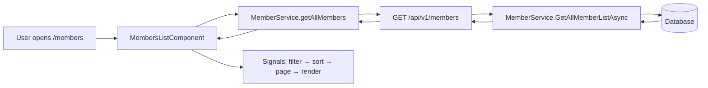
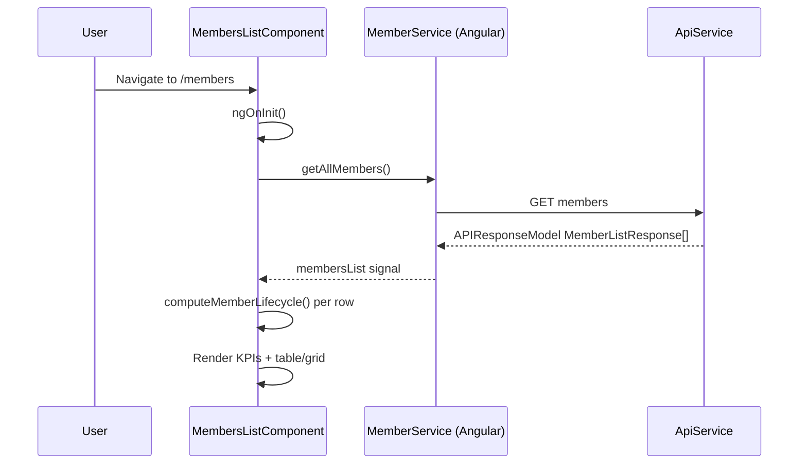
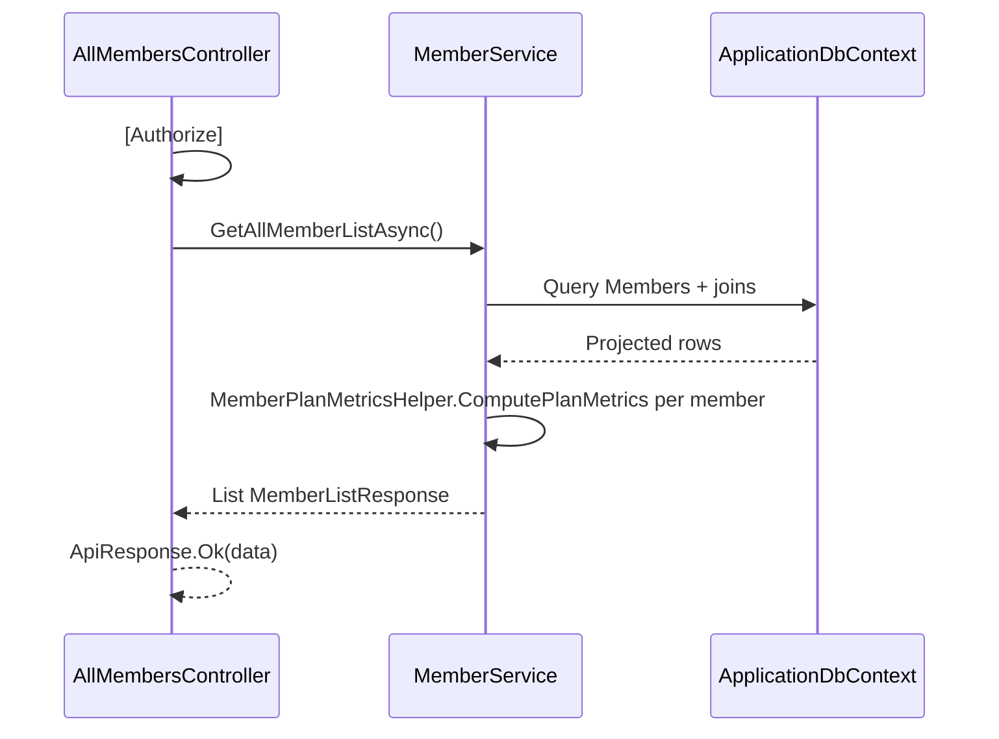

# Members List — Implementation Workflow

End-to-end workflow for the **Members List** feature across **SLMS_UI** (Angular) and **SLMS_API** (.NET).

---

## 1. Overview

| Layer | Entry | Strategy |
|-------|--------|----------|
| **Angular** | Route `/members` | Single API load → client-side filter, sort, paginate, KPIs |
| **.NET** | `GET /api/v1/members` | Returns full `MemberListResponse[]` (no server-side paging/filter params) |



---

## 2. Angular Workflow (SLMS_UI)

### 2.1 Routing

| Route | Component | File |
|-------|-----------|------|
| `/members` | `MembersListComponent` | `SLMS_UI/src/app/features/members/members-list-component/` |
| `/members/create` | `CreateMemberComponent` | `SLMS_UI/src/app/features/members/create-member-component/` |
| `/members/bulk-upload` | `BulkUploadMembersComponent` | `SLMS_UI/src/app/features/members/bulk-upload-members-component/` |
| `/members/:memberId` | `MemberDetailsComponent` | `SLMS_UI/src/app/features/members/member-details-component/` |
| `/institutions/:institutionId/members/create` | `CreateMemberComponent` | Institution scope locked |
| `/branches/:branchId/members/create` | `CreateMemberComponent` | Branch scope locked |
| `/libraries/:libraryId/members/create` | `CreateMemberComponent` | Library scope locked |

> Full nested route matrix: [scoped-members-workflow.md](./scoped-members-workflow.md)

Route config: `SLMS_UI/src/app/app.routes.ts`  
Navigation: `SLMS_UI/src/app/core/constants/navigation.ts`

Entry from navigation: sidebar **Members** → `/members`.

### 2.2 Page layout

```
PageHeader (Bulk upload → /members/bulk-upload, Add member → /members/create)
├── KPI row (5 cards — Active, Expiring ≤7d, Expired, Fees due, Premium)
├── Needs-action banner (when actionCount > 0 and needsAction filter off)
├── Glass card
│   ├── Filter bar (search, expiry/status/plan/branch/shift dropdowns)
│   ├── View toggle (table | grid) — default: grid
│   ├── Table or grid of members
│   ├── Pagination (first / prev / page / next / last + page size)
│   └── Empty / loading / error states
├── Quick-view side panel (slide-over, no route change)
└── RenewPlanDialogComponent (renew or assign plan)
```

### 2.3 Page load sequence



**Steps:**

1. `ngOnInit()` calls `loadAllMembers()`.
2. `MemberService.getAllMembers()` → `GET {apiUrl}/members`.
3. Response `data` stored in `membersList` signal.
4. `members` computed adds `life` via `computeMemberLifecycle()`.
5. Pipeline: `filtered` → `sorted` → `paged` → template.

### 2.4 State management

**Pattern:** Angular signals + computed (no NgRx).

| Signal | Purpose |
|--------|---------|
| `membersList` | Raw API rows |
| `loading`, `error` | Fetch state |
| `query`, `statuses`, `plans`, `branches`, `shifts`, `lifecycles`, `needsAction` | Filters |
| `view` | `table` \| `grid` (default **`grid`**) |
| `sortKey`, `sortDir` | Client sort |
| `page`, `pageSize` | Client pagination (10/25/50/100) |
| `openFilter` | Active filter dropdown |
| `quickId` | Quick-view side panel |
| `renewTarget`, `renewBusy` | Renew dialog |

**Computed pipeline:**

```
membersList
  → members (+ lifecycle)
  → filtered
  → sorted
  → paged
```

**Filter persistence:** `localStorage` key `members:filters:v3` (`MEMBERS_FILTER_STORAGE_KEY`) via `persistFilters()` on filter/sort/view changes.  
`hydrateFilters()` is commented out in `ngOnInit` (save works, restore disabled).

### 2.5 Key UI features

#### KPI row (client-computed)

| KPI | Source |
|-----|--------|
| Active | `status === 'Active'` |
| Expiring ≤ 7d | lifecycle `Expiring soon` + `Grace` (clickable filter) |
| Expired | lifecycle `Expired` (clickable filter) |
| Fees due | sum of `feesOwed` |
| Premium | plan `Yearly` or `Half Yearly` |

#### Needs-action banner

Shown when `actionCount() > 0` and the **Needs action** filter is not active. Summarizes expired + expiring counts; **Review now** applies `applyNeedsActionFilter()`.

#### Filters

- **Search:** name, email, phone, id, institution, branch, library, shift, plan
- **Expiry:** lifecycle states + “Needs action”
- **Status:** Active, Inactive, Suspended
- **Plan:** Monthly, Quarterly, Half Yearly, Yearly
- **Branch / Shift:** derived from loaded data
- **KPI quick filters:** expiring, expired, grace, no-plan, needs-action
- **Outside click** closes filter dropdowns (`document:click` host listener)

#### Sorting (table view)

| Sort key | Column |
|----------|--------|
| `name` | Member (default asc) |
| `status` | Status |
| `plan` | Plan |
| `shift` | Shift |
| `branch` | Branch |
| `attendanceRate` | Attendance % |
| `feesOwed` | Fees owed |
| `joinDate` | Join date |
| `planExpiry` | Plan expiry |

Click column header to toggle asc/desc. **Reset sort** restores `name` ascending.

#### Views & actions

- **Table view** — sortable columns, row action menu, lifecycle row tinting
- **Grid view** — card layout (default)
- **Quick view** — `quickId` signal; slide-over panel with profile summary and links
- **Renew plan** — `RenewPlanDialogComponent`:
  - Has plan → `POST members/{id}/renew`
  - No plan → load member detail + library plans → `POST members/{id}/plan-or-shift` `{ planId }`
- **Copy member ID** — clipboard toast
- **Export** — UI button only (not wired)

#### Pagination

Client-side on `sorted` results. Controls: first, previous, page indicator, next, last. Page sizes: **10 / 25 / 50 / 100** (default 25). Filter or search changes reset to page 1.

### 2.6 Lifecycle (client-side)

File: `SLMS_UI/src/app/features/members/member-lifecycle.util.ts`

Computed from `planEndDate`, `joinDate`, `feesOwed`:

| State | Rule (simplified) |
|-------|-------------------|
| No plan | No end date |
| Grace | ≤7 days past expiry, no fees |
| Expired | Past expiry with fees / grace elapsed |
| New | Joined ≤14 days |
| Expiring soon | ≤7 days until expiry |
| Active | Otherwise |

Drives row styling, filters, KPI clicks, and “needs action” banner.

### 2.7 Angular services & models

| Item | Path |
|------|------|
| `MemberService` | `SLMS_UI/src/app/features/members/MemberService.ts` |
| `MemberListResponse` | `SLMS_UI/src/app/core/models/MemberRequest.ts` |
| `APIResponseModel<T>` | `SLMS_UI/src/app/core/models/APIResponseModel.ts` |
| `ApiService` | `SLMS_UI/src/app/core/services/api.service.ts` |
| `CommonService` | `SLMS_UI/src/app/core/services/common.service.ts` |
| `ToastService` | `SLMS_UI/src/app/core/services/toast.service.ts` |

#### List-related API calls (Angular)

| Method | HTTP | Endpoint |
|--------|------|----------|
| `getAllMembers()` | GET | `members` |
| `getInstitutionMembers(institutionId)` | GET | `institutions/{id}/members` |
| `getBranchMembers(institutionId, branchId)` | GET | `institutions/{id}/branches/{branchId}/members` |
| `getLibraryMember(inst, branch, lib)` | GET | `institutions/.../libraries/.../members` |
| `renewMembership(id)` | POST | `members/{id}/renew` |
| `changePlanOrShift(id, body)` | POST | `members/{id}/plan-or-shift` |
| `getMemberById(id)` | GET | `members/{id}` |
| `getLibraryPlan(inst, branch, lib)` | GET | `institutions/.../libraries/.../plans` |
| `downloadBulkTemplate(inst, branch, lib)` | GET | `institutions/.../libraries/.../members/bulk/template` |
| `bulkUploadMembers(inst, branch, lib, file)` | POST | `institutions/.../libraries/.../members/bulk` (optional; UI uses row-by-row `createMember` for live progress) |
| `createMember(inst, branch, lib, body)` | POST | `institutions/.../libraries/.../members` |

> `GET members/summary` exists on API but is **not used** by the list page.

---

## 3. .NET Workflow (SLMS_API)

### 3.1 Request flow



### 3.2 Controllers

#### `AllMembersController` (primary list API)

**File:** `SLMS_API/Controllers/AllMembersController.cs`  
**Route:** `api/v1/members`  
**Auth:** `[Authorize]`

| HTTP | Route | Action | Service |
|------|-------|--------|---------|
| GET | `/` | `GetAll` | `GetAllMemberListAsync` |
| GET | `/summary` | `GetSummary` | `GetMembershipSummaryAsync` |
| GET | `/{memberId}` | `GetById` | `GetMemberDetailsByIdAsync` |
| POST | `/{memberId}/renew` | `RenewMembership` | `RenewMembershipAsync` |
| POST | `/{memberId}/plan-or-shift` | `ChangePlanOrShift` | `ChangePlanOrShiftAsync` |
| POST | `/{memberId}/contacts` | `AddContact` | `AddContactAsync` |

#### `MembersController` (library-scoped)

**File:** `SLMS_API/Controllers/MembersController.cs`  
**Route:** `api/v1/institutions/{institutionId}/branches/{branchId}/libraries/{libraryId}/members`

| HTTP | Route | Action |
|------|-------|--------|
| GET | `/` | `GetLibraryMemberListAsync` |
| POST | `/` | `Create` |
| GET | `bulk/template` | `DownloadBulkTemplate` — Excel `.xlsx` template |
| POST | `bulk` | `BulkUpload` — server-side bulk parse + create |

Used for library-scoped list/create/bulk; global list page uses `AllMembersController`.

> Bulk upload UI workflow: [members-bulk-upload-workflow.md](./members-bulk-upload-workflow.md)

#### `InstitutionMembersController`

**Route:** `api/v1/institutions/{institutionId}/members`  
**Auth:** Manual `UserId` check → `401` if unauthenticated.

| HTTP | Route | Action |
|------|-------|--------|
| GET | `/` | `GetInstitutionMemberListAsync` |

#### `BranchMembersController`

**Route:** `api/v1/institutions/{institutionId}/branches/{branchId}/members`

| HTTP | Route | Action |
|------|-------|--------|
| GET | `/` | `GetBranchMemberListAsync` |

See [scoped-members-workflow.md](./scoped-members-workflow.md) for UI integration.

### 3.3 `GetAllMemberListAsync` logic

**File:** `SLMS_API/Application/Services/MemberService.cs`

1. Load all `Members` (`AsNoTracking`).
2. Join current `MemberLibrary` (`IsCurrent`) → institution, branch, library, seat, `JoinedOn`.
3. Join current `MemberPlan` (`IsCurrent`) → plan name, dates, price, duration.
4. Attendance aggregation:
   - `LastVisit` = latest `AttendanceDate`
   - `Visits30d` = total attendance count (global list; not limited to 30 days)
5. `AttendanceRate` = visits / membership days × 100 (capped at 100).
6. `MemberPlanMetricsHelper.ComputePlanMetrics(endDate, price, today)` → `DaysRemaining`, `FeesOwed`, `MemberPlanStatus` (shared with dashboard; see **BR-06.1** below).
7. `Status` = `IsActive ? "Active" : "Inactive"`.
8. Avatar URL (DiceBear).

#### BR-06.1 — Plan metrics (`MemberPlanMetricsHelper`)

**File:** `SLMS_API/Application/Helpers/MemberPlanMetricsHelper.cs`

| Output | Rule |
|--------|------|
| `DaysRemaining` | Signed days until/since plan end |
| `PlanStatus` | Active (>7d left) · ExpiringSoon (≤7d or expiry day) · Expired (past end) · NoPlan |
| `FeesOwed` (list row) | Full plan price only if expired **> 7 days**; otherwise `0` |

**Dashboard pending payments** uses `ComputeMemberFeesOwed` on the same helper: expired dues **or** partial unpaid balance (`amount − paidAmount`), never both. See [dashboard-workflow.md](./dashboard-workflow.md).

### 3.4 DTOs

| DTO | File |
|-----|------|
| `MemberListResponse` | `SLMS_API/Application/Contracts/Organizations/Responses/MemberListResponse.cs` |
| `MembershipSummaryResponse` | Same file |
| `ApiResponse<T>` | `SLMS_API/Application/Contracts/Common/ApiResponse.cs` |
| `MemberPlanStatus` enum | `SLMS_API/Common/Enums/MemberPlanStatus.cs` |

### 3.5 Database entities

| Entity | Role |
|--------|------|
| `Member` | Root aggregate |
| `ApplicationUser` | Name, email, phone |
| `MemberLibrary` | Current org/branch/library, seat, join date |
| `MemberPlan` | Current plan (`IsCurrent`) |
| `Plan` | Plan metadata |
| `MemberAttendance` | Last visit, visit counts |
| `Institution`, `Branch`, `Library`, `Seat` | Via `MemberLibrary` |

**DbContext:** `SLMS_API/Infrastructure/Data/ApplicationDbContext.cs`

---

## 4. User journeys

### 4.1 Browse and filter members

```
Open /members
  → Load all members
  → Apply search / status / plan / expiry filters
  → Sort column
  → Change page size / page
  → Switch table ↔ grid view
```

### 4.2 Quick actions from list

```
Row action menu / card actions
  → View profile → /members/:id
  → Quick view → side panel (quickId)
  → Renew plan → dialog
      → Has plan: POST members/:id/renew
      → No plan: GET member + plans → POST members/:id/plan-or-shift
  → Copy ID → clipboard
```

### 4.3 Expiry-driven filtering

```
Click KPI "Expiring ≤ 7d" or "Expired"
  → applyExpiryQuick() sets lifecycle filters
  → filtered computed updates
  → table/grid shows matching members
```

### 4.4 Create member

```
Page header → Add member
  → /members/create
  → POST institutions/{id}/branches/{id}/libraries/{id}/members
  → (see create-member-component)
```

### 4.5 Bulk upload members

```
Page header → Bulk upload
  → /members/bulk-upload
  → Select institution / branch / library
  → Download Excel template (API) or PDF reference (client)
  → Fill Excel → Upload
  → Client parses rows → POST create member per row with live progress
  → (see members-bulk-upload-workflow.md)
```

---

## 5. File index

### Angular

```
SLMS_UI/src/app/
├── app.routes.ts
├── core/
│   ├── constants/navigation.ts
│   ├── constType.ts
│   ├── enums/OnbardingSteps.ts
│   ├── models/MemberRequest.ts
│   ├── models/APIResponseModel.ts
│   └── services/{api,common,toast}.service.ts
└── features/members/
    ├── MemberService.ts
    ├── member-lifecycle.util.ts
    ├── members-list-component/
    │   ├── members-list-component.ts   # signals, filters, sort, page, quick view
    │   ├── members-list-component.html
    │   └── members-list-component.css
    ├── create-member-component/
    ├── bulk-upload-members-component/
    ├── member-bulk-upload.util.ts
    ├── member-bulk-template-export.util.ts
    └── components/
        ├── renew-plan-dialog/
        └── member-avatar/
```

### .NET

```
SLMS_API/
├── Controllers/AllMembersController.cs
├── Controllers/MembersController.cs
├── Controllers/InstitutionMembersController.cs
├── Controllers/BranchMembersController.cs
├── Application/Services/MemberService.cs
├── Application/Services/Interfaces/IMemberService.cs
├── Application/Helpers/MemberBulkExcelHelper.cs
├── Application/Contracts/Organizations/Responses/BulkMemberUploadResponse.cs
├── Application/Contracts/Organizations/Responses/MemberListResponse.cs
├── Application/Contracts/Common/ApiResponse.cs
├── Common/Enums/MemberPlanStatus.cs
└── Domain/Entities/{Member,MemberLibrary,MemberPlan,MemberAttendance,...}.cs
```

---

## 6. Known gaps & notes

| Topic | Note |
|-------|------|
| Server-side paging | Not implemented; full list downloaded |
| `GET members/summary` | Available but unused by list UI |
| Lifecycle rules | UI `computeMemberLifecycle()` differs slightly from API `MemberPlanMetricsHelper` |
| Dashboard dues total | Dashboard uses `ComputeMemberFeesOwed` (includes partial payment); list KPI “Fees due” uses row `feesOwed` from `ComputePlanMetrics` only |
| `Visits30d` | Global list counts all attendances; library list uses 30-day window |
| Filter restore | `hydrateFilters()` disabled in `ngOnInit` |
| Export | Button present, no handler |
| Bulk upload | Implemented at `/members/bulk-upload` — see [members-bulk-upload-workflow.md](./members-bulk-upload-workflow.md) |
| `UserName` | Not mapped in `GetAllMemberListAsync` |
| Member Contacts & Auth | Phone number is required for all members (`^[6-9]\d{9}$`). Email and Date of Birth are optional for add, edit, and bulk upload. In edit mode, email and date of birth can be updated or added. |

---

## 7. Related docs

- Member details: [members-detail-workflow.md](./members-detail-workflow.md)
- Bulk upload: [members-bulk-upload-workflow.md](./members-bulk-upload-workflow.md)
- Scoped members (detail tabs): [scoped-members-workflow.md](./scoped-members-workflow.md)
- Institution details: [institution-detail-workflow.md](./institution-detail-workflow.md)
- Libraries list: [libraries-list-workflow.md](./libraries-list-workflow.md)
- Books & circulation: [books-workflow.md](./books-workflow.md)
- Attendance kiosk: [attendance-kiosk-workflow.md](./attendance-kiosk-workflow.md)
- Membership expiry plan: `docs/lovable-source/.lovable/plan/membership-expiry-across-members-list-details-2026-08-04.md`
