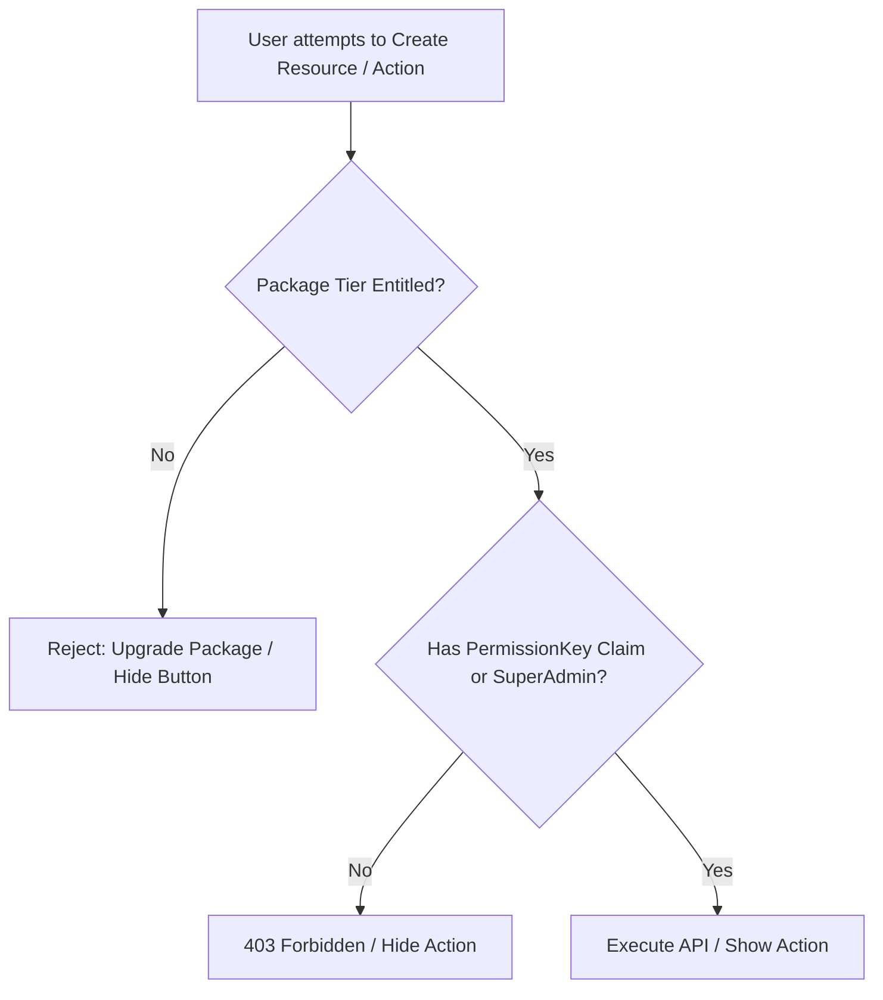

# Package Entitlements & RBAC Authorization — Implementation Workflow

End-to-end workflow for **M-17 Package Entitlements & RBAC Authorization** across **SLMS_UI** (Angular) and **SLMS_API** (.NET).

**Module ID:** M-17 · **Scope:** Global Entitlements & Permissions

---

## 1. Overview

Lexora implements a dual-layer access control model:
1. **Subscription Package Entitlements:** Controls structural resource creation limits based on the organization's subscription tier (`Basic`, `Value`, `Premium` / `Trial`).
2. **Role-Based Access Control (RBAC):** Controls granular functional capabilities using `PermissionKey` claims assigned to user roles. `SuperAdmin` bypasses permission checks globally.



---

## 2. Subscription Package Rules

Package codes are defined in `SLMS_API/Common/Constants/PackageCodes.cs`:

| Package Code | Package Name | Can Add Institution | Can Add Branch | Can Add Library |
|--------------|--------------|---------------------|----------------|-----------------|
| `BASIC` | Basic Plan | ❌ No | ❌ No | ❌ No |
| `VALUE` | Value Plan | ❌ No | ❌ No | ✅ Yes (Unlimited) |
| `PREMIUM` | Premium Plan | ✅ Yes (Unlimited) | ✅ Yes (Unlimited) | ✅ Yes (Unlimited) |
| `TRIAL` | Free Trial | ✅ Yes (Unlimited) | ✅ Yes (Unlimited) | ✅ Yes (Unlimited) |

---

## 3. .NET Workflow (SLMS_API)

### 3.1 Package Entitlement Service

**Interface:** `SLMS_API/Application/Services/Interfaces/IPackageEntitlementService.cs`  
**Implementation:** `SLMS_API/Application/Services/PackageEntitlementService.cs`  
**DTO:** `SLMS_API/Application/Contracts/Package/Response/OrganizationEntitlementsResponse.cs`

- Computes whether the current organization can create institutions, branches, or libraries based on active package subscriptions.
- Endpoint: `GET /api/v1/package-subscriptions/entitlements`

### 3.2 Endpoint Creation Enforcement

Package entitlement checks are enforced directly in controller creation actions:
- `InstitutionsController.Create`: Throws exception / returns fail if `!entitlements.CanCreateInstitution`.
- `BranchesController.Create`: Throws exception / returns fail if `!entitlements.CanCreateBranch`.
- `LibrariesController.Create`: Throws exception / returns fail if `!entitlements.CanCreateLibrary`.

### 3.3 Granular RBAC & `[Permission]` Attributes

**Handler:** `SLMS_API/Infrastructure/Authorization/PermissionAuthorizationHandler.cs`  
**Policy Provider:** `SLMS_API/Infrastructure/Authorization/PermissionPolicyProvider.cs`

- All controllers are secured with `[Permission(PermissionKey.Xxx)]`.
- `SuperAdmin` role automatically satisfies all permission requirements.
- Core controllers secured:
  - `InstitutionsController`, `BranchesController`, `BranchListController`
  - `LibrariesController`, `LibraryListController`
  - `AllMembersController`, `MembersController`, `InstitutionMembersController`, `BranchMembersController`
  - `BooksController`, `AttendanceController`, `PlanController`, `PackageSubscriptionsController`, `AttendanceScannerController`

---

## 4. Angular Workflow (SLMS_UI)

### 4.1 Entitlement Service & Signals

**Service:** `SLMS_UI/src/app/core/services/organization-entitlement.service.ts`  
**Model:** `SLMS_UI/src/app/core/models/organization-entitlement.models.ts`

- Fetches entitlements upon app initialization / authentication.
- Provides reactive signals:
  - `canCreateInstitution()`
  - `canCreateBranch()`
  - `canCreateLibrary()`

### 4.2 Combined UI Visibility Checks

UI components combine package entitlement with `AuthService.hasPermission()`:

```typescript
// Institutions List
protected readonly canCreateInstitution = computed(
  () => this.organizationEntitlements.canCreateInstitution() && this.auth.hasPermission(PermissionKey.InstitutionsCreate)
);

// Branches List / Detail
protected readonly canCreateBranch = computed(
  () => this.organizationEntitlements.canCreateBranch() && this.auth.hasPermission(PermissionKey.BranchesCreate)
);

// Libraries List / Detail
protected readonly canCreateLibrary = computed(
  () => this.organizationEntitlements.canCreateLibrary() && this.auth.hasPermission(PermissionKey.LibrariesCreate)
);
```

### 4.3 Route Protection with `permissionGuard`

**File:** `SLMS_UI/src/app/app.routes.ts`  
Routes are guarded using `permissionGuard` with appropriate `PermissionKey` definitions:
- `/institutions` → `PermissionKey.InstitutionsList`
- `/branches` → `PermissionKey.BranchesList`
- `/libraries` → `PermissionKey.LibrariesList`
- `/members` → `PermissionKey.MembersList`
- `/books` → `PermissionKey.BooksList`
- `/attendance` → `PermissionKey.AttendanceView`

---

## 5. Testing & Verification Checklist

- [x] Basic package users cannot see or execute "Add Institution", "Add Branch", or "Add Library".
- [x] Value package users can see and execute "Add Library", but not institution or branch creation.
- [x] Premium / Trial package users have full creation capabilities across the hierarchy.
- [x] API endpoints return descriptive errors if creation is attempted without package entitlement.
- [x] SuperAdmin role retains full access regardless of assigned permission claims.
