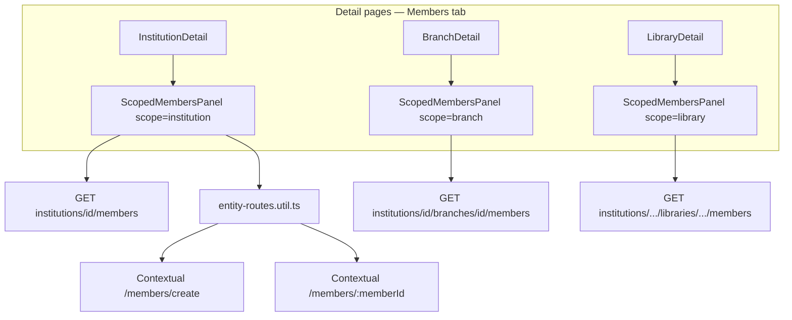

# Scoped Members — Implementation Workflow

End-to-end workflow for **Members tabs** on institution, branch, and library detail pages, plus **context-aware member create/detail URLs** across **SLMS_UI** (Angular) and **SLMS_API** (.NET).

**Module ID:** M-06b (extension of M-06 Members) · **Owner:** Operations · **Depends on:** M-04 Institutions, M-05 Branches, M-08 Libraries, M-06 Members

---

## 1. Overview

| Layer | Entry | Strategy |
|-------|--------|----------|
| **Angular** | Members tab on detail pages | Reusable `ScopedMembersPanelComponent`; client-side filter + pagination |
| **.NET** | Scoped list endpoints | Filter members by institution / branch / library via `MemberLibraries` |



### Business rules

| Rule | Implementation |
|------|----------------|
| **BR-06b.1** Institution tab lists all members with current `MemberLibrary` in that institution | `GetInstitutionMemberListAsync` |
| **BR-06b.2** Branch tab lists members in that branch | `GetBranchMemberListAsync` |
| **BR-06b.3** Library tab lists members in that library | `GetLibraryMemberListAsync` (existing) |
| **BR-06b.4** Scoped list APIs require authenticated user | Manual `UserId` check (same pattern as `libraries-view`) |
| **BR-06b.5** Create/detail URLs preserve navigation context | `entity-routes.util.ts` + nested routes in `app.routes.ts` |
| **BR-06b.6** Back from create/detail returns to origin tab | `?tab=members` query param |

---

## 2. Angular Workflow (SLMS_UI)

### 2.1 Where the Members tab appears

| Page | Route | Tab query | Panel scope |
|------|-------|-----------|-------------|
| Institution detail | `/institutions/:institutionId` | `?tab=members` | `institution` |
| Branch detail (inst path) | `/institutions/:institutionId/branches/:branchId` | `?tab=members` | `branch` |
| Branch detail (standalone) | `/branches/:branchId` | `?tab=members` | `branch` |
| Library detail (nested) | `/institutions/.../branches/.../libraries/:libraryId` | `?tab=members` | `library` |
| Library detail (standalone) | `/libraries/:libraryId` | `?tab=members` | `library` |

### 2.2 `ScopedMembersPanelComponent`

**Path:** `SLMS_UI/src/app/features/members/components/scoped-members-panel/`

| Input | Purpose |
|-------|---------|
| `scope` | `institution` \| `branch` \| `library` |
| `institutionId` | Required for all scopes |
| `branchId` | Required for branch + library |
| `libraryId` | Required for library |
| `title`, `description` | Section header copy |

**Features:**

- Search (name, email, phone, plan, branch, library, shift)
- Status filter (Active / Inactive / Suspended)
- Branch filter (institution scope only)
- Library filter (institution + branch scopes)
- Paginated table with lifecycle badge
- **Add member** → contextual create URL
- **View** → contextual detail URL

**Styles:** Filter bar CSS lives in `scoped-members-panel.component.css` (not inherited from parent detail pages).

### 2.3 Context-aware routes (`entity-routes.util.ts`)

**Path:** `SLMS_UI/src/app/core/utils/entity-routes.util.ts`

| Helper | Resolves to |
|--------|-------------|
| `memberCreateLink(ctx)` | Nested or global `/members/create` |
| `memberDetailLink(id, ctx)` | Nested or global `/members/:id` |
| `libraryDetailLink(id, ctx)` | Nested or global library detail |
| `memberBackNav(params)` | Back link + `?tab=members` |
| `collectRouteParams(route)` | Merges params from parent route segments |

#### Nested URL matrix

| Context | Member detail | Member create |
|---------|---------------|---------------|
| Institution | `/institutions/{id}/members/{memberId}` | `/institutions/{id}/members/create` |
| Branch (inst route) | `/institutions/{id}/branches/{branchId}/members/{memberId}` | `.../members/create` |
| Branch (standalone) | `/branches/{branchId}/members/{memberId}` | `/branches/{branchId}/members/create` |
| Library | `/libraries/{libraryId}/members/{memberId}` | `/libraries/{libraryId}/members/create` |
| Global | `/members/{memberId}` | `/members/create` |

**Route order:** `members/create` must be registered **before** `members/:memberId` in `app.routes.ts`.

### 2.4 Scoped member create

**Component:** `CreateMemberComponent`

- Reads `institutionId`, `branchId`, `libraryId` from `collectRouteParams`
- Locks scope fields when opened from nested URL
- Cancel / success → `memberCreateBackNav()` → origin detail `?tab=members`

### 2.5 Scoped member detail

**Component:** `MemberDetailsComponent`

- Uses `collectRouteParams` for nested IDs
- Back button → `memberBackNav()` (not hard-coded `/members`)
- API still uses global `GET /api/v1/members/{id}`

### 2.6 Angular services

| Method | HTTP | Used when |
|--------|------|-----------|
| `getInstitutionMembers(institutionId)` | GET | `scope === 'institution'` |
| `getBranchMembers(institutionId, branchId)` | GET | `scope === 'branch'` |
| `getLibraryMember(inst, branch, lib)` | GET | `scope === 'library'` |

**File:** `SLMS_UI/src/app/features/members/MemberService.ts`

### 2.7 Auth notes

Scoped list endpoints require a valid JWT (same as `libraries-view`):

- `app.config.ts` — single `provideHttpClient(withInterceptors([authInterceptor]))`
- `APP_INITIALIZER` — `AuthService.restoreSession()` on boot
- Refresh endpoint — `POST auth/refresh-token` (not `auth/refresh`)

---

## 3. .NET Workflow (SLMS_API)

### 3.1 Controllers

#### `InstitutionMembersController`

**Route:** `api/v1/institutions/{institutionId}/members`

| HTTP | Action | Service |
|------|--------|---------|
| GET | `GetMembers` | `GetInstitutionMemberListAsync` |

Auth: manual `UserId` parse → `401` if missing.

#### `BranchMembersController`

**Route:** `api/v1/institutions/{institutionId}/branches/{branchId}/members`

| HTTP | Action | Service |
|------|--------|---------|
| GET | `GetMembers` | `GetBranchMemberListAsync` |

#### `MembersController` (library — existing)

**Route:** `api/v1/institutions/{institutionId}/branches/{branchId}/libraries/{libraryId}/members`

| HTTP | Action | Service |
|------|--------|---------|
| GET | `GetLibraryMemberListAsync` | Library-scoped list |
| POST | `Create` | Create member in library |

### 3.2 `MemberService` scoped helpers

**File:** `SLMS_API/Application/Services/MemberService.cs`

| Method | Filter |
|--------|--------|
| `GetInstitutionMemberListAsync` | `MemberLibraries.InstitutionId == id`, `IsCurrent` |
| `GetBranchMemberListAsync` | + `BranchId == branchId` |
| `GetLibraryMemberListAsync` | + `LibraryId == libraryId` |

Shared projection via private `GetScopedMemberListAsync`.

### 3.3 Response DTO

`MemberListResponse` — same shape as global list (name, branch, library, plan, status, seat, dates, etc.).

---

## 4. User journeys

### 4.1 Institution → Members tab

```
Open /institutions/{id}?tab=members
  → ScopedMembersPanel loads GET institutions/{id}/members
  → Filter / search / paginate client-side
  → Click member → /institutions/{id}/members/{memberId}
  → Back → /institutions/{id}?tab=members
```

### 4.2 Branch → add member in context

```
Open /institutions/{id}/branches/{branchId}?tab=members
  → Add member → /institutions/{id}/branches/{branchId}/members/create
  → Institution + branch pre-selected and locked
  → Success → back to branch detail Members tab
```

### 4.3 Library → view member

```
Open /libraries/{libraryId}?tab=members
  → View member → /libraries/{libraryId}/members/{memberId}
  → Back → /libraries/{libraryId}?tab=members
```

---

## 5. File map

```
SLMS_UI/src/app/
├── app.routes.ts                              # Nested member + library routes
├── app.config.ts                              # Auth interceptor + restoreSession
├── core/
│   ├── utils/entity-routes.util.ts
│   └── services/auth.service.ts               # refresh-token fix
└── features/
    ├── members/
    │   ├── MemberService.ts                   # getInstitutionMembers, getBranchMembers
    │   ├── create-member-component/
    │   ├── member-details-component/
    │   └── components/scoped-members-panel/
    ├── institutions/institution-detail/
    ├── branches/branch-detail-component/
    └── libraries/library-detail-component/

SLMS_API/
├── Controllers/
│   ├── InstitutionMembersController.cs
│   ├── BranchMembersController.cs
│   └── MembersController.cs
└── Application/Services/MemberService.cs
```

---

## 6. Testing checklist

| # | Scenario | Expected |
|---|----------|----------|
| 1 | Institution Members tab while logged in | List loads; filters visible |
| 2 | Institution Members tab without token | `401` on API; error state in panel |
| 3 | Branch Members tab | Only branch members shown |
| 4 | Library Members tab | Only library members shown |
| 5 | Add member from institution tab | Create form locked to institution |
| 6 | Member detail from nested URL | Back returns to `?tab=members` |
| 7 | Filter by branch (institution scope) | Table narrows correctly |
| 8 | Clear filters | Full list restored |

---

## 7. Related docs

- Institution detail: [institution-detail-workflow.md](./institution-detail-workflow.md)
- Members list (global): [members-list-workflow.md](./members-list-workflow.md)
- Member detail: [members-detail-workflow.md](./members-detail-workflow.md)
- Libraries list: [libraries-list-workflow.md](./libraries-list-workflow.md)
- Attendance QR (device binding): [attendance-kiosk-workflow.md](./attendance-kiosk-workflow.md)
