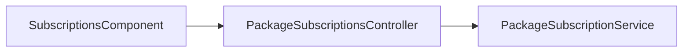

# SaaS Subscriptions — Implementation Workflow

End-to-end workflow for **M-10 SaaS Subscriptions** across **SLMS_UI** (Angular) and **SLMS_API** (.NET).

**Module ID:** M-10 · **Route:** `/subscriptions` · **Depends on:** M-01 Authentication, M-04 Institutions

---

## 1. Overview

Institution-level SaaS package subscriptions: view active packages, renewal quotes, renew/upgrade flows. SuperAdmin sees all tenants; org users see their institution scope.



---

## 2. Angular Workflow (SLMS_UI)

### 2.1 Routing

| Route | Component | File |
|-------|-----------|------|
| `/subscriptions` | `SubscriptionsComponent` | `SLMS_UI/src/app/features/subscriptions/` |

**Guard:** `permissionGuard` with `PermissionKey.SubscriptionsView`

**Navigation:** Sidebar → **Subscriptions**

### 2.2 Features

- Overview cards: active packages, expiring soon, revenue summary
- Package list with institution name (SuperAdmin) or own institution
- Renew / upgrade dialogs with quote from API
- UTC-safe date formatting via shared `formatAppDateTime`

---

## 3. .NET Workflow (SLMS_API)

**Controller:** `SLMS_API/Controllers/PackageSubscriptionsController.cs`  
**Base route:** `api/v1/package-subscriptions`

| Method | Endpoint | Purpose |
|--------|----------|---------|
| GET | `/overview` | Subscription overview for caller scope |
| GET | `/quote` | Price quote for renew/upgrade |
| POST | `/renew` | Renew existing package |
| POST | `/subscribe` | New subscription |
| POST | `/upgrade` | Upgrade package tier |

---

## 4. File map

```
SLMS_UI/src/app/features/subscriptions/
├── subscriptions.component.ts
├── subscriptions.component.html
└── (uses core/models/package-subscription.models.ts)

SLMS_API/
├── Controllers/PackageSubscriptionsController.cs
└── Application/Services/PackageSubscriptionService.cs
```

---

## 5. Test checklist

- [ ] Org user sees only mapped institution subscriptions
- [ ] SuperAdmin sees cross-tenant list
- [ ] Expiring-soon banner when within 7 days
- [ ] Renew flow completes with success toast
- [ ] Permission denied without `subscriptions.view`

---

## 6. Related docs

- [institution-detail-workflow.md](./institution-detail-workflow.md) — Institution billing tab
- [auth-workflow.md](./auth-workflow.md) — Permission keys
