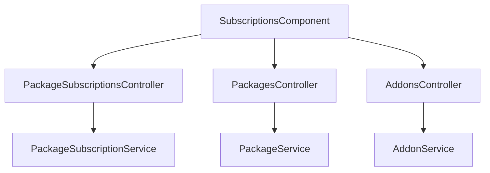

# SaaS Subscriptions & Capacity Add-ons — Implementation Workflow

End-to-end workflow for **M-10 SaaS Subscriptions & Add-ons** across **SLMS_UI** (Angular) and **SLMS_API** (.NET).

**Module ID:** M-10 · **Route:** `/subscriptions` · **Depends on:** M-01 Authentication, M-04 Institutions, M-17 Package Entitlements, M-18 Tenant & Subscription Approvals

---

## 1. Overview

Institution-level SaaS package subscriptions, resource limits (Institutions, Branches, Libraries, Users, Members), capacity add-ons, renewal quotes, approval workflows, and billing history. SuperAdmin manages all tenant subscriptions and can modify package and add-on pricing and quotas at runtime; organization admins manage their own subscription, active add-ons, and renewals.



---

## 2. Angular Workflow (SLMS_UI)

### 2.1 Routing

| Route | Component | File |
|-------|-----------|------|
| `/subscriptions` | `SubscriptionsComponent` | `SLMS_UI/src/app/features/subscriptions/` |

**Guard:** `permissionGuard` with `PermissionKey.SubscriptionsView`  
**Navigation:** Sidebar → **Subscriptions**

### 2.2 Features

- **Overview KPI Cards:** Total active packages, expiring soon count (within 14 days, configurable via `appsettings.json`), expired count, and all-time total revenue.
- **Expiring / Expired Alert Banners:** Top notification banners with remaining days, renewal status, and contextual action buttons ("Upgrade Plan" / "Renew Now").
- **Pending Plan Request Banner:** Alerts user if a Renew or Upgrade request is pending SuperAdmin review, with transaction reference and 1-click **"Send Slip via WhatsApp"** button.
- **Current Plan & Inclusions:** Displays active subscription details, renewal status, dates, and quota inclusions.
- **Active Capacity Add-ons & Status Table:** Displays purchased add-ons with status badges (`Pending Approval`, `Applied to Quotas`, `Declined`), admin remarks, and WhatsApp slip submission.
- **Available Plans & Quotas Grid:** Interactive cards showing prices, duration, feature sets, and resource limits (`MaxInstitutions`, `MaxBranches`, `MaxLibraries`, `MaxUsers`, `MaxMembers`).
- **Trial Plan Specific Handling:**
  - Cannot be renewed; forced to upgrade to a paid tier.
  - Excluded from renew/upgrade dialog plan selection dropdowns.
  - Add-on purchases disabled while on Trial plan.
- **SuperAdmin Controls:**
  - Edit package quotas and pricing live via modal dialog (`openEditPackage`).
  - Create and edit add-on definitions (`openCreateAddon`, `openEditAddon`).
- **Billing History & Invoices:** Tabulated invoice history with Request Type (`Renew` / `Upgrade`), Approval Status (`Pending Approval` / `Approved` / `Rejected`), admin remarks, downloadable PDF invoices, and consolidated PDF summary report (`subscription-invoice-export.util.ts`).

---

## 3. .NET Workflow (SLMS_API)

### 3.1 Subscriptions Controller

**Controller:** `SLMS_API/Controllers/PackageSubscriptionsController.cs`  
**Base route:** `api/v1/package-subscriptions`

| Method | Endpoint | Authorization | Purpose |
|--------|----------|---------------|---------|
| GET | `/overview` | SubscriptionsView | Subscription overview with current plan, pending requests, quotas, and history |
| GET | `/quote` | SubscriptionsView | Prorated price quote for renew/upgrade (`forUpgrade=true` auto-enforced for trials) |
| POST | `/renew` | SubscriptionsUpdate | Renew existing package (Pending if user; auto-approved if SuperAdmin) |
| POST | `/subscribe` | SubscriptionsCreate | New subscription |
| POST | `/upgrade` | SubscriptionsUpdate | Upgrade package tier (Pending if user; auto-approved if SuperAdmin) |
| GET | `/requests` | SuperAdmin | Fetch all renew & upgrade requests |
| POST | `/requests/{id}/approve` | SuperAdmin | Approve plan change, calculate dates & amount, activate plan |
| POST | `/requests/{id}/reject` | SuperAdmin | Reject plan change request |

### 3.2 Addons Controller

**Controller:** `SLMS_API/Controllers/AddonsController.cs`  
**Base route:** `api/v1/addons`

| Method | Endpoint | Authorization | Purpose |
|--------|----------|---------------|---------|
| GET | `/` | Anonymous | Public list of active add-ons |
| GET | `/all` | SuperAdmin | SuperAdmin list of all add-ons |
| GET | `/{id}` | Authenticated | Get add-on details |
| POST | `/` | SuperAdmin | SuperAdmin create add-on |
| PUT | `/{id}` | SuperAdmin | SuperAdmin update add-on |
| DELETE | `/{id}` | SuperAdmin | SuperAdmin delete add-on |
| POST | `/purchase` | Authenticated | Purchase add-on (enters Pending state; blocked for Trial plan) |
| GET | `/my-addons` | Authenticated | List all purchased add-ons with approval status for user |
| GET | `/requests` | SuperAdmin | SuperAdmin list of all add-on requests |
| POST | `/requests/{id}/approve` | SuperAdmin | Approve add-on request and activate extra quota |
| POST | `/requests/{id}/reject` | SuperAdmin | Reject add-on request |

### 3.3 Packages Controller

**Controller:** `SLMS_API/Controllers/PackagesController.cs`  
**Base route:** `api/v1/packages`

| Method | Endpoint | Authorization | Purpose |
|--------|----------|---------------|---------|
| GET | `/` | Anonymous | Public list of active packages |
| GET | `/all` | SuperAdmin | SuperAdmin list of all packages with quotas |
| GET | `/{id}` | Anonymous | Get package by ID |
| POST | `/` | SuperAdmin | SuperAdmin create package |
| PUT | `/{id}` | SuperAdmin | SuperAdmin update package & quotas |
| DELETE | `/{id}` | SuperAdmin | SuperAdmin delete package |

---

## 4. File Map

```
SLMS_UI/src/app/
├── features/subscriptions/
│   ├── subscriptions.component.ts
│   ├── subscriptions.component.html
│   ├── subscriptions.component.css
│   ├── package-features-list.component.ts
│   └── subscription-invoice-export.util.ts
├── features/admin/tenant-approvals/
│   ├── tenant-approvals.component.ts
│   ├── tenant-approvals.component.html
│   └── tenant-approvals.component.css
└── core/
    ├── models/package-subscription.models.ts
    ├── services/package.service.ts
    ├── services/addon.service.ts
    └── services/package-subscription.service.ts

SLMS_API/
├── Controllers/
│   ├── PackageSubscriptionsController.cs
│   ├── PackagesController.cs
│   └── AddonsController.cs
├── Application/
│   ├── Services/
│   │   ├── PackageSubscriptionService.cs
│   │   ├── PackageService.cs
│   │   ├── AddonService.cs
│   │   └── PackageEntitlementService.cs
│   └── Contracts/
│       ├── PackageSubscription/
│       │   └── PackageSubscriptionContracts.cs
│       ├── Package/
│       └── Addon/
└── Domain/Entities/
    ├── Package.cs
    ├── Addon.cs
    ├── UserPackage.cs
    └── UserPackageAddon.cs
```
