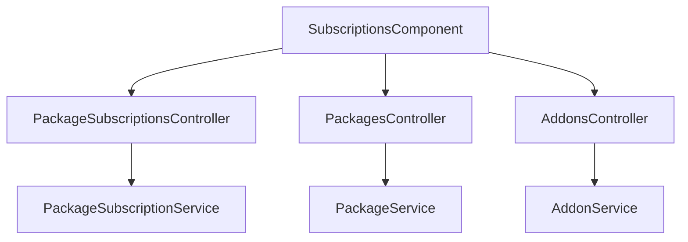

# SaaS Subscriptions & Capacity Add-ons — Implementation Workflow

End-to-end workflow for **M-10 SaaS Subscriptions & Add-ons** across **SLMS_UI** (Angular) and **SLMS_API** (.NET).

**Module ID:** M-10 · **Route:** `/subscriptions` · **Depends on:** M-01 Authentication, M-04 Institutions, M-17 Package Entitlements

---

## 1. Overview

Institution-level SaaS package subscriptions, resource limits (Institutions, Branches, Libraries, Users, Members), capacity add-ons, renewal quotes, and billing history. SuperAdmin manages all tenant subscriptions and can modify package and add-on pricing and quotas at runtime; organization admins manage their own subscription, active add-ons, and renewals.



---

## 2. Angular Workflow (SLMS_UI)

### 2.1 Routing

| Route | Component | File |
|-------|-----------|------|
| `/subscriptions` | `SubscriptionsComponent` | `SLMS_UI/src/app/features/subscriptions/` |

**Guard:** `permissionGuard` with `PermissionKey.SubscriptionsView`  
**Navigation:** Sidebar → **Subscriptions**

### 2.2 Features

- **Overview KPI Cards:** Total active packages, expiring soon count (within 7 days), expired count, and all-time total revenue.
- **Current Plan & Inclusions:** Displays active subscription details, renewal status, dates, and quota inclusions.
- **Active Capacity Add-ons:** Displays currently active add-ons purchased by the organization with expiry dates and extra capacity breakdown.
- **Available Plans & Quotas Grid:** Interactive cards showing prices, duration, feature sets, and resource limits (`MaxInstitutions`, `MaxBranches`, `MaxLibraries`, `MaxUsers`, `MaxMembers`).
- **Capacity Add-ons Catalog:** Add extra libraries, members, staff users, branches, or institutions without upgrading the base plan tier. Includes quantity selector and instant price calculation.
- **SuperAdmin Controls:**
  - Edit package quotas and pricing live via modal dialog (`openEditPackage`).
  - Create and edit add-on definitions (`openCreateAddon`, `openEditAddon`).
- **Billing History & Invoices:** Tabulated invoice history with downloadable PDF invoices and consolidated PDF summary report (`subscription-invoice-export.util.ts`).

---

## 3. .NET Workflow (SLMS_API)

### 3.1 Subscriptions Controller

**Controller:** `SLMS_API/Controllers/PackageSubscriptionsController.cs`  
**Base route:** `api/v1/package-subscriptions`

| Method | Endpoint | Purpose |
|--------|----------|---------|
| GET | `/overview` | Subscription overview for caller scope |
| GET | `/quote` | Prorated price quote for renew/upgrade |
| POST | `/renew` | Renew existing package |
| POST | `/subscribe` | New subscription |
| POST | `/upgrade` | Upgrade package tier |

### 3.2 Addons Controller

**Controller:** `SLMS_API/Controllers/AddonsController.cs`  
**Base route:** `api/v1/addons`

| Method | Endpoint | Purpose |
|--------|----------|---------|
| GET | `/` | Public list of active add-ons |
| GET | `/all` | SuperAdmin list of all add-ons |
| GET | `/{id}` | Get add-on details |
| POST | `/` | SuperAdmin create add-on |
| PUT | `/{id}` | SuperAdmin update add-on |
| DELETE | `/{id}` | SuperAdmin delete add-on |
| POST | `/purchase` | Purchase add-on for current organization |
| GET | `/my-addons` | List active purchased add-ons for user |

### 3.3 Packages Controller

**Controller:** `SLMS_API/Controllers/PackagesController.cs`  
**Base route:** `api/v1/packages`

| Method | Endpoint | Purpose |
|--------|----------|---------|
| GET | `/` | Public list of active packages |
| GET | `/all` | SuperAdmin list of all packages with quotas |
| GET | `/{id}` | Get package by ID |
| POST | `/` | SuperAdmin create package |
| PUT | `/{id}` | SuperAdmin update package & quotas |
| DELETE | `/{id}` | SuperAdmin delete package |

---

## 4. File map

```
SLMS_UI/src/app/
├── features/subscriptions/
│   ├── subscriptions.component.ts
│   ├── subscriptions.component.html
│   ├── subscriptions.component.css
│   ├── package-features-list.component.ts
│   └── subscription-invoice-export.util.ts
└── core/
    ├── models/package-subscription.models.ts
    ├── services/package.service.ts
    ├── services/addon.service.ts
    └── services/package-subscription.service.ts

SLMS_API/
├── Controllers/
│   ├── PackageSubscriptionsController.cs
│   ├── PackagesController.cs
│   └── AddonsController.cs
├── Application/
│   ├── Services/
│   │   ├── PackageSubscriptionService.cs
│   │   ├── PackageService.cs
│   │   └── AddonService.cs
│   └── Contracts/
│       ├── Package/
│       └── Addon/
└── Domain/Entities/
    ├── Package.cs
    ├── Addon.cs
    ├── UserPackage.cs
    └── UserPackageAddon.cs
```

---

## 5. Test checklist

- [ ] Org user sees only mapped institution subscriptions and active add-ons
- [ ] SuperAdmin sees cross-tenant list with edit buttons for packages & add-ons
- [ ] Expiring-soon banner displays when subscription ends within 7 days
- [ ] Capacity add-on purchase increases organization creation limits immediately
- [ ] Single invoice and all-history PDF downloads generate properly
- [ ] Permission denied without `subscriptions.view`

---

## 6. Related docs

- [package-entitlements-workflow.md](./package-entitlements-workflow.md) — Dynamic quotas & creation limits
- [institution-detail-workflow.md](./institution-detail-workflow.md) — Institution billing tab
- [auth-workflow.md](./auth-workflow.md) — Registration with optional add-ons
