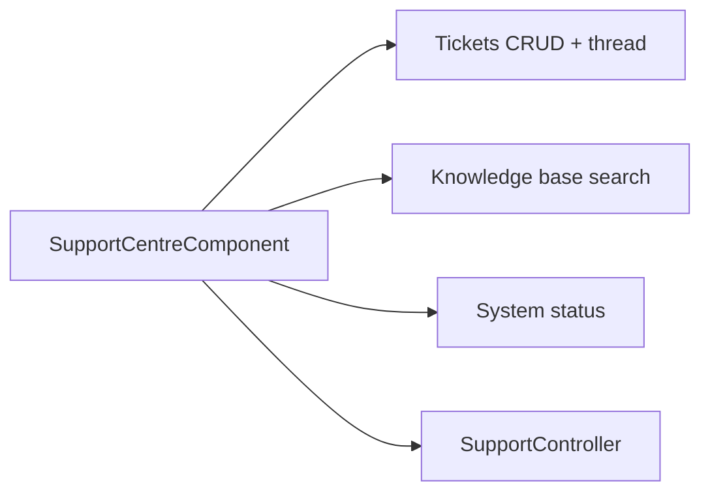

# Support Centre — Implementation Workflow

End-to-end workflow for **M-09 Support** across **SLMS_UI** (Angular) and **SLMS_API** (.NET).

**Module ID:** M-09 · **Routes:** `/support`, `/support/status` · **Depends on:** M-01 Authentication

---

## 1. Overview

In-app support hub: tickets, knowledge base, contact channels, and public system status page.



---

## 2. Angular Workflow (SLMS_UI)

### 2.1 Routing

| Route | Component | File |
|-------|-----------|------|
| `/support` | `SupportCentreComponent` | `SLMS_UI/src/app/features/support/support-centre.component.ts` |
| `/support/status` | `SupportStatusComponent` | `SLMS_UI/src/app/features/support/support-status.component.ts` |

Navigation: sidebar **Support** → `/support`

### 2.2 Support centre tabs

| Tab | Features |
|-----|----------|
| Tickets | List, filters, detail drawer (thread / notes / activity) |
| Knowledge base | Article search with highlight scoring |
| Contact | Channel cards (chat, email, phone, specialist) |
| Status | Embedded system status summary |

**Ticket creation:** `NewTicketDialogComponent` — category, priority, attachments  
**Drafts:** Local persistence via `support-draft.store.ts`

### 2.3 Key utilities

| File | Role |
|------|------|
| `support.service.ts` | API wrapper |
| `support-format.util.ts` | Dates, SLA, priority tones |
| `support-highlight.util.ts` | KB search highlighting |
| `support-subscription.store.ts` | Subscription context for tickets |

---

## 3. .NET Workflow (SLMS_API)

**Controller:** `SLMS_API/Controllers/SupportController.cs`  
**Base route:** `api/v1/support`

| Method | Endpoint | Purpose |
|--------|----------|---------|
| GET | `/tickets` | List user tickets |
| GET | `/tickets/{ticketId}` | Ticket detail + messages |
| POST | `/tickets` | Create ticket |
| POST | `/tickets/{ticketId}/messages` | Reply |
| PATCH | `/tickets/{ticketId}/status` | Update status |
| POST | `/attachments` | Upload attachment |
| GET | `/attachments/{attachmentId}/download` | Download file |
| GET | `/articles` | KB article list |
| GET | `/articles/{articleId}` | Article detail |
| GET | `/status` | System status page data |
| POST | `/status/simulate-incident` | Dev/demo incident |

---

## 4. File map

```
SLMS_UI/src/app/features/support/
├── support-centre.component.ts
├── support-centre.component.html
├── support-status.component.ts
├── support.service.ts
├── support-draft.store.ts
├── support-format.util.ts
├── support-highlight.util.ts
└── components/new-ticket-dialog/

SLMS_API/
├── Controllers/SupportController.cs
└── Application/Contracts/Support/
```

---

## 5. Test checklist

- [ ] Ticket list loads for current user
- [ ] Create ticket with category and priority
- [ ] Reply in thread drawer
- [ ] Attachment upload and download
- [ ] KB search returns highlighted snippets
- [ ] Status tab shows component health
- [ ] `/support/status` standalone page renders

---

## 6. Related docs

- [auth-workflow.md](./auth-workflow.md) — User context for tickets
- [administration-workflow.md](./administration-workflow.md) — Admin roles (future agent UI)
