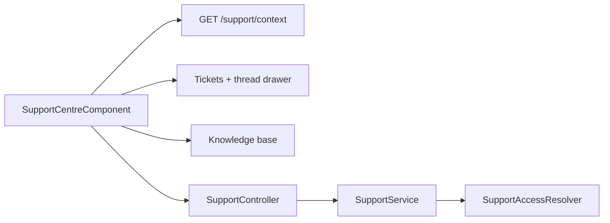

# Support Centre — Implementation Workflow

End-to-end workflow for **M-09 Support** across **SLMS_UI** (Angular) and **SLMS_API** (.NET).

**Module ID:** M-09 · **Routes:** `/support`, `/support/status` · **Depends on:** M-01 Authentication

---

## 1. Overview

In-app support hub with **institution-scoped tickets**, role-based status rules, attachments, knowledge base, and system status. SuperAdmin sees all tickets; org staff see mapped institutions; users see own + institution tickets.



---

## 2. Angular Workflow (SLMS_UI)

### 2.1 Routing

| Route | Component | File |
|-------|-----------|------|
| `/support` | `SupportCentreComponent` | `SLMS_UI/src/app/features/support/support-centre.component.ts` |
| `/support/status` | `SupportStatusComponent` | `SLMS_UI/src/app/features/support/support-status.component.ts` |

Navigation: sidebar **Support** → `/support`

### 2.2 Support centre tabs

| Tab | Features |
|-----|----------|
| Tickets | Scoped list, filters (status, priority, category, institution), detail drawer |
| Knowledge base | Article search with highlight scoring |
| Contact | Support channel cards |
| Status | System health summary (embedded) |

### 2.3 Ticket drawer

| Sub-tab | Purpose |
|---------|---------|
| Thread | Messages + **attachments** (click to download) |
| Internal notes | Placeholder for agent-only notes |
| Status timeline | Status history + message events |

**Reply:** Body + optional file attachments (up to 5 × 10 MB).  
**Create ticket:** `NewTicketDialogComponent` — category filtered by role, institution selector for staff, attachments on first message.

### 2.4 Access rules (UI reflects API)

| Role | View | Reply | Change status |
|------|------|-------|---------------|
| SuperAdmin | All tickets | Yes | All categories |
| Org staff (mapped institutions) | Scoped tickets | Yes | Operational categories only |
| Regular user | Own + institution tickets | Yes | No (except staff on operational) |
| Bug / Feature / Technical status | — | — | SuperAdmin only |

**Scope banner:** Shows `context.scopeLabel` and institution filter when applicable.

### 2.5 Key files

| File | Role |
|------|------|
| `support.service.ts` | API wrapper incl. `getContext()`, upload/download |
| `support-centre.component.ts` / `.html` | Main UI |
| `components/new-ticket-dialog/` | Create ticket + attachments |
| `support-format.util.ts` | Dates, SLA, UTC formatting |
| `support-highlight.util.ts` | KB search highlighting |
| `support-draft.store.ts` | Local ticket drafts |
| `core/models/support.models.ts` | Types, enums, capabilities |

---

## 3. .NET Workflow (SLMS_API)

**Controller:** `SLMS_API/Controllers/SupportController.cs`  
**Services:** `SupportService`, `SupportAccessResolver`  
**Base route:** `api/v1/support`

| Method | Endpoint | Purpose |
|--------|----------|---------|
| GET | `/context` | Caller scope, institutions, creatable categories |
| GET | `/tickets` | Scoped ticket list |
| GET | `/tickets/{ticketId}` | Detail + messages + attachments + status history |
| POST | `/tickets` | Create ticket (optional `institutionId`, `memberId`, `attachmentIds`) |
| POST | `/tickets/{ticketId}/messages` | Reply (`body`, optional `attachmentIds`) |
| PATCH | `/tickets/{ticketId}/status` | Status change (permission-checked) |
| POST | `/attachments` | Upload file (max 10 MB; pdf, png, jpg, doc, docx, txt) |
| GET | `/attachments/{attachmentId}/download` | Download (uploader or ticket viewer) |
| GET | `/articles` | KB search |
| GET | `/articles/{articleId}` | Article detail |
| GET | `/status` | System status |
| POST | `/status/simulate-incident` | SuperAdmin demo incident |

**Entities:** `SupportTicket` (with `InstitutionId`, `MemberId`), `SupportTicketStatusHistory`, `SupportTicketMessage`, `SupportTicketAttachment`.

**Migration:** `AddSupportInstitutionScoping` — institution columns + status history table.

---

## 4. File map

```
SLMS_UI/src/app/features/support/
├── support-centre.component.ts
├── support-centre.component.html
├── support-status.component.ts
├── support.service.ts
├── support-draft.store.ts
├── support-format.util.ts
├── support-highlight.util.ts
└── components/new-ticket-dialog/

SLMS_API/
├── Controllers/SupportController.cs
├── Application/Services/SupportService.cs
├── Application/Services/SupportAccessResolver.cs
├── Domain/Entities/SupportTicket*.cs
└── Application/Contracts/Support/
```

---

## 5. Test checklist

- [ ] `GET /support/context` returns institutions for org staff
- [ ] SuperAdmin sees all tickets; org user sees scoped list only
- [ ] Create ticket with attachment → file visible on first message
- [ ] Reply with attachment → message shows file; download works
- [ ] Non–SuperAdmin cannot change Bug/Feature/Technical ticket status
- [ ] User reply on Resolved ticket reopens (non-staff) with status history
- [ ] KB search highlights matches
- [ ] Attachment upload rejects disallowed file types

---

## 6. Related docs

- [auth-workflow.md](./auth-workflow.md) — Roles and permissions
- [profile-workflow.md](./profile-workflow.md) — User context
- [administration-workflow.md](./administration-workflow.md) — Role permissions
