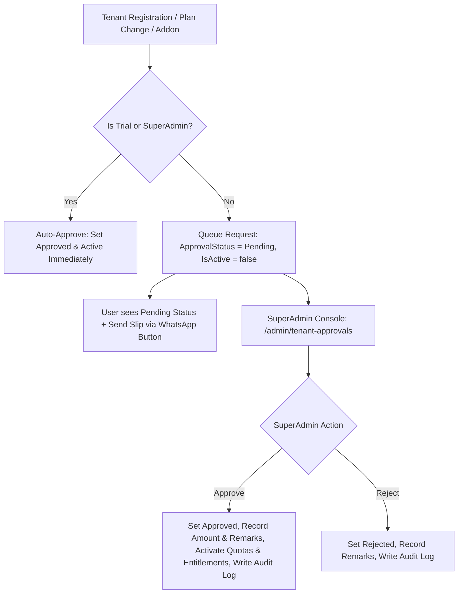

# Tenant Registrations & Subscription Approvals — Implementation Workflow

End-to-end workflow for **M-18 Tenant & Subscription Approvals Console** across **SLMS_UI** (Angular) and **SLMS_API** (.NET).

**Module ID:** M-18 · **Route:** `/admin/tenant-approvals` · **Depends on:** M-01 Authentication, M-03 Onboarding, M-10 Subscriptions, M-17 Entitlements & RBAC

---

## 1. Overview

Lexora implements a comprehensive verification and approval workflow managed by SuperAdmins:
1. **Tenant Registrations Approval:** When a new organization registers on a paid plan, their account enters `ApprovalStatus = "Pending"`. After completing the onboarding wizard, they are redirected to a `/pending-approval` waiting page. SuperAdmin reviews organization details, verifies payment receipts, sets approved amounts, adds remarks, and activates the tenant with 1 click.
2. **Trial Auto-Approval:** New registrations on the `Trial` package are **auto-approved immediately** (`ApprovalStatus = "Approved"`, `IsActive = true`) without requiring SuperAdmin action.
3. **Capacity Add-ons Approval:** When a tenant requests add-on capacity packs (extra branches, libraries, members, staff users, institutions), the request is queued in `Pending` state. Quotas are only expanded once SuperAdmin approves the request.
4. **Plan Renewal & Upgrade Approval:** When a logged-in user requests a plan renewal or upgrade, the request is submitted to SuperAdmin for approval. If a SuperAdmin performs the renewal/upgrade, it is **auto-approved instantly**.
5. **Direct Outreach & WhatsApp Hotline:** Both user and SuperAdmin screens feature pre-filled 1-click WhatsApp messaging templates (Payment Request, Discount Offer, Follow-up Reminder, and Slip Submission).



---

## 2. Angular Workflow (SLMS_UI)

### 2.1 Routing & Navigation

| Route | Component | File | Guard / Access |
|-------|-----------|------|----------------|
| `/admin/tenant-approvals` | `TenantApprovalsComponent` | `SLMS_UI/src/app/features/admin/tenant-approvals/` | `RoleDefinitions.SuperAdmin` |
| `/pending-approval` | `PendingApprovalComponent` | `SLMS_UI/src/app/features/auth/pending-approval/` | Authenticated users in Pending state |

### 2.2 SuperAdmin Console Features (`TenantApprovalsComponent`)

- **Top-Level Section Switcher:**
  1. **Tenant Registrations:** Review new organization signups.
  2. **Capacity Add-on Requests:** Review extra quota add-on purchases.
  3. **Plan Renew & Upgrade Requests:** Review plan extensions and tier upgrades.
- **Metric Overview KPI Cards:** Live counts for Total Requests, Pending Review (with pulse animation), Approved & Active, and Declined.
- **Status Filter Tabs & Search:** Filter by `all`, `pending`, `approved`, `rejected`, and live keyword search across user, organization, plan, and phone.
- **Interactive Review & Outreach Modals:**
  - **Applicant & Org Details:** Contact name, email, phone number, organization name, library network setup.
  - **Editable Financials:** SuperAdmin can set `FinalApprovedAmount` (e.g. after discounts/negotiations) and `AdminRemarks`.
  - **WhatsApp Direct Outreach Module:** Switch between pre-configured message templates (`payment`, `discount`, `reminder`) or edit text with a 1-click **"Send on WhatsApp"** button.
  - **One-Click Actions:** `Approve & Activate` (or `Reject Request`) with live submission states.

### 2.3 User Experience Flows

- **Post-Registration Wizard:**
  - If registered with `Trial`: Wizard completes and navigates directly to `/dashboard`.
  - If registered with Paid Plan: Wizard completes and navigates to `/pending-approval` showing SuperAdmin hotline numbers, email, and WhatsApp slip submission.
- **Subscriptions Page (`/subscriptions`):**
  - Displays a top warning banner if a Renew or Upgrade request is pending SuperAdmin review, with a direct **"Send Slip via WhatsApp"** button.
  - Displays add-on request status badges (`Pending`, `Approved`, `Declined`) with WhatsApp slip actions.

---

## 3. .NET Workflow (SLMS_API)

### 3.1 Subscriptions & Plan Requests Endpoints

**Controller:** `SLMS_API/Controllers/PackageSubscriptionsController.cs`  
**Base route:** `api/v1/package-subscriptions`

| Method | Endpoint | Authorization | Purpose |
|--------|----------|---------------|---------|
| POST | `/renew` | Authenticated | Submit renewal request (Pending if regular user; auto-approved if SuperAdmin) |
| POST | `/upgrade` | Authenticated | Submit upgrade request (Pending if regular user; auto-approved if SuperAdmin) |
| GET | `/requests` | SuperAdmin | Fetch all plan renewal & upgrade requests |
| POST | `/requests/{id}/approve` | SuperAdmin | Approve plan request, activate subscription, log audit |
| POST | `/requests/{id}/reject` | SuperAdmin | Reject plan request with remarks, log audit |

### 3.2 Add-ons Approval Endpoints

**Controller:** `SLMS_API/Controllers/AddonsController.cs`  
**Base route:** `api/v1/addons`

| Method | Endpoint | Authorization | Purpose |
|--------|----------|---------------|---------|
| POST | `/purchase` | Authenticated | Submit add-on request (Pending state) |
| GET | `/requests` | SuperAdmin | List all capacity add-on requests |
| POST | `/requests/{id}/approve` | SuperAdmin | Approve add-on, activate extra capacity quota |
| POST | `/requests/{id}/reject` | SuperAdmin | Reject add-on request |

### 3.3 Tenant Registration Approval Endpoints

**Controller:** `SLMS_API/Controllers/AdminController.cs`  
**Base route:** `api/v1/admin`

| Method | Endpoint | Authorization | Purpose |
|--------|----------|---------------|---------|
| GET | `/tenant-registrations` | SuperAdmin | List all tenant registration requests |
| POST | `/tenant-registrations/{userId}/approve` | SuperAdmin | Approve tenant, unlock onboarding/dashboard access |
| POST | `/tenant-registrations/{userId}/reject` | SuperAdmin | Reject tenant registration |

---

## 4. Database Schema & Entities

### 4.1 `UserPackage` Entity & Columns
```csharp
public string ApprovalStatus { get; set; } = "Approved"; // "Pending", "Approved", "Rejected"
public string? AdminRemarks { get; set; }
public decimal? FinalApprovedAmount { get; set; }
public DateTime? ApprovedAtUtc { get; set; }
public DateTime? RejectedAtUtc { get; set; }
public string? ApprovedByUserId { get; set; }
public string? RequestType { get; set; } // "Renew", "Upgrade", "Initial"
public string? Note { get; set; }
public Guid? PreviousPackageId { get; set; }
```

### 4.2 `UserPackageAddon` Entity & Columns
```csharp
public string ApprovalStatus { get; set; } = "Pending"; // "Pending", "Approved", "Rejected"
public string? AdminRemarks { get; set; }
public decimal? FinalApprovedAmount { get; set; }
public DateTime? ApprovedAtUtc { get; set; }
public DateTime? RejectedAtUtc { get; set; }
public string? ApprovedByUserId { get; set; }
```

---

## 5. Test & Verification Checklist

- [x] Register with Trial plan → auto-approved, bypasses pending page, lands on `/dashboard`.
- [x] Register with Paid plan (Basic/Value/Premium) → lands on `/pending-approval`.
- [x] SuperAdmin approves tenant → user's approval status becomes `Approved`, user can login and access dashboard.
- [x] Regular user buys capacity add-on → request enters `Pending`, quotas not incremented until approved.
- [x] SuperAdmin approves capacity add-on → quotas immediately increment in `PackageEntitlementService`.
- [x] Regular user renews/upgrades plan → request enters `Pending`, old plan remains active until approval.
- [x] SuperAdmin renews/upgrades plan for user → immediately auto-approved.
- [x] WhatsApp outreach links open WhatsApp Web/App with properly escaped, formatted pre-filled messages.
