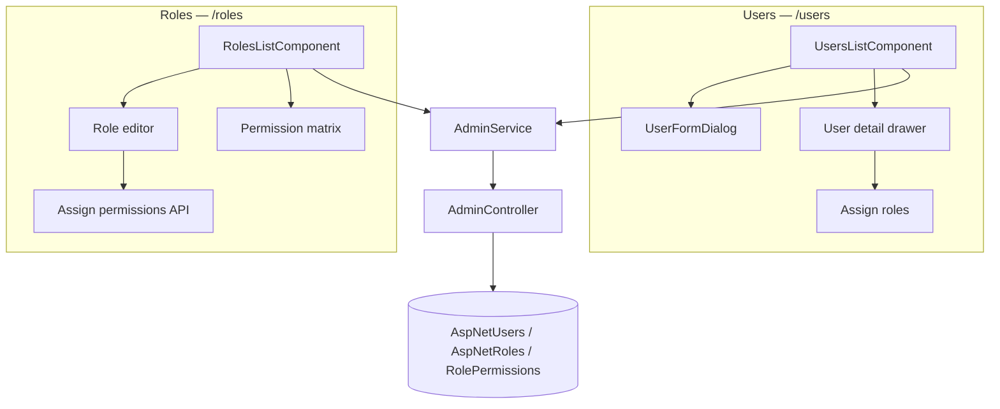
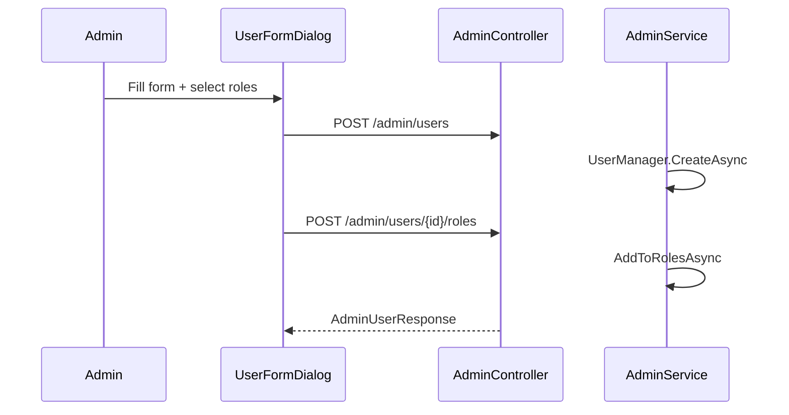
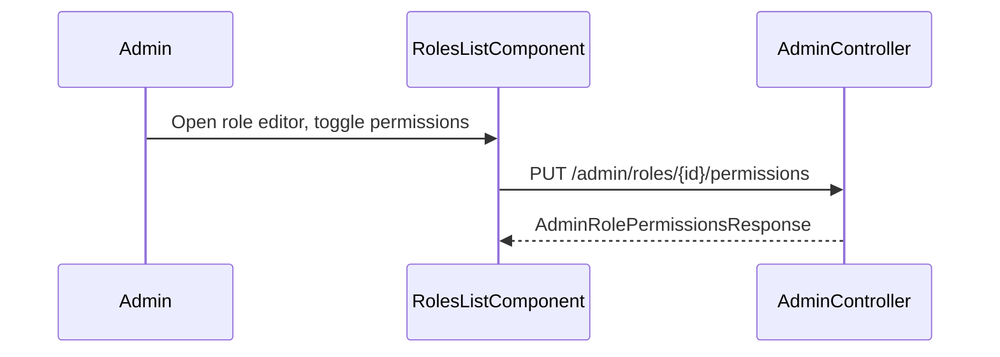

# Users & Roles Administration — Implementation Workflow

End-to-end workflow for **M-15 Users & Roles** across **SLMS_UI** (Angular) and **SLMS_API** (.NET).

**Module ID:** M-15 · **Owner:** Platform / Security · **Depends on:** M-01 Authentication

---

## 1. Overview

| Layer | Entry | Strategy |
|-------|--------|----------|
| **Angular** | `/users`, `/roles` | User directory with create/edit/assign roles; role catalogue with permission matrix |
| **.NET** | `api/v1/admin/*` | ASP.NET Identity user/role CRUD + permission assignment |



### Business rules

| Rule | Implementation |
|------|----------------|
| **BR-15.1** Users belong to predefined Identity roles | `RoleDefinitions.All` validated on assign |
| **BR-15.2** Email unique per user | `UserManager.FindByEmailAsync` on create |
| **BR-15.3** Role permissions synced from definitions | `RolePermissionDefinitions` + `SeedRolePermissionsAsync` |
| **BR-15.4** Admin routes gated by numeric permissions | `permissionGuard` + `[Permission]` on API |
| **BR-15.5** Audit trail on user/role changes | `IAuditLogService` in `AdminService` |

### Functional requirements

| ID | Requirement | Status |
|----|-------------|--------|
| FR-15.1 | List users with roles and status | Done |
| FR-15.2 | Create user (email, password, name, active) | Done |
| FR-15.3 | Edit user profile and active status | Done |
| FR-15.4 | Assign / replace user roles | Done |
| FR-15.5 | Delete user | Done |
| FR-15.6 | List roles with permission matrix | Done |
| FR-15.7 | Create / edit role + permissions | Done |
| FR-15.8 | Permission-gated routes | Done |
| FR-15.9 | User activity / audit timeline UI | Planned |
| FR-15.10 | Per-user permission overrides | Planned |

---

## 2. Angular Workflow (SLMS_UI)

### 2.1 Routes & navigation

| Route | Component | Guard permission |
|-------|-----------|------------------|
| `/users` | `UsersListComponent` | `UsersList` (68) |
| `/roles` | `RolesListComponent` | `RolesList` (74) |
| `/unauthorized` | `UnauthorizedComponent` | — |

Config: `SLMS_UI/src/app/app.routes.ts`  
Sidebar: `SLMS_UI/src/app/layouts/sidebar/sidebar.component.ts`

### 2.2 Users page (`/users`)

**Layout:**

```
PageHeader (+ Add user button)
├── KPI strip (total, active, inactive, with roles)
├── Filters (search, status: all / active / inactive)
├── User table (avatar, name, email, roles, status, created, actions)
├── UserFormDialog (create / edit)
└── User detail drawer (slide-over)
    ├── Account status (activate / deactivate)
    ├── Role checkboxes + Save roles
    └── Edit profile shortcut
```

**Create user flow:**

1. Click **Add user** → `UserFormDialogComponent` opens.
2. Fill full name, email, password (min 8 chars), select staff Role from dropdown (Librarians, Branch Managers, Institution Admins, etc.), active status, and access scopes (institutions/branches/libraries).
3. `POST /admin/users` → optional `POST /admin/users/{id}/roles`.
4. Table refreshes with new user.

**Edit user flow:**

1. Row action **Edit** or drawer **Edit profile** → dialog with existing data (no password field), Role select dropdown, and access scope.
2. `PUT /admin/users/{id}` → `POST /admin/users/{id}/roles` if roles changed.

**Assign roles (drawer):**

1. Click table row → drawer opens.
2. Toggle role checkboxes → **Save roles**.
3. `POST /admin/users/{id}/roles` with full role list (replaces existing).

**Delete user:**

- Trash icon → confirm → `DELETE /admin/users/{id}`.

### 2.3 Roles page (`/roles`)

**Layout (Lovable-inspired):**

```
PageHeader (+ New role)
├── KPI strip (total, system, custom, assigned members)
├── Role cards grid (scope, permission summary, member count)
├── Permission comparison matrix (multi-role diff view)
├── Role detail drawer (permissions, members, audit)
└── Role editor overlay (name, scope, permission toggles by module)
```

**Create role:**

1. **New role** → editor overlay.
2. `POST /admin/roles` → `PUT /admin/roles/{id}/permissions`.

**Edit role:**

1. Click role card → edit or drawer.
2. Name change → `PUT /admin/roles/{id}`.
3. Permission change → `PUT /admin/roles/{id}/permissions`.

### 2.4 Permission checks (UI)

| Action | Permission key | ID |
|--------|----------------|-----|
| List users | `UsersList` | 68 |
| Create user | `UsersCreate` | 69 |
| View user | `UsersView` | 67 |
| Update user | `UsersUpdate` | 71 |
| Delete user | `UsersDelete` | 72 |
| Assign roles to user | `RolesUpdate` | 77 |
| List roles | `RolesList` | 74 |
| Create role | `RolesCreate` | 75 |
| Update role / permissions | `RolesUpdate` | 77 |

`AuthService.hasPermission()` reads JWT permission claims from `StorageService`.

### 2.5 Angular services & models

| File | Purpose |
|------|---------|
| `core/services/admin.service.ts` | All admin API calls |
| `core/models/admin.models.ts` | `AdminUser`, `AdminRole`, request DTOs |
| `core/constants/permissions.ts` | `PermissionKey` enum (mirrors API) |
| `features/admin/users-list/users-list.component.*` | Users directory |
| `features/admin/users-list/user-form-dialog.component.*` | Create/edit dialog |
| `features/admin/roles-list/roles-list.component.*` | Roles + matrix |
| `features/admin/roles-list/roles-list.util.ts` | Permission catalog UI helpers |

#### AdminService methods

| Method | HTTP |
|--------|------|
| `getUsers()` | `GET admin/users` |
| `getUserById(id)` | `GET admin/users/{id}` |
| `createUser(req)` | `POST admin/users` |
| `updateUser(id, req)` | `PUT admin/users/{id}` |
| `deleteUser(id)` | `DELETE admin/users/{id}` |
| `assignUserRoles(id, req)` | `POST admin/users/{id}/roles` |
| `getRoles()` | `GET admin/roles` |
| `createRole(name)` | `POST admin/roles` |
| `updateRole(id, name)` | `PUT admin/roles/{id}` |
| `getRolePermissions(id)` | `GET admin/roles/{id}/permissions` |
| `assignRolePermissions(id, keys)` | `PUT admin/roles/{id}/permissions` |
| `getPermissions()` | `GET admin/permissions` |
| `getAuditLogs()` | `GET admin/audit-logs` |

---

## 3. .NET Workflow (SLMS_API)

### 3.1 Controller

**File:** `SLMS_API/Controllers/AdminController.cs`  
**Route:** `api/v1/admin`  
**Auth:** `[Authorize]` + per-action `[Permission]`

### 3.2 User endpoints

| Method | Route | Service | Permission |
|--------|-------|---------|------------|
| `GET` | `/users` | `GetUsersAsync` | `UsersList` |
| `POST` | `/users` | `CreateUserAsync` | `UsersCreate` |
| `GET` | `/users/{id}` | `GetUserByIdAsync` | `UsersView` |
| `PUT` | `/users/{id}` | `UpdateUserAsync` | `UsersUpdate` |
| `DELETE` | `/users/{id}` | `DeleteUserAsync` | `UsersDelete` |
| `POST` | `/users/{id}/roles` | `AssignRolesAsync` | `RolesUpdate` |

**Create user request:**

```json
{
  "email": "user@example.com",
  "password": "Password@123",
  "fullName": "Priya Sharma",
  "isActive": true
}
```

**Assign roles request:**

```json
{
  "roles": ["BranchAdmin", "LibrarianAdmin"]
}
```

`AssignRolesAsync` replaces roles: removes unlisted, adds new ones. Validates against `RoleDefinitions.All`.

### 3.3 Role endpoints

| Method | Route | Service | Permission |
|--------|-------|---------|------------|
| `GET` | `/roles` | `GetRolesAsync` | `RolesList` |
| `POST` | `/roles` | `CreateRoleAsync` | `RolesCreate` |
| `PUT` | `/roles/{id}` | `UpdateRoleAsync` | `RolesUpdate` |
| `GET` | `/roles/{id}/permissions` | `GetRolePermissionsAsync` | `RolesView` |
| `PUT` | `/roles/{id}/permissions` | `AssignRolePermissionsAsync` | `RolesUpdate` |
| `GET` | `/permissions` | `GetPermissionsAsync` | `RolesView` |

### 3.4 Service layer

**File:** `SLMS_API/Application/Services/AdminService.cs`

- Uses `UserManager<ApplicationUser>` and `RoleManager<IdentityRole>`.
- User create sets `EmailConfirmed = true`, `UserName = Email`.
- Role permission assignment writes to `RolePermissions` table.
- All mutations log via `IAuditLogService`.

### 3.5 Contracts

| Type | Path |
|------|------|
| `AdminCreateUserRequest`, `AdminUpdateUserRequest`, `AdminAssignRolesRequest` | `Application/Contracts/Admin/Requests/` |
| `AdminCreateRoleRequest`, `AdminUpdateRoleRequest`, `AdminAssignRolePermissionsRequest` | same |
| `AdminUserResponse`, `AdminRoleResponse`, `AdminRolePermissionsResponse` | `Application/Contracts/Admin/Responses/` |

### 3.6 Predefined roles

Source: `SLMS_API/Common/Constants/RoleDefinitions.cs`

`SuperAdmin`, `OrganisationAdmin`, `OrganisationManager`, `InstitutionAdmin`, `InstitutionManager`, `BranchAdmin`, `BranchManager`, `LibrarianAdmin`, `LibrarianManager`, `Librarians`, `Teachers`, `Members`

Default permission sets: `RolePermissionDefinitions.cs`

---

## 4. End-to-end flows

### 4.1 Create user with roles



### 4.2 Edit role permissions



---

## 5. File map

```
SLMS_UI/src/app/
├── app.routes.ts
├── core/
│   ├── constants/permissions.ts
│   ├── guards/permission.guard.ts
│   ├── models/admin.models.ts
│   └── services/admin.service.ts
└── features/admin/
    ├── users-list/
    │   ├── users-list.component.ts
    │   ├── users-list.component.html
    │   ├── users-list.component.css
    │   ├── user-form-dialog.component.ts
    │   └── user-form-dialog.component.html
    └── roles-list/
        ├── roles-list.component.ts
        ├── roles-list.component.html
        ├── roles-list.component.css
        └── roles-list.util.ts

SLMS_API/
├── Controllers/AdminController.cs
├── Application/
│   ├── Services/AdminService.cs
│   ├── Services/Interfaces/IAdminService.cs
│   └── Contracts/Admin/
├── Common/Constants/RoleDefinitions.cs
├── Common/Constants/RolePermissionDefinitions.cs
└── Common/Enums/PermissionKey.cs
```

---

## 6. Testing checklist

| # | Scenario | Expected |
|---|----------|----------|
| 1 | SuperAdmin opens `/users` | User list loads with KPIs |
| 2 | Create user with roles | User appears in table with roles |
| 3 | Deactivate user in drawer | Status → Inactive; cannot sign in |
| 4 | Assign new roles in drawer | Roles update after Save |
| 5 | Delete user | Removed from list |
| 6 | User without `UsersList` opens `/users` | Error or redirect to `/unauthorized` |
| 7 | Create role with permissions | Role card shows permission counts |
| 8 | Edit role name | Persists via API on save |

---

## 7. Related docs

- [administration-workflow.md](./administration-workflow.md) — permission model overview
- [members-list-workflow.md](./members-list-workflow.md) — member accounts (separate from staff users)
- [scoped-members-workflow.md](./scoped-members-workflow.md) — scoped member tabs on detail pages
- [attendance-kiosk-workflow.md](./attendance-kiosk-workflow.md) — `attendance.scanner.use` permission

---

## 8. Planned enhancements

- User activity timeline tab (login, role changes)
- Governance feed UI wired to `GET /admin/audit-logs`
- Per-user permission overrides (beyond role defaults)
- Invite user / reset password from admin UI
